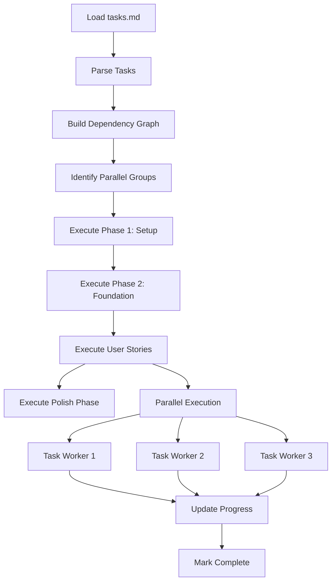

# Flow Implementer - Examples

Detailed examples of task execution, parallel processing patterns, error recovery, and progress tracking.

## Task Parsing Examples

### Basic Task Format
```markdown
- [ ] T001 [US1] Create database schema in db/schema.sql
- [ ] T002 [P] [US1] Install dependencies via npm install
- [X] T003 [US2] Implement User model in src/models/user.py
```

### Parsed Task Structure
```javascript
interface Task {
  id: string;          // T001, T002, etc.
  parallel: boolean;   // Has [P] marker
  story: string;       // US1, US2, etc.
  description: string;
  filePath: string;
  dependencies: string[];
  status: 'pending' | 'in_progress' | 'completed' | 'failed';
}

// Example parsed task
{
  id: "T012",
  parallel: true,
  story: "US1",
  description: "Create User model",
  filePath: "src/models/user.py",
  dependencies: ["T001", "T005"],
  status: "pending"
}
```

## Execution Pipeline Example

### Workflow Diagram


### Sequential Execution Example
```javascript
// Phase-based execution
const executionPlan = {
  "Phase 1: Setup & Configuration": {
    tasks: ["T001", "T002", "T003", "T004", "T005"],
    parallel: false,  // Must run sequentially
    critical: true
  },
  "Phase 2: Core Models": {
    tasks: ["T006", "T007", "T008"],
    parallel: true,   // Can run in parallel
    critical: true
  },
  "Phase 3: User Story US1": {
    tasks: ["T009", "T010", "T011"],
    parallel: true,
    critical: false
  }
};
```

## Implementation Pattern Examples

### Pattern 1: File Creation
```yaml
pattern: create-file
description: Create new code file with boilerplate
steps:
  1. Check if file exists (skip if exists unless --force)
  2. Create directory structure if needed
  3. Generate file content based on template/spec
  4. Write file with proper formatting
  5. Validate syntax/linting
  6. Update imports/exports in related files

example:
  task: "Create User model in src/models/user.py"
  actions:
    - mkdir -p src/models/
    - Generate Python class with fields
    - Add type hints and docstrings
    - Run black formatter
    - Update __init__.py imports
```

### Pattern 2: Component Implementation (TDD)
```yaml
pattern: implement-component-tdd
description: Implement component using Test-Driven Development
steps:
  1. Create test file first
  2. Write failing tests based on acceptance criteria
  3. Run tests (should fail)
  4. Implement minimal component to pass tests
  5. Run tests (should pass)
  6. Refactor and optimize
  7. Add documentation
  8. Update exports/index

example:
  task: "Implement LoginForm component in src/components/LoginForm.tsx"
  actions:
    - Create LoginForm.test.tsx
    - Write tests for email/password validation
    - Run tests → RED
    - Create LoginForm.tsx with basic structure
    - Implement validation logic
    - Run tests → GREEN
    - Add PropTypes and JSDoc
    - Update src/components/index.ts
```

### Pattern 3: API Endpoint
```yaml
pattern: create-api-endpoint
description: Create RESTful API endpoint with validation and tests
steps:
  1. Define route in router
  2. Create controller function
  3. Add request validation middleware
  4. Implement business logic
  5. Add error handling
  6. Write integration tests
  7. Update API documentation (OpenAPI)

example:
  task: "Create POST /api/users endpoint in src/routes/users.js"
  actions:
    - Add route: router.post('/users', validateUser, createUser)
    - Create validateUser middleware (Joi schema)
    - Implement createUser controller
    - Add try-catch with appropriate HTTP codes
    - Write test: POST /api/users with valid/invalid data
    - Update openapi.yaml with schema
```

### Pattern 4: Database Migration
```yaml
pattern: create-migration
description: Create database migration with up/down paths
steps:
  1. Generate migration file with timestamp
  2. Write up() migration (schema changes)
  3. Write down() migration (rollback)
  4. Add seed data if needed
  5. Test migration in dev environment
  6. Update schema documentation

example:
  task: "Create users table migration in db/migrations/001_create_users.sql"
  actions:
    - Generate: 20241024_create_users_table.sql
    - Write CREATE TABLE users (...)
    - Write DROP TABLE IF EXISTS users
    - Add seed: INSERT INTO users (...)
    - Run: npm run migrate:up
    - Update: db/schema.md
```

## Error Recovery Examples

### Retry Strategy
```javascript
const retryStrategy = {
  maxRetries: 3,
  backoff: 'exponential',
  baseDelay: 1000,    // 1 second
  maxDelay: 30000,    // 30 seconds
  retryableErrors: [
    'NetworkError',
    'TimeoutError',
    'RateLimitError',
    'TemporaryFailure'
  ],
  nonRetryableErrors: [
    'SyntaxError',
    'ValidationError',
    'AuthenticationError'
  ]
};

// Exponential backoff calculation
function getRetryDelay(attempt) {
  const delay = Math.min(
    baseDelay * Math.pow(2, attempt),
    maxDelay
  );
  // Add jitter to prevent thundering herd
  return delay + Math.random() * 1000;
}

// Example retry flow
// Attempt 1: Immediate (0ms)
// Attempt 2: 1000ms + jitter
// Attempt 3: 2000ms + jitter
// Attempt 4: 4000ms + jitter
// FAIL: Max retries exceeded
```

### Alternative Approach Strategy
```javascript
// If primary approach fails, try alternatives
const alternatives = {
  "install-dependencies": [
    { method: "npm install", priority: 1 },
    { method: "npm ci", priority: 2 },
    { method: "yarn install", priority: 3 }
  ],
  "format-code": [
    { method: "prettier --write", priority: 1 },
    { method: "eslint --fix", priority: 2 },
    { method: "skip", priority: 3 }  // Last resort
  ]
};

// Example execution
// Try: npm install → FAIL (network error)
// Retry: npm install (3x) → FAIL
// Alternative: npm ci → SUCCESS
```

### Partial Success Handling
```javascript
// Continue with independent tasks when one fails
const executionState = {
  completed: ["T001", "T002", "T003"],
  failed: ["T004"],        // Failed: Database connection
  blocked: ["T008", "T009"], // Depends on T004
  available: ["T005", "T006", "T007"] // Independent of T004
};

// Agent continues with T005-T007 while user fixes T004
```

## Progress Tracking Examples

### Real-time Progress Display
```
📊 Implementation Progress: ████████░░ 80% (12/15 tasks)

Phase: User Story Implementation (US2)

In Progress (3):
  → T012 [P] [US2] Create authentication middleware (45s elapsed)
  → T013 [P] [US2] Implement login endpoint (12s elapsed)
  → T014 [P] [US2] Add password hashing (8s elapsed)

Completed (8):
  ✓ T001 Initialize project structure
  ✓ T002 Install dependencies
  ✓ T003 Configure database
  ✓ T004 Set environment variables
  ✓ T005 Create base models
  ✓ T006 Implement User model
  ✓ T007 Create database migrations
  ✓ T008 Set up testing framework

Queued (4):
  ⏳ T015 [US2] Write integration tests
  ⏳ T016 [US2] Add API documentation
  ⏳ T017 [US3] Implement dashboard
  ⏳ T018 [US3] Create charts component

Failed: 0 tasks

Estimated completion: 3 minutes
Next task: T015 (when T012-T014 complete)
```

### Task Execution Log
```markdown
## Task Execution Log

### T012 [P] [US2] Create authentication middleware in src/middleware/auth.js
- **Status**: COMPLETED ✓
- **Duration**: 2.3s
- **Parallelized with**: T013, T014
- **Actions**:
  1. Created directory: src/middleware/
  2. Generated auth middleware with JWT verification
  3. Added error handling for invalid tokens
  4. Wrote unit tests
  5. All tests passed (4/4)
  6. Updated src/middleware/index.js exports

### T013 [P] [US2] Implement login endpoint in src/routes/auth.js
- **Status**: COMPLETED ✓
- **Duration**: 3.1s
- **Parallelized with**: T012, T014
- **Actions**:
  1. Created route: POST /api/auth/login
  2. Added request validation (Joi schema)
  3. Implemented password verification with bcrypt
  4. Generated JWT token on success
  5. Added rate limiting (5 attempts/min)
  6. Wrote integration tests (6/6 passing)
  7. Updated openapi.yaml

### T014 [P] [US2] Add password hashing in src/utils/password.js
- **Status**: COMPLETED ✓
- **Duration**: 1.8s
- **Parallelized with**: T012, T013
- **Actions**:
  1. Created password utility module
  2. Implemented hash function (bcrypt, cost=12)
  3. Implemented verify function
  4. Added password strength validation
  5. Wrote unit tests (8/8 passing)
  6. Updated src/utils/index.js exports
```

## Configuration Examples

### Full Configuration
```json
{
  "implementer": {
    "parallel": {
      "enabled": true,
      "maxWorkers": 5,
      "taskTimeout": 60000,
      "dynamicScaling": true
    },
    "errorRecovery": {
      "autoRetry": true,
      "maxRetries": 3,
      "backoffStrategy": "exponential",
      "tryAlternatives": true,
      "continueOnNonCritical": true
    },
    "testing": {
      "runTests": true,
      "testFirst": false,
      "coverageTarget": 80,
      "failOnCoverageBelow": 70,
      "testTimeout": 30000
    },
    "validation": {
      "linting": true,
      "typeChecking": true,
      "formatting": true,
      "securityScan": false
    },
    "progress": {
      "updateInterval": 1000,
      "showDetails": true,
      "logFile": ".flow/implementation.log",
      "webhookUrl": null
    },
    "quality": {
      "requireBlueprint": false,
      "enforceConventions": true,
      "autoFormat": true,
      "autoFix": true
    }
  }
}
```

### Minimal Configuration (Fast Prototyping)
```json
{
  "implementer": {
    "parallel": { "enabled": true, "maxWorkers": 3 },
    "errorRecovery": { "autoRetry": false },
    "testing": { "runTests": false },
    "validation": { "linting": false, "formatting": false },
    "progress": { "showDetails": false }
  }
}
```

### Enterprise Configuration (High Quality)
```json
{
  "implementer": {
    "parallel": { "enabled": true, "maxWorkers": 10 },
    "errorRecovery": { "autoRetry": true, "maxRetries": 5 },
    "testing": { "runTests": true, "testFirst": true, "coverageTarget": 90 },
    "validation": {
      "linting": true,
      "typeChecking": true,
      "securityScan": true
    },
    "quality": {
      "requireBlueprint": true,
      "enforceConventions": true
    }
  }
}
```

## Parallel Execution Examples

### Example 1: Independent User Stories
```markdown
## Parallel Group 1 (US1 - Authentication)
- [ ] T009 [P] [US1] Create User model
- [ ] T010 [P] [US1] Implement auth middleware
- [ ] T011 [P] [US1] Add login endpoint

## Parallel Group 2 (US2 - Dashboard)
- [ ] T015 [P] [US2] Create Dashboard component
- [ ] T016 [P] [US2] Implement metrics API
- [ ] T017 [P] [US2] Add chart visualization

# Both groups run simultaneously
# Total time: max(Group1, Group2) instead of Group1 + Group2
```

### Example 2: File Isolation
```markdown
## Parallel Group (Different Files)
- [ ] T020 [P] Create src/models/user.py
- [ ] T021 [P] Create src/models/post.py
- [ ] T022 [P] Create src/models/comment.py
- [ ] T023 [P] Create src/utils/validation.js

# All can run in parallel - no file conflicts
```

### Example 3: Sequential Dependencies
```markdown
## Sequential Execution (Dependencies)
- [ ] T001 Initialize database schema  # Must run first
- [ ] T002 Create base models          # Depends on T001
- [ ] T003 [P] Create User model       # Depends on T002, parallel with T004
- [ ] T004 [P] Create Post model       # Depends on T002, parallel with T003
- [ ] T005 Create relationships        # Depends on T003, T004

# Execution order: T001 → T002 → (T003 || T004) → T005
```

## Quality Assurance Examples

### Pre-execution Checks
```bash
✓ Checking prerequisites...
  ✓ Git repository clean (no uncommitted changes)
  ✓ All dependencies installed (package.json valid)
  ✓ Environment variables set (.env exists)
  ✓ Database accessible (connection successful)
  ✓ File permissions correct (write access to src/)
  ✓ Blueprint compliance (architecture-blueprint.md exists)

✅ All pre-checks passed. Starting implementation...
```

### Post-execution Validation
```bash
🔍 Running post-execution validation...

Code Quality:
  ✓ Linting: 0 errors, 0 warnings (eslint)
  ✓ Type checking: No errors (TypeScript)
  ✓ Formatting: All files formatted (Prettier)
  ✓ Security scan: No vulnerabilities (npm audit)

Testing:
  ✓ Unit tests: 42/42 passing (100%)
  ✓ Integration tests: 12/12 passing (100%)
  ✓ Coverage: 87% (target: 80%)
    ✓ Statements: 89%
    ✓ Branches: 85%
    ✓ Functions: 90%
    ✓ Lines: 87%

Documentation:
  ✓ JSDoc coverage: 95%
  ✓ README updated
  ✓ API docs updated (openapi.yaml)

Git:
  ✓ No merge conflicts
  ✓ Branch up to date with main

✅ All validation checks passed!
```

## Performance Metrics Examples

### Execution Summary
```
📈 Implementation Summary

Total Time: 8m 32s
Tasks Completed: 25/25 (100%)
Tasks Failed: 0
Tasks Skipped: 0

Performance:
  ⚡ Tasks per minute: 2.9
  ⚡ Average task duration: 20.5s
  ⚡ Parallel efficiency: 73% (ideal: 80%+)
  ⚡ Speedup from parallelism: 2.8x

Quality Metrics:
  ✅ Test pass rate: 100% (54/54 tests)
  ✅ Coverage: 87% (target: 80%)
  ✅ Linting compliance: 100%
  ✅ Type safety: 100%

Resource Usage:
  💻 Peak CPU: 78%
  💾 Peak memory: 1.2 GB
  💽 Disk I/O: 245 MB
  🌐 Network: 12 MB (downloads)

Bottlenecks Detected:
  ⚠️ T012: Slow (45s) - Database queries
  ⚠️ T018: Slow (38s) - Large file generation
```

---

*For technical implementation details and algorithms, see [reference.md](./reference.md)*
