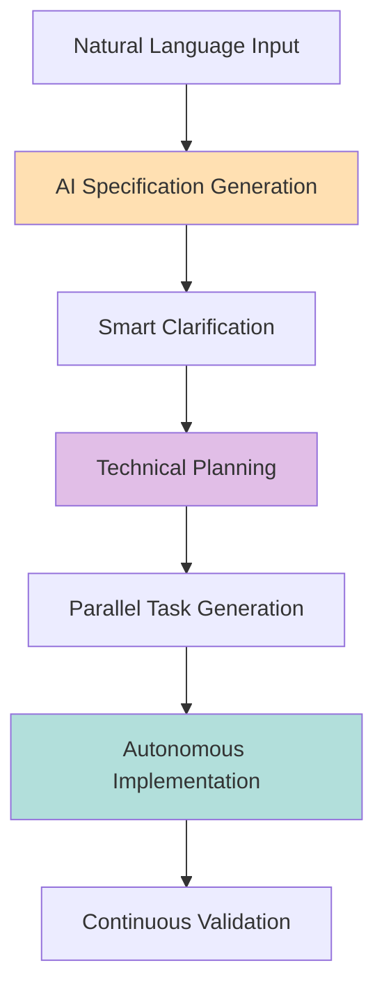

# Claude Code Marketplace

An internal marketplace for Claude Code plugins.

## 🚀 Overview

The Claude Code Marketplace is a **Skills-first** architecture that replaces traditional command-based interactions with intelligent, context-aware Skills powered by AI. No backward compatibility baggage - just add a new skill and the flow will adapt.

### Key Innovations

- **🧠 AI-Powered Skills**: Natural language understanding with intelligent defaults
- **🤖 Autonomous Subagents**: Multi-step tasks executed independently
- **🪝 Smart Hooks**: Event-driven automation and validation
- **📊 Parallel Execution**: Maximize efficiency with concurrent processing
- **🎯 Context-Aware**: Adapts to your project type and domain

## ⚡ Quick Start

```bash
# List available plugins
market:list

# Install the Flow plugin
market:install flow

# Initialize a new project
flow:init

# Generate a specification from natural language
flow:specify "Build a real-time collaborative document editor like Google Docs"

# The AI takes over from here...
```

## 🎪 The Flow Plugin: Specification-Driven Development Reimagined

Flow is our flagship plugin that demonstrates the full power of the Skills architecture.

### AI-Powered Workflow



### Updated Architecture (v2.0)

Flow now uses a **blueprint-first, flat artifact model** with optional JIRA integration:

#### Directory Structure
```
.flow/                          # Project-level artifacts (flat peer model)
├── product-requirements.md     # Project-level PRD (WHAT to build)
├── architecture-blueprint.md   # Technical standards (HOW to build)
├── contracts/openapi.yaml      # API contracts (if API project)
└── data-models/entities.md     # Domain entities

features/001-feature-name/      # Sequential naming
├── spec.md                     # Feature spec (with JIRA frontmatter)
├── plan.md                     # Implementation plan
└── tasks.md                    # Task breakdown
```

#### Key Concepts
- **Flat Peer Model**: All `.flow/` artifacts are peers - no strict hierarchy
- **Blueprint**: Architecture and guidance
- **JIRA Integration**: Bidirectional sync - start from JIRA or local
- **User Approval**: Always asks before syncing TO JIRA or modifying `.flow/` files
- **Traceability**: JIRA ID in frontmatter, prepended to git branch

#### JIRA Integration Workflows
```bash
# Start from JIRA story
flow:specify "https://jira.company.com/browse/PROJ-123"

# Start locally, optionally create JIRA story
flow:specify "Add user authentication"  # Asks: Create JIRA story?

# Bidirectional sync
flow:sync --to-jira      # Push local changes to JIRA (asks first)
flow:sync --from-jira PROJ-123  # Pull JIRA updates (shows diff, asks)
```

### Flow Skills

| Skill | AI Features | Subagents Used |
|-------|-------------|----------------|
| `flow:specify` | Domain detection, requirement inference, smart defaults, JIRA sync | flow-researcher |
| `flow:blueprint` | Architecture definition (replaces flow:constitution) | - |
| `flow:plan` | Architecture decisions, technology evaluation, contract updates | flow-researcher, flow-analyzer |
| `flow:implement` | Parallel execution, error recovery, progress tracking | flow-implementer |
| `flow:sync` | Bidirectional JIRA synchronization | - |
| `flow:analyze` | Pattern extraction, consistency validation | flow-analyzer |

### Example: From Idea to Implementation

```bash
# One command to rule them all
flow:specify "Create a SaaS platform for team collaboration with real-time features"

# The AI will:
# 1. Detect it's a SaaS + real-time project
# 2. Research best practices (WebSockets vs SSE)
# 3. Generate complete specifications
# 4. Ask only critical clarifications (max 3)
# 5. Create technical plan with architecture
# 6. Generate parallel task execution plan
# 7. Implement autonomously with progress tracking
```

## 🤖 Subagents: Autonomous Execution

### Flow Subagents

#### 🔍 Flow-Analyzer
Performs deep codebase analysis:
- Pattern extraction
- Architecture discovery
- Constitution inference
- Brownfield project understanding

#### ⚙️ Flow-Implementer
Executes implementation autonomously:
- Parallel task execution
- Intelligent error recovery
- Test-driven development
- Real-time progress tracking

#### 🔬 Flow-Researcher
Conducts technical research:
- Best practices discovery
- Library evaluation
- Decision documentation
- Risk assessment

### Subagent Execution

```javascript
// Subagents work in parallel for maximum efficiency
await Promise.all([
  invokeAgent('flow-researcher', { topic: 'real-time-frameworks' }),
  invokeAgent('flow-analyzer', { scope: 'existing-codebase' }),
  invokeAgent('flow-implementer', { tasks: taskList, parallel: true })
]);
```

## 🪝 Hooks: Intelligent Automation

### Event-Driven Architecture

```javascript
// Pre-execution validation
on('before:flow:specify', async (context) => {
  await validateProjectSetup(context);
  await loadDomainTemplates(context);
  await prepareResearchTasks(context);
});

// Post-execution automation
on('after:flow:specify', async (context) => {
  if (hasClarifications(context)) {
    await trigger('flow:clarify');
  }
  await syncWithJira(context);
  await publishToConfluence(context);
});

// Error handling
on('error:constitution-violation', async (context) => {
  await blockExecution();
  await alertUser(context.violation);
});
```

## 🧠 AI Configuration

### Intelligence Levels

```json
{
  "ai": {
    "inferenceLevel": "aggressive",  // How much to infer
    "autoResearch": true,            // Research best practices
    "parallelAgents": 5,             // Concurrent subagents
    "domainDetection": true,         // Auto-detect project type
    "smartDefaults": true            // Apply intelligent defaults
  }
}
```

### Supported Domains

Flow automatically detects and optimizes for:

- **E-commerce**: Payment, cart, inventory patterns
- **SaaS**: Multi-tenancy, subscriptions, billing
- **Real-time**: WebSockets, SSE, live updates
- **API Platforms**: Versioning, rate limiting, OpenAPI
- **Analytics**: Dashboards, metrics, visualizations
- **Fintech**: Transactions, compliance, security

## 📊 Parallel Execution

### Task Parallelization

```
Executing User Story 1 (P1)
============================
⚡ Running 5 tasks in parallel:

[T012] Creating User model...         ███░░ 60%
[T013] Creating Auth service...       ██░░░ 40%
[T014] Setting up database...         ████░ 80%
[T015] Creating API endpoints...      █░░░░ 20%
[T016] Writing tests...               ███░░ 60%

Completed: 9/20 tasks
Time saved: 67% vs sequential execution
```

## 🎯 Workflow Personas

### 1. Rapid Prototyper
```bash
flow:specify "Quick POC for ML recommendation engine" --inference=aggressive
# AI assumes all defaults, no questions asked
```

### 2. Enterprise Developer
```bash
flow:init --integrations jira,confluence
flow:constitution  # Set team standards
flow:specify "Payment processing system with PCI compliance"
# Full rigor, audit trail, compliance checks
```

### 3. Solo Founder
```bash
flow:specify "Complete SaaS platform for project management"
# AI handles everything, asks minimal questions
```

## 🔮 Advanced Features

### Research-Driven Development

The flow-researcher subagent automatically:
- Evaluates technology alternatives
- Documents decisions in ADR format
- Assesses risks and trade-offs
- Provides migration paths

### Brownfield Intelligence

For existing projects:
- Analyzes current codebase
- Extracts patterns and conventions
- Infers constitution
- Maintains consistency

### Error Recovery

Intelligent error handling:
- Automatic retry with backoff
- Alternative implementation strategies
- Partial success continuation
- Rollback on critical failures

## 📈 Performance Metrics

### Efficiency Gains

| Metric | Traditional | With Flow | Improvement |
|--------|------------|-----------|-------------|
| Spec Creation | 2-4 hours | 5 minutes | 24-48x |
| Planning | 1-2 days | 15 minutes | 96-192x |
| Implementation | 1-2 weeks | 2-4 hours | 60-120x |
| Error Recovery | Manual | Automatic | ∞ |

## 🛠️ Creating Your Own Plugin

### Plugin Structure

```
my-plugin/
├── plugin.json           # Plugin manifest
├── skills/               # AI-powered skills
│   └── my-skill.skill.md
├── agents/               # Autonomous agents
│   └── my-agent.agent.md
└── hooks/                # Event handlers
    └── my-hook.js
```

### Skill Definition

```yaml
---
name: my-plugin:generate
aiEnhanced: true
subagents: [my-researcher, my-implementer]
---

# Skill implementation with AI features
```

## 🚦 Roadmap

### Immediate (Now)
- ✅ Skills architecture
- ✅ Subagents system
- ✅ Hooks framework
- ✅ Flow plugin

### Next (Q1 2025)
- [ ] Visual progress dashboard
- [ ] Multi-language support
- [ ] Cloud execution
- [ ] Plugin marketplace UI

### Future (2025+)
- [ ] AI plugin generation
- [ ] Cross-plugin orchestration
- [ ] Distributed execution
- [ ] Self-improving agents

## 💡 Philosophy

> "Why write code when AI can write it better? Why manage tasks when agents can execute them autonomously? Why repeat patterns when systems can learn and apply them?"

The Claude Code Marketplace represents a paradigm shift from imperative commands to declarative intentions. You describe what you want; our AI figures out how to build it.

## 🤝 Contributing

We welcome contributions that push the boundaries of what's possible:

1. **New Plugins**: Create domain-specific workflows
2. **Subagents**: Build specialized autonomous agents
3. **Skills**: Design AI-enhanced interactions
4. **Hooks**: Add intelligent automation

## 📚 Resources

- [Skills Development Guide](docs/skills-guide.md)
- [Subagent Architecture](docs/subagents.md)
- [Hook System](docs/hooks.md)
- [AI Configuration](docs/ai-config.md)

## 🎉 Get Started

```bash
# The future of development starts with one command:
flow:init && flow:specify "Your idea here"
```

Welcome to the age of AI-driven development. Let's build something amazing together.

---

**Claude Code Marketplace** - Where human creativity meets AI capability.