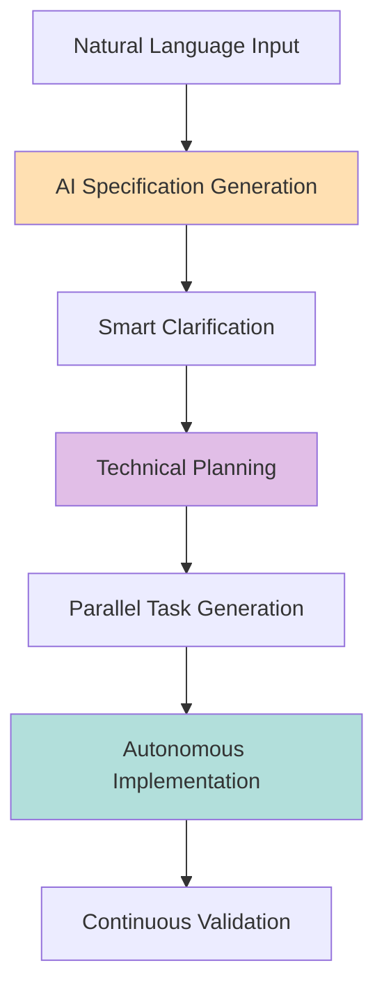

# Claude Code Marketplace

An internal marketplace for Claude Code plugins.

## 🚀 Overview

The Claude Code Marketplace is a **Skills-first** architecture that replaces traditional command-based interactions with intelligent, context-aware Skills powered by AI. No backward compatibility baggage - just add a new skill and the flow will adapt.

### Key Innovations (v3.0 - Production Ready!)

- **🧠 AI-Powered Skills**: Natural language understanding with intent detection
- **🎯 Intelligent Orchestration**: Complete workflows with `flow:orchestrate`
- **🔍 Intent Detection**: Claude suggests appropriate skills automatically
- **💾 Session Continuity**: Resume workflows exactly where you left off
- **🚀 Progressive Disclosure**: 80% reduction in context usage
- **🪝 7 Comprehensive Hooks**: Validation, formatting, status tracking
- **🤖 Restructured Subagents**: Optimized for parallel execution
- **📊 Real-time Progress**: Track workflow status throughout execution
- **✨ Auto-formatting**: Code quality without manual intervention

## ⚡ Quick Start

```bash
# Claude automatically detects your intent and suggests skills!

# Option 1: Complete automation (NEW!)
"Build a real-time collaborative document editor"
# → Claude detects intent and suggests flow:orchestrate
# → Executes complete workflow automatically

# Option 2: Traditional skill invocation
flow:init                # Initialize Flow project
flow:orchestrate         # Run complete workflow end-to-end

# Option 3: Step-by-step execution
flow:specify "Build a document editor"  # Generate spec
flow:plan                               # Create technical plan
flow:tasks                              # Generate task list
flow:implement                          # Execute implementation

# The AI adapts to your working style!
```

## 🎪 The Flow Plugin: Specification-Driven Development Reimagined

Flow is our flagship plugin that demonstrates the full power of the Skills architecture.

### AI-Powered Workflow



### Updated Architecture (v2.0)

Flow now uses a **blueprint-first, flat artifact model** with optional JIRA integration:

#### Directory Structure
```
.flow/                          # Project-level artifacts (flat peer model)
├── product-requirements.md     # Project-level PRD (WHAT to build)
├── architecture-blueprint.md   # Technical standards (HOW to build)
├── contracts/openapi.yaml      # API contracts (if API project)
└── data-models/entities.md     # Domain entities

features/001-feature-name/      # Sequential naming
├── spec.md                     # Feature spec (with JIRA frontmatter)
├── plan.md                     # Implementation plan
└── tasks.md                    # Task breakdown
```

#### Key Concepts
- **Flat Peer Model**: All `.flow/` artifacts are peers - no strict hierarchy
- **Blueprint**: Architecture and guidance
- **JIRA Integration**: Bidirectional sync - start from JIRA or local
- **User Approval**: Always asks before syncing TO JIRA or modifying `.flow/` files
- **Traceability**: JIRA ID in frontmatter, prepended to git branch

#### JIRA Integration Workflows
```bash
# Start from JIRA story
flow:specify "https://jira.company.com/browse/PROJ-123"

# Start locally, optionally create JIRA story
flow:specify "Add user authentication"  # Asks: Create JIRA story?

# Bidirectional sync
flow:sync --to-jira      # Push local changes to JIRA (asks first)
flow:sync --from-jira PROJ-123  # Pull JIRA updates (shows diff, asks)
```

### Flow Skills (Enhanced with Smart Triggers!)

| Skill | When It Triggers Automatically | Key Features |
|-------|--------------------------------|--------------|
| `flow:orchestrate` 🆕 | "Build/create complete project" | Executes entire workflow end-to-end |
| `flow:specify` | "Create/add/build a feature" | Domain detection, JIRA sync, smart defaults |
| `flow:blueprint` | "Define architecture/tech stack" | Technical standards & patterns |
| `flow:plan` | "How to implement/technical design" | Architecture decisions, technology evaluation |
| `flow:implement` | "Build/code/implement this" | Parallel execution, error recovery |
| `flow:analyze` | "Check consistency/validate" | Cross-artifact validation |
| `flow:discover` 🆕 | "Understand existing project/backlog" | JIRA analysis, codebase discovery |
| `flow:metrics` 🆕 | "Show AI vs human code metrics" | Generation analytics, ROI tracking |

**NEW**: Skills now have specific "Use when:" descriptions for better discovery!

### Example: Three Ways to Work

#### 🚀 Method 1: Full Automation (NEW!)
```bash
# Just describe what you want - Claude handles EVERYTHING
"Create a SaaS platform for team collaboration"

# Claude will:
# 1. Detect intent → Suggest flow:orchestrate
# 2. Run complete workflow automatically
# 3. Initialize → Blueprint → Specify → Plan → Tasks → Implement
# 4. Track progress with visual updates
# 5. Save state for session continuity
```

#### 🎯 Method 2: Intent-Based (NEW!)
```bash
# Natural language - Claude suggests the right skill
"I need to add user authentication"
# → Claude suggests: flow:specify

"How should I architect this?"
# → Claude suggests: flow:plan

"Check if everything is consistent"
# → Claude suggests: flow:analyze
```

#### 📝 Method 3: Direct Skills
```bash
# Traditional approach - call skills directly
flow:specify "User authentication with OAuth"
flow:plan
flow:tasks
flow:implement
```

## 🤖 Subagents: Autonomous Execution

### Flow Subagents

#### 🔍 Flow-Analyzer
Performs deep codebase analysis:
- Pattern extraction
- Architecture discovery
- Constitution inference
- Brownfield project understanding

#### ⚙️ Flow-Implementer
Executes implementation autonomously:
- Parallel task execution
- Intelligent error recovery
- Test-driven development
- Real-time progress tracking

#### 🔬 Flow-Researcher
Conducts technical research:
- Best practices discovery
- Library evaluation
- Decision documentation
- Risk assessment

### Subagent Execution

```javascript
// Subagents work in parallel for maximum efficiency
await Promise.all([
  invokeAgent('flow-researcher', { topic: 'real-time-frameworks' }),
  invokeAgent('flow-analyzer', { scope: 'existing-codebase' }),
  invokeAgent('flow-implementer', { tasks: taskList, parallel: true })
]);
```

## 🪝 Hooks: Comprehensive Automation (7 Hooks!)

### NEW Hook System Features (8 Hooks!)

| Hook | Purpose | When It Runs |
|------|---------|--------------|
| **detect-intent.js** | Suggests appropriate Flow skills | On every user prompt |
| **validate-prerequisites.js** | Ensures workflow requirements | Before skill execution |
| **format-code.js** | Auto-formats all code | After file modifications |
| **update-workflow-status.js** | Tracks progress | After each skill |
| **track-metrics.js** 🆕 | Tracks AI vs human code metrics | After file operations |
| **save-session.js** | Saves workflow state | At session end |
| **restore-session.js** | Restores previous state | At session start |
| **aggregate-results.js** | Combines parallel results | After sub-agents |

### Example: Intent Detection in Action
```bash
User: "I want to build a new feature"
System: 🎯 Detected intent: flow:specify
        Consider using: flow:specify

User: "Check if everything looks good"
System: 🎯 Detected intent: flow:analyze
        Consider using: flow:analyze
```

### Example: Session Continuity
```bash
# Day 1
flow:specify "E-commerce platform"
flow:plan
# [User exits]

# Day 2
# [User returns]
System: 🔄 Session Restored
        Last session: 18 hours ago
        Feature: 001-ecommerce
        Tasks: 5/20 complete (25%)

        📝 Suggestions:
        • Continue working on: 001-ecommerce
        • Next workflow step: flow:tasks
```

## 🧠 AI Configuration

### Intelligence Levels

```json
{
  "ai": {
    "inferenceLevel": "aggressive",  // How much to infer
    "autoResearch": true,            // Research best practices
    "parallelAgents": 5,             // Concurrent subagents
    "domainDetection": true,         // Auto-detect project type
    "smartDefaults": true            // Apply intelligent defaults
  }
}
```

### Supported Domains

Flow automatically detects and optimizes for:

- **E-commerce**: Payment, cart, inventory patterns
- **SaaS**: Multi-tenancy, subscriptions, billing
- **Real-time**: WebSockets, SSE, live updates
- **API Platforms**: Versioning, rate limiting, OpenAPI
- **Analytics**: Dashboards, metrics, visualizations
- **Fintech**: Transactions, compliance, security

## 📊 Parallel Execution

### Task Parallelization

```
Executing User Story 1 (P1)
============================
⚡ Running 5 tasks in parallel:

[T012] Creating User model...         ███░░ 60%
[T013] Creating Auth service...       ██░░░ 40%
[T014] Setting up database...         ████░ 80%
[T015] Creating API endpoints...      █░░░░ 20%
[T016] Writing tests...               ███░░ 60%

Completed: 9/20 tasks
Time saved: 67% vs sequential execution
```

## 🎯 Workflow Personas

### 1. Rapid Prototyper
```bash
flow:specify "Quick POC for ML recommendation engine" --inference=aggressive
# AI assumes all defaults, no questions asked
```

### 2. Enterprise Developer
```bash
flow:init --integrations jira,confluence
flow:constitution  # Set team standards
flow:specify "Payment processing system with PCI compliance"
# Full rigor, audit trail, compliance checks
```

### 3. Solo Founder
```bash
flow:specify "Complete SaaS platform for project management"
# AI handles everything, asks minimal questions
```

## 🔮 Advanced Features

### Research-Driven Development

The flow-researcher subagent automatically:
- Evaluates technology alternatives
- Documents decisions in ADR format
- Assesses risks and trade-offs
- Provides migration paths

### Brownfield Intelligence

For existing projects:
- Analyzes current codebase
- Extracts patterns and conventions
- Infers constitution
- Maintains consistency

### Error Recovery

Intelligent error handling:
- Automatic retry with backoff
- Alternative implementation strategies
- Partial success continuation
- Rollback on critical failures

## 📈 Performance Metrics

### Efficiency Gains

| Metric | Traditional | With Flow | Improvement |
|--------|------------|-----------|-------------|
| Spec Creation | 2-4 hours | 5 minutes | 24-48x |
| Planning | 1-2 days | 15 minutes | 96-192x |
| Implementation | 1-2 weeks | 2-4 hours | 60-120x |
| Error Recovery | Manual | Automatic | ∞ |

## 🛠️ Creating Your Own Plugin

### Plugin Structure

```
my-plugin/
├── plugin.json           # Plugin manifest
├── skills/               # AI-powered skills
│   └── my-skill.skill.md
├── agents/               # Autonomous agents
│   └── my-agent.agent.md
└── hooks/                # Event handlers
    └── my-hook.js
```

### Skill Definition

```yaml
---
name: my-plugin:generate
aiEnhanced: true
subagents: [my-researcher, my-implementer]
---

# Skill implementation with AI features
```

## 🚦 Roadmap

### Immediate (Now)
- ✅ Skills architecture
- ✅ Subagents system
- ✅ Hooks framework
- ✅ Flow plugin

### Next (Q1 2025)
- [ ] Visual progress dashboard
- [ ] Multi-language support
- [ ] Cloud execution
- [ ] Plugin marketplace UI

### Future (2025+)
- [ ] AI plugin generation
- [ ] Cross-plugin orchestration
- [ ] Distributed execution
- [ ] Self-improving agents

## 💡 Philosophy

> "Why write code when AI can write it better? Why manage tasks when agents can execute them autonomously? Why repeat patterns when systems can learn and apply them?"

The Claude Code Marketplace represents a paradigm shift from imperative commands to declarative intentions. You describe what you want; our AI figures out how to build it.

## 🤝 Contributing

We welcome contributions that push the boundaries of what's possible:

1. **New Plugins**: Create domain-specific workflows
2. **Subagents**: Build specialized autonomous agents
3. **Skills**: Design AI-enhanced interactions
4. **Hooks**: Add intelligent automation

## 📚 Complete Documentation

### 🚀 Getting Started
- **[Quick Start Guide](QUICKSTART.md)** - Get building in 60 seconds!
- **[Flow Plugin Documentation](plugins/flow/README.md)** - Complete Flow reference
- **[Real-World Examples](plugins/flow/EXAMPLES.md)** - 10 complete project examples
- **[Improvements & Features](plugins/flow/IMPROVEMENTS.md)** - What's new in v3.0

### 📖 Reference Guides
- **[CLAUDE.md](CLAUDE.md)** - Project configuration and workflows
- [Skills Development Guide](docs/skills-guide.md) *(coming soon)*
- [Subagent Architecture](docs/subagents.md) *(coming soon)*
- [Hook System](docs/hooks.md) *(coming soon)*

## 🎉 Get Started Now!

### Fastest Start (30 seconds)
```bash
# Just type what you want to build:
"Build a [your idea here]"
# Claude handles EVERYTHING automatically!
```

### Traditional Start
```bash
flow:orchestrate  # Complete automation
# OR
flow:init && flow:specify "Your idea here"  # Step by step
```

### 📖 Essential Reading
1. **[Quick Start Guide](QUICKSTART.md)** - Start here! 60-second guide
2. **[Flow Documentation](plugins/flow/README.md)** - Complete reference
3. **[Examples](plugins/flow/EXAMPLES.md)** - Learn from 10 real projects

### 🆕 What's New in v3.1
- **Intent Detection**: Claude understands natural language
- **Workflow Orchestration**: Complete automation with one command
- **JIRA Discovery**: Seamless brownfield onboarding with backlog analysis
- **Metrics Tracking**: AI vs human code analytics and ROI tracking
- **Session Management**: Never lose your work
- **8 Smart Hooks**: Validation, formatting, metrics, and progress tracking
- **80% Less Context**: Progressive disclosure for efficiency
- **12 Flow Skills**: Complete lifecycle coverage from discovery to metrics

Welcome to the age of AI-driven development. Let's build something amazing together!

---

**Claude Code Marketplace** - Where human creativity meets AI capability.