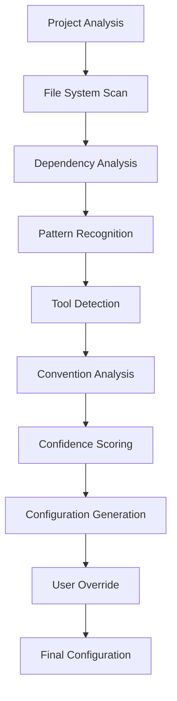

# Spec Auto-Detection Specification

## Overview

The Spec auto-detection system intelligently analyzes project structure, dependencies, and patterns to provide optimal default configuration without user intervention. This document specifies the detection algorithms, confidence scoring, and override mechanisms.

## Detection Pipeline



## Core Detection Modules

### 1. Project Type Detection

#### Algorithm

```python
def detect_project_type(root_path):
    """
    Detect project type based on file patterns and structure
    Returns: (type, confidence_score)
    """

    indicators = {
        'application': {
            'patterns': [
                'src/main.*',           # Java/Kotlin apps
                'src/app.*',            # Angular apps
                'src/App.*',            # React apps
                'app.py',               # Python apps
                'main.go',              # Go apps
                'src/main.rs',          # Rust apps
                'Package.swift',        # Swift apps
            ],
            'directories': ['src/app', 'src/pages', 'src/views', 'src/components'],
            'files': ['index.html', 'index.js', 'main.py', 'app.config.*'],
            'weight': 1.0
        },
        'library': {
            'patterns': [
                'src/lib.*',
                'src/index.ts',
                'lib/*',
                '__init__.py',
                'src/lib.rs',
            ],
            'directories': ['src/lib', 'lib', 'src'],
            'files': ['index.d.ts', 'setup.py', 'Cargo.toml'],
            'not_files': ['main.*', 'app.*', 'server.*'],
            'weight': 0.9
        },
        'service': {
            'patterns': [
                'server.*',
                'api/*',
                'src/api/*',
                'service.py',
                'main.go',
                'src/server/*',
            ],
            'directories': ['api', 'src/api', 'services', 'endpoints'],
            'files': ['Dockerfile', 'docker-compose.yml', 'openapi.yaml'],
            'config_files': ['nginx.conf', 'apache.conf'],
            'weight': 0.95
        },
        'monorepo': {
            'patterns': [
                'packages/*',
                'apps/*',
                'services/*',
                'libs/*',
            ],
            'directories': ['packages', 'apps', 'workspaces', 'projects'],
            'files': ['lerna.json', 'rush.json', 'pnpm-workspace.yaml', 'nx.json'],
            'weight': 1.0
        },
        'plugin': {
            'patterns': [
                'plugin.json',
                'manifest.json',
                '.claude/*',
                'extension.js',
            ],
            'directories': ['.claude', 'src/extension'],
            'files': ['plugin.json', 'manifest.json', 'package.json'],
            'package_json_fields': ['main', 'exports', 'bin'],
            'weight': 0.85
        },
        'framework': {
            'patterns': [
                'framework/*',
                'core/*',
                'src/core/*',
            ],
            'directories': ['core', 'framework', 'kernel', 'runtime'],
            'files': ['framework.json', 'core.js'],
            'weight': 0.8
        }
    }

    scores = {}
    for project_type, rules in indicators.items():
        score = calculate_match_score(root_path, rules)
        scores[project_type] = score * rules['weight']

    # Get highest scoring type
    best_type = max(scores, key=scores.get)
    confidence = scores[best_type]

    # Confidence thresholds
    if confidence < 0.3:
        return ('unknown', 0.0)
    elif confidence < 0.6:
        return (best_type, confidence)
    else:
        return (best_type, min(confidence, 0.95))
```

#### Detection Rules

| Project Type | Key Indicators | Confidence Weight |
|--------------|----------------|-------------------|
| **Application** | `index.html`, `App.*`, `main.*`, UI components | 1.0 |
| **Library** | `lib/`, `index.d.ts`, no main entry, exports | 0.9 |
| **Service** | `api/`, `server.*`, Dockerfile, routes | 0.95 |
| **Monorepo** | `packages/`, `lerna.json`, workspaces | 1.0 |
| **Plugin** | `.claude/`, `manifest.json`, exports | 0.85 |
| **Framework** | `core/`, abstract classes, providers | 0.8 |

### 2. Language & Framework Detection

#### Language Detection

```python
def detect_language(root_path):
    """
    Detect primary programming language
    Returns: (language, confidence, version)
    """

    language_indicators = {
        'typescript': {
            'files': ['tsconfig.json', '*.ts', '*.tsx'],
            'priority': 1,  # Highest priority
        },
        'javascript': {
            'files': ['package.json', '*.js', '*.jsx'],
            'priority': 2,
        },
        'python': {
            'files': ['requirements.txt', 'Pipfile', '*.py', 'pyproject.toml'],
            'priority': 3,
        },
        'java': {
            'files': ['pom.xml', 'build.gradle', '*.java', 'gradle.build'],
            'priority': 3,
        },
        'go': {
            'files': ['go.mod', 'go.sum', '*.go'],
            'priority': 3,
        },
        'rust': {
            'files': ['Cargo.toml', 'Cargo.lock', '*.rs'],
            'priority': 3,
        },
        'ruby': {
            'files': ['Gemfile', 'Gemfile.lock', '*.rb'],
            'priority': 4,
        },
        'csharp': {
            'files': ['*.csproj', '*.sln', '*.cs'],
            'priority': 3,
        },
        'swift': {
            'files': ['Package.swift', '*.swift', '*.xcodeproj'],
            'priority': 3,
        },
        'kotlin': {
            'files': ['build.gradle.kts', '*.kt', '*.kts'],
            'priority': 3,
        }
    }

    # Count files by extension
    file_counts = count_files_by_extension(root_path)

    # Calculate scores
    scores = {}
    for lang, indicators in language_indicators.items():
        score = 0
        for pattern in indicators['files']:
            score += file_counts.get(pattern, 0) / indicators['priority']
        scores[lang] = score

    # Detect version
    primary_lang = max(scores, key=scores.get)
    version = detect_language_version(primary_lang, root_path)
    confidence = min(scores[primary_lang] / sum(scores.values()), 0.99)

    return (primary_lang, confidence, version)
```

#### Framework Detection

```python
def detect_framework(root_path, language):
    """
    Detect framework based on language and project files
    Returns: (framework, confidence, version)
    """

    framework_detectors = {
        'typescript': {
            'react': ['package.json:react', 'src/App.tsx', 'pages/', 'next.config.js'],
            'angular': ['angular.json', '@angular/core', 'app.module.ts'],
            'vue': ['package.json:vue', 'vue.config.js', 'App.vue'],
            'nestjs': ['@nestjs/core', 'main.ts:NestFactory'],
            'express': ['package.json:express', 'app.js:express()'],
        },
        'javascript': {
            'react': ['package.json:react', 'src/App.js'],
            'vue': ['package.json:vue', 'vue.config.js'],
            'express': ['package.json:express', 'server.js'],
            'nextjs': ['next.config.js', 'pages/'],
            'svelte': ['package.json:svelte', 'rollup.config.js'],
        },
        'python': {
            'django': ['manage.py', 'settings.py', 'requirements.txt:django'],
            'flask': ['requirements.txt:flask', 'app.py:Flask'],
            'fastapi': ['requirements.txt:fastapi', 'main.py:FastAPI'],
            'pytest': ['pytest.ini', 'conftest.py'],
        },
        'java': {
            'spring': ['pom.xml:spring', 'application.properties', '@SpringBootApplication'],
            'quarkus': ['pom.xml:quarkus', 'application.properties'],
            'micronaut': ['pom.xml:micronaut', 'application.yml'],
        },
        'go': {
            'gin': ['go.mod:gin', 'gin.Engine'],
            'echo': ['go.mod:echo', 'echo.New()'],
            'fiber': ['go.mod:fiber', 'fiber.New()'],
        }
    }

    detectors = framework_detectors.get(language, {})
    scores = {}

    for framework, patterns in detectors.items():
        score = 0
        for pattern in patterns:
            if check_pattern(root_path, pattern):
                score += 1
        scores[framework] = score / len(patterns) if patterns else 0

    if not scores:
        return (None, 0.0, None)

    best_framework = max(scores, key=scores.get)
    confidence = scores[best_framework]
    version = detect_framework_version(best_framework, root_path)

    return (best_framework, confidence, version)
```

### 3. Tool & Integration Detection

#### Version Control Detection

```python
def detect_vcs(root_path):
    """
    Detect version control system
    Returns: VCSConfig
    """

    vcs_indicators = {
        'git': {
            'files': ['.git/', '.gitignore'],
            'config': '.git/config',
            'detect_remote': True,
        },
        'mercurial': {
            'files': ['.hg/', '.hgignore'],
            'config': '.hg/hgrc',
        },
        'svn': {
            'files': ['.svn/'],
            'config': '.svn/config',
        }
    }

    for vcs, indicators in vcs_indicators.items():
        if all(exists(join(root_path, f)) for f in indicators['files']):
            config = parse_vcs_config(indicators['config'])

            if vcs == 'git' and indicators['detect_remote']:
                remote = detect_git_remote(root_path)
                provider = detect_git_provider(remote)  # GitHub, GitLab, Bitbucket

                return VCSConfig(
                    type=vcs,
                    provider=provider,
                    remote=remote,
                    branch_pattern=detect_branch_pattern(root_path)
                )

    return None
```

#### CI/CD Detection

```python
def detect_cicd(root_path):
    """
    Detect CI/CD configuration
    Returns: List[CICDConfig]
    """

    cicd_files = {
        'github_actions': '.github/workflows/*.yml',
        'gitlab_ci': '.gitlab-ci.yml',
        'jenkins': 'Jenkinsfile',
        'circleci': '.circleci/config.yml',
        'travis': '.travis.yml',
        'azure_pipelines': 'azure-pipelines.yml',
        'bitbucket': 'bitbucket-pipelines.yml',
        'teamcity': '.teamcity/settings.kts',
    }

    detected = []
    for system, pattern in cicd_files.items():
        if glob(join(root_path, pattern)):
            config = parse_cicd_config(system, pattern)
            detected.append(CICDConfig(
                system=system,
                triggers=config.get('triggers', []),
                stages=config.get('stages', []),
                artifacts=config.get('artifacts', [])
            ))

    return detected
```

#### Package Manager Detection

```python
def detect_package_manager(root_path, language):
    """
    Detect package manager for the project
    Returns: PackageManagerConfig
    """

    package_managers = {
        'javascript': [
            ('pnpm', ['pnpm-lock.yaml', 'pnpm-workspace.yaml']),
            ('yarn', ['yarn.lock', '.yarnrc']),
            ('npm', ['package-lock.json', 'npm-shrinkwrap.json']),
        ],
        'python': [
            ('poetry', ['poetry.lock', 'pyproject.toml']),
            ('pipenv', ['Pipfile.lock', 'Pipfile']),
            ('pip', ['requirements.txt', 'requirements/*.txt']),
            ('conda', ['environment.yml', 'conda.yml']),
        ],
        'java': [
            ('maven', ['pom.xml']),
            ('gradle', ['build.gradle', 'gradle.build', 'build.gradle.kts']),
            ('ant', ['build.xml']),
        ],
        'rust': [
            ('cargo', ['Cargo.toml', 'Cargo.lock']),
        ],
        'go': [
            ('go_modules', ['go.mod', 'go.sum']),
            ('dep', ['Gopkg.toml', 'Gopkg.lock']),
        ],
    }

    managers = package_managers.get(language, [])
    for manager, files in managers:
        if any(exists(join(root_path, f)) for f in files):
            return PackageManagerConfig(
                type=manager,
                lock_file=files[0] if exists(join(root_path, files[0])) else None,
                workspaces=detect_workspaces(root_path, manager)
            )

    return None
```

### 4. Convention & Pattern Detection

#### Naming Convention Detection

```python
def detect_naming_conventions(root_path):
    """
    Detect naming conventions used in the project
    Returns: NamingConventions
    """

    # Analyze file names
    file_patterns = analyze_file_naming(root_path)

    conventions = {
        'files': detect_case_style(file_patterns['files']),  # kebab, camel, pascal, snake
        'directories': detect_case_style(file_patterns['dirs']),
        'components': detect_component_naming(root_path),
        'tests': detect_test_naming(root_path),
        'features': detect_feature_naming(root_path),
    }

    return NamingConventions(**conventions)
```

#### Testing Framework Detection

```python
def detect_testing_framework(root_path, language):
    """
    Detect testing frameworks and patterns
    Returns: TestingConfig
    """

    testing_patterns = {
        'javascript': {
            'jest': ['jest.config.js', 'package.json:jest', '*.test.js', '*.spec.js'],
            'mocha': ['mocha.opts', '.mocharc.*', 'package.json:mocha'],
            'cypress': ['cypress.json', 'cypress.config.js', 'cypress/'],
            'playwright': ['playwright.config.js', 'package.json:playwright'],
            'vitest': ['vitest.config.js', 'package.json:vitest'],
        },
        'python': {
            'pytest': ['pytest.ini', 'conftest.py', 'test_*.py', '*_test.py'],
            'unittest': ['test*.py', 'tests.py'],
            'nose': ['setup.cfg:nose', '.noserc'],
        },
        'java': {
            'junit': ['pom.xml:junit', '*Test.java', 'Test*.java'],
            'testng': ['testng.xml', 'pom.xml:testng'],
            'spock': ['*Spec.groovy', 'build.gradle:spock'],
        }
    }

    frameworks = testing_patterns.get(language, {})
    detected = []

    for framework, patterns in frameworks.items():
        score = 0
        for pattern in patterns:
            if check_pattern(root_path, pattern):
                score += 1

        if score > 0:
            detected.append({
                'framework': framework,
                'confidence': score / len(patterns),
                'pattern': detect_test_pattern(root_path, framework)
            })

    # Sort by confidence
    detected.sort(key=lambda x: x['confidence'], reverse=True)

    if detected:
        primary = detected[0]
        return TestingConfig(
            framework=primary['framework'],
            pattern=primary['pattern'],
            coverage_enabled=detect_coverage_tools(root_path),
            test_directory=detect_test_directory(root_path)
        )

    return None
```

### 5. Project Structure Analysis

#### Directory Structure Detection

```python
def detect_directory_structure(root_path):
    """
    Analyze and classify directory structure
    Returns: DirectoryStructure
    """

    common_structures = {
        'feature_based': {
            'patterns': ['features/*', 'modules/*', 'domains/*'],
            'depth': 2,
            'organization': 'by_feature'
        },
        'layer_based': {
            'patterns': ['controllers/', 'services/', 'models/', 'views/'],
            'depth': 1,
            'organization': 'by_layer'
        },
        'hexagonal': {
            'patterns': ['domain/', 'application/', 'infrastructure/', 'adapters/'],
            'depth': 2,
            'organization': 'hexagonal'
        },
        'clean': {
            'patterns': ['entities/', 'usecases/', 'interfaces/', 'frameworks/'],
            'depth': 2,
            'organization': 'clean_architecture'
        },
        'mvc': {
            'patterns': ['models/', 'views/', 'controllers/'],
            'depth': 1,
            'organization': 'mvc'
        },
        'atomic': {
            'patterns': ['atoms/', 'molecules/', 'organisms/', 'templates/', 'pages/'],
            'depth': 1,
            'organization': 'atomic_design'
        }
    }

    scores = {}
    for structure_type, config in common_structures.items():
        score = 0
        for pattern in config['patterns']:
            if glob(join(root_path, pattern)):
                score += 1
        scores[structure_type] = score / len(config['patterns'])

    best_match = max(scores, key=scores.get) if scores else 'unknown'

    return DirectoryStructure(
        type=best_match,
        confidence=scores.get(best_match, 0),
        custom_paths=detect_custom_paths(root_path),
        depth=calculate_average_depth(root_path)
    )
```

## Confidence Scoring System

### Score Calculation

```python
def calculate_confidence_score(detections):
    """
    Calculate overall confidence score for auto-detection
    Returns: float (0.0 to 1.0)
    """

    weights = {
        'project_type': 0.25,
        'language': 0.20,
        'framework': 0.15,
        'vcs': 0.10,
        'package_manager': 0.10,
        'structure': 0.10,
        'testing': 0.05,
        'cicd': 0.05
    }

    total_score = 0
    total_weight = 0

    for category, weight in weights.items():
        if category in detections and detections[category]:
            confidence = detections[category].get('confidence', 0)
            total_score += confidence * weight
            total_weight += weight

    # Normalize score
    if total_weight > 0:
        final_score = total_score / total_weight
    else:
        final_score = 0.0

    # Apply confidence bands
    if final_score >= 0.9:
        return ('high', final_score)
    elif final_score >= 0.7:
        return ('medium', final_score)
    elif final_score >= 0.5:
        return ('low', final_score)
    else:
        return ('uncertain', final_score)
```

### Confidence Thresholds

| Confidence Level | Score Range | Auto-Apply | User Prompt |
|-----------------|-------------|------------|-------------|
| **High** | 0.9 - 1.0 | ✅ Yes | Optional confirmation |
| **Medium** | 0.7 - 0.89 | ✅ Yes | Show detected values |
| **Low** | 0.5 - 0.69 | ⚠️ Partial | Request confirmation |
| **Uncertain** | < 0.5 | ❌ No | Manual configuration |

## Configuration Generation

### Template Selection

```python
def select_optimal_template(detections):
    """
    Select best configuration template based on detections
    Returns: ConfigTemplate
    """

    template_matrix = {
        ('application', 'typescript', 'react'): 'react-app',
        ('application', 'typescript', 'angular'): 'angular-app',
        ('application', 'python', 'django'): 'django-app',
        ('service', 'go', None): 'go-microservice',
        ('service', 'python', 'fastapi'): 'fastapi-service',
        ('library', 'typescript', None): 'ts-library',
        ('monorepo', None, None): 'monorepo',
    }

    key = (
        detections.get('project_type', {}).get('value'),
        detections.get('language', {}).get('value'),
        detections.get('framework', {}).get('value')
    )

    # Find best match with fallbacks
    template = template_matrix.get(key)
    if not template:
        # Try without framework
        key = (key[0], key[1], None)
        template = template_matrix.get(key)
    if not template:
        # Try without language
        key = (key[0], None, None)
        template = template_matrix.get(key)
    if not template:
        template = 'standard'

    return load_template(template)
```

### Default Value Generation

```python
def generate_defaults(detections, template):
    """
    Generate configuration defaults from detections
    Returns: dict
    """

    config = {
        'version': '1.0.0',
        'project': {},
        'paths': {},
        'workflow': {},
        'integrations': {},
    }

    # Project section
    if 'project_type' in detections:
        config['project']['type'] = detections['project_type']['value']

    if 'language' in detections:
        config['project']['language'] = detections['language']['value']
        config['project']['language_version'] = detections['language'].get('version')

    if 'framework' in detections:
        config['project']['framework'] = detections['framework']['value']
        config['project']['framework_version'] = detections['framework'].get('version')

    # Paths section
    if 'structure' in detections:
        structure = detections['structure']
        if structure['type'] == 'feature_based':
            config['paths']['features'] = 'features'
        elif structure['type'] == 'monorepo':
            config['paths']['features'] = 'specs'

    # Workflow section
    if 'testing' in detections:
        config['workflow']['phases'] = {
            'build': {
                'require_tests': True
            }
        }
        config['workflow']['skills'] = {
            'implement': {
                'test_first': detections['testing'].get('tdd_pattern', False)
            }
        }

    # Integrations
    if 'vcs' in detections:
        vcs = detections['vcs']
        if vcs['type'] == 'git':
            config['integrations']['git'] = {
                'enabled': True,
                'auto_branch': True,
                'branch_naming': vcs.get('branch_pattern', 'feature/{id}-{name}')
            }

            if vcs.get('provider') == 'github':
                config['integrations']['github'] = {
                    'enabled': True,
                    'create_prs': True
                }

    if 'cicd' in detections:
        for ci_system in detections['cicd']:
            if ci_system['system'] == 'github_actions':
                config['integrations']['github']['create_prs'] = True

    return deep_merge(template, config)
```

## Override Mechanisms

### User Override Interface

```python
def present_detection_results(detections, config):
    """
    Present auto-detected configuration for user review
    Returns: FinalConfig
    """

    print("🔍 Auto-Detection Results\n")
    print("=" * 50)

    for category, detection in detections.items():
        confidence_icon = get_confidence_icon(detection['confidence'])
        print(f"{confidence_icon} {category.title()}: {detection['value']}")
        print(f"   Confidence: {detection['confidence']:.1%}")

        if detection.get('alternatives'):
            print(f"   Alternatives: {', '.join(detection['alternatives'])}")

    print("\n📋 Generated Configuration:\n")
    print(yaml.dump(config, default_flow_style=False))

    response = prompt("""
    Options:
    1. Accept all detected values
    2. Modify specific values
    3. Use minimal configuration
    4. Start with blank configuration

    Choice (1-4):
    """)

    if response == '2':
        config = interactive_modification(config, detections)
    elif response == '3':
        config = minimal_config()
    elif response == '4':
        config = blank_config()

    return config
```

### Override Priority

```yaml
# Override precedence (highest to lowest)
1. Explicit user overrides      # User explicitly sets value
2. Environment variables        # SPEC_* env vars
3. Project config file          # .spec/config.yaml
4. Auto-detected values         # This system
5. Template defaults            # From selected template
6. Built-in defaults            # Hardcoded fallbacks
```

## Detection Caching

### Cache Strategy

```python
def cache_detection_results(root_path, detections):
    """
    Cache detection results to avoid re-scanning
    """

    cache_file = join(root_path, '.spec/.cache/auto-detection.json')

    cache_data = {
        'version': DETECTION_VERSION,
        'timestamp': time.time(),
        'checksum': calculate_project_checksum(root_path),
        'detections': detections,
        'config': generate_defaults(detections)
    }

    with open(cache_file, 'w') as f:
        json.dump(cache_data, f, indent=2)

def is_cache_valid(root_path):
    """
    Check if cached detection is still valid
    """

    cache_file = join(root_path, '.spec/.cache/auto-detection.json')

    if not exists(cache_file):
        return False

    with open(cache_file) as f:
        cache_data = json.load(f)

    # Check version
    if cache_data['version'] != DETECTION_VERSION:
        return False

    # Check age (max 7 days)
    age = time.time() - cache_data['timestamp']
    if age > 7 * 24 * 3600:
        return False

    # Check project changes
    current_checksum = calculate_project_checksum(root_path)
    if current_checksum != cache_data['checksum']:
        return False

    return True
```

## Performance Optimization

### Parallel Detection

```python
async def detect_all_parallel(root_path):
    """
    Run all detections in parallel for performance
    """

    tasks = [
        detect_project_type_async(root_path),
        detect_language_async(root_path),
        detect_framework_async(root_path),
        detect_vcs_async(root_path),
        detect_package_manager_async(root_path),
        detect_structure_async(root_path),
        detect_testing_async(root_path),
        detect_cicd_async(root_path),
    ]

    results = await asyncio.gather(*tasks)

    return {
        'project_type': results[0],
        'language': results[1],
        'framework': results[2],
        'vcs': results[3],
        'package_manager': results[4],
        'structure': results[5],
        'testing': results[6],
        'cicd': results[7],
    }
```

### Early Termination

```python
def detect_with_early_termination(root_path):
    """
    Stop detection if confidence is low
    """

    # Quick checks first
    if not is_valid_project_root(root_path):
        return None

    # Detect language first (fast)
    language = detect_language(root_path)
    if language['confidence'] < 0.3:
        return request_manual_config()

    # Continue with other detections
    # ...
```

## Examples

### React Application Detection

```yaml
# Detected from:
# - package.json with "react" dependency
# - src/App.jsx file
# - public/index.html
# - .gitignore with node_modules

Detections:
  project_type: application (95% confidence)
  language: typescript (88% confidence)
  framework: react (92% confidence)
  package_manager: pnpm (100% confidence)
  testing: jest (85% confidence)
  structure: feature_based (78% confidence)

Generated Config:
  version: "1.0.0"
  project:
    type: application
    language: typescript
    framework: react
  workflow:
    skills:
      generate:
        template: react-component
      implement:
        test_first: true
  integrations:
    github:
      enabled: true
```

### Python Microservice Detection

```yaml
# Detected from:
# - requirements.txt with fastapi
# - Dockerfile present
# - src/api/ directory structure
# - pytest.ini

Detections:
  project_type: service (90% confidence)
  language: python (95% confidence)
  framework: fastapi (88% confidence)
  package_manager: poetry (85% confidence)
  testing: pytest (92% confidence)
  cicd: github_actions (100% confidence)

Generated Config:
  version: "1.0.0"
  project:
    type: service
    language: python
    framework: fastapi
  workflow:
    phases:
      design:
        require_adr: true
    skills:
      plan:
        research_mode: always
```

### Monorepo Detection

```yaml
# Detected from:
# - packages/ directory
# - pnpm-workspace.yaml
# - Multiple package.json files
# - Shared tsconfig.json

Detections:
  project_type: monorepo (98% confidence)
  language: mixed (typescript, javascript)
  package_manager: pnpm (100% confidence)
  structure: monorepo (95% confidence)

Generated Config:
  version: "1.0.0"
  project:
    type: monorepo
  paths:
    features: specs
  workflow:
    phases:
      build:
        max_parallel_tasks: 8
  packages:
    - path: packages/ui
      config:
        project:
          type: library
    - path: services/api
      config:
        project:
          type: service
```

## Edge Cases & Fallbacks

### Unknown Project Type

```python
def handle_unknown_project():
    """
    When project type cannot be determined
    """

    # Provide guided selection
    print("Unable to detect project type automatically.")
    print("\nPlease select your project type:")
    print("1. Web Application (React, Angular, Vue)")
    print("2. API Service (REST, GraphQL, gRPC)")
    print("3. Library/Package (npm, PyPI, crates.io)")
    print("4. Monorepo (multiple packages)")
    print("5. Plugin/Extension")
    print("6. Other")

    choice = input("Select (1-6): ")
    # Map choice to configuration...
```

### Mixed Languages

```python
def handle_mixed_languages(languages):
    """
    When multiple languages detected
    """

    # Sort by prevalence
    sorted_langs = sorted(
        languages.items(),
        key=lambda x: x[1]['file_count'],
        reverse=True
    )

    primary = sorted_langs[0][0]
    secondary = [lang for lang, _ in sorted_langs[1:3]]

    return {
        'primary': primary,
        'secondary': secondary,
        'config': {
            'project': {
                'language': primary,
                'additional_languages': secondary
            }
        }
    }
```

### No Version Control

```python
def handle_no_vcs():
    """
    When no VCS detected
    """

    print("⚠️ No version control system detected.")
    response = prompt("Initialize git repository? (y/n): ")

    if response.lower() == 'y':
        subprocess.run(['git', 'init'])
        subprocess.run(['git', 'add', '.'])
        subprocess.run(['git', 'commit', '-m', 'Initial commit'])

        return {
            'git': {
                'enabled': True,
                'auto_branch': True
            }
        }

    return {}
```

---

**Version**: 1.0.0
**Last Updated**: 2024-11-02
**Status**: Draft
**Performance Target**: < 2 seconds for full detection
**Accuracy Target**: > 90% correct detection rate