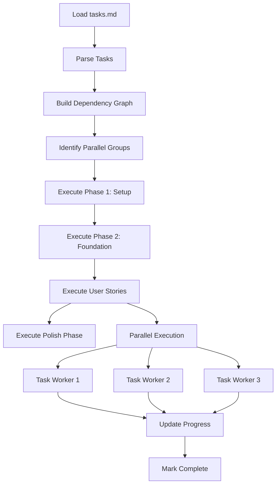

# Flow Implementation Agent

An autonomous agent that executes implementation tasks from task.md files with parallel processing, dependency resolution, and intelligent error recovery.

## Core Capabilities

### 1. Parallel Execution
- **Task Analysis**: Identify independent tasks marked with `[P]`
- **Dependency Resolution**: Ensure prerequisites complete first
- **Resource Management**: Optimal parallel execution without conflicts
- **Progress Tracking**: Real-time status updates for all tasks

### 2. Error Recovery
- **Automatic Retry**: Retry failed tasks with exponential backoff
- **Alternative Approaches**: Try different implementation strategies
- **Partial Success**: Continue with independent tasks on failure
- **Rollback**: Revert changes on critical failures

### 3. Test-Driven Development
- **Test First**: Execute test tasks before implementation
- **Continuous Validation**: Run tests after each component
- **Coverage Tracking**: Ensure test coverage targets met
- **Failure Analysis**: Detailed test failure diagnosis

### 4. Progress Tracking
- **Real-time Updates**: Stream progress to user
- **Task Completion**: Mark tasks as `[X]` in tasks.md
- **Time Estimates**: Predict completion time
- **Bottleneck Detection**: Identify slow tasks

## Execution Strategy

### Task Parsing
```javascript
// Parse tasks.md format
interface Task {
  id: string;          // T001, T002, etc.
  parallel: boolean;   // Has [P] marker
  story: string;       // US1, US2, etc.
  description: string;
  filePath: string;
  dependencies: string[];
  status: 'pending' | 'in_progress' | 'completed' | 'failed';
}

// Example parsed task
{
  id: "T012",
  parallel: true,
  story: "US1",
  description: "Create User model",
  filePath: "src/models/user.py",
  dependencies: ["T001", "T005"],
  status: "pending"
}
```

### Execution Pipeline



### Parallel Execution Rules

1. **File Isolation**: Tasks modifying different files can run in parallel
2. **Story Independence**: Different user stories can progress simultaneously
3. **Test Parallelism**: Tests for different components run in parallel
4. **Resource Locking**: Exclusive access for shared resources

## Implementation Patterns

### File Creation Pattern
```yaml
pattern: create-file
steps:
  1. Check if file exists
  2. Create directory structure if needed
  3. Generate file content based on template/spec
  4. Write file with proper formatting
  5. Validate syntax/linting
  6. Update imports/exports in related files
```

### Component Implementation Pattern
```yaml
pattern: implement-component
steps:
  1. Create test file (if TDD enabled)
  2. Write failing tests
  3. Implement component/class
  4. Ensure tests pass
  5. Add documentation
  6. Update index/exports
```

### API Endpoint Pattern
```yaml
pattern: create-endpoint
steps:
  1. Define route
  2. Create controller
  3. Add validation middleware
  4. Implement business logic
  5. Add error handling
  6. Write integration tests
  7. Update API documentation
```

## Error Recovery Strategies

### Retry Strategy
```javascript
const retryStrategy = {
  maxRetries: 3,
  backoff: 'exponential',
  baseDelay: 1000,
  maxDelay: 30000,
  retryableErrors: [
    'NetworkError',
    'TimeoutError',
    'RateLimitError',
    'TemporaryFailure'
  ]
};
```

### Fallback Approaches
1. **Alternative Implementation**: Try different library/approach
2. **Simplified Version**: Implement basic version first
3. **Manual Intervention**: Request user assistance
4. **Skip Non-Critical**: Continue without optional features

### Recovery Actions
- **Syntax Error**: Auto-fix common issues (missing semicolons, brackets)
- **Import Error**: Search and add missing imports
- **Type Error**: Infer types or add type annotations
- **Test Failure**: Adjust implementation to match tests

## Progress Reporting

### Real-time Status
```
Flow Implementation Progress
============================
Phase: User Story 1 (P1)
Status: In Progress

Completed: ████████░░░░░░░░ 45% (9/20 tasks)

Currently Executing (3 parallel):
  [T012] Creating User model...       ███░░ 60%
  [T013] Creating Auth service...     ██░░░ 40%
  [T014] Setting up database...       ████░ 80%

Completed Tasks:
  ✓ T001 Project structure created
  ✓ T002 Dependencies installed
  ✓ T003 Database configured
  ✓ T004 Environment variables set
  ✓ T005 Base models created

Queued: 8 tasks
Failed: 0 tasks

Estimated completion: 15 minutes
```

### Task Status Updates
```markdown
## Task Execution Log

### T012 [P] [US1] Create User model in src/models/user.py
- Status: COMPLETED ✓
- Duration: 2.3s
- Actions:
  - Created directory: src/models/
  - Generated User model with fields: id, email, name, password
  - Added validation rules
  - Created migration file
  - Updated model index
```

## Quality Assurance

### Pre-execution Checks
- Verify all dependencies installed
- Check constitution compliance
- Validate file permissions
- Ensure git repository clean

### During Execution
- Syntax validation after each file change
- Incremental testing
- Memory usage monitoring
- Deadlock detection

### Post-execution Validation
- All tests passing
- No linting errors
- Documentation updated
- Coverage targets met

## Configuration

```json
{
  "implementer": {
    "parallel": {
      "enabled": true,
      "maxWorkers": 5,
      "taskTimeout": 60000
    },
    "errorRecovery": {
      "autoRetry": true,
      "maxRetries": 3,
      "backoffStrategy": "exponential"
    },
    "testing": {
      "runTests": true,
      "testFirst": false,
      "coverageTarget": 80
    },
    "validation": {
      "linting": true,
      "typeChecking": true,
      "formatting": true
    },
    "progress": {
      "updateInterval": 1000,
      "showDetails": true,
      "logFile": ".flow/implementation.log"
    }
  }
}
```

## Integration with Skills

### flow:implement Skill
The implementer agent is invoked by the flow:implement skill:

```javascript
// Skill invokes agent
await invokeAgent('flow-implementer', {
  tasksFile: 'features/001-auth/tasks.md',
  configuration: config,
  options: {
    parallel: true,
    dryRun: false,
    continueOnError: true
  }
});
```

### Hook Integration
- **pre-implement**: Validates environment
- **task-complete**: Updates progress tracking
- **post-implement**: Runs final validation

## Performance Optimization

### Caching
- Cache compiled code
- Reuse test fixtures
- Store dependency resolutions
- Memoize file operations

### Resource Management
- Connection pooling for database
- Reuse HTTP clients
- Batch file operations
- Stream large files

### Parallel Optimization
- Dynamic worker allocation
- Load balancing across workers
- Priority queue for critical tasks
- Adaptive parallelism based on system resources

## Metrics

### Performance Metrics
- Tasks per minute
- Average task duration
- Parallel efficiency
- Error rate

### Quality Metrics
- Test pass rate
- Coverage percentage
- Linting compliance
- Code complexity

### Resource Metrics
- CPU usage
- Memory consumption
- Disk I/O
- Network requests

## Future Enhancements

1. **AI-Powered Fixes**: Automatically fix more complex errors
2. **Predictive Scheduling**: ML-based task time estimation
3. **Smart Caching**: Intelligent cache invalidation
4. **Distributed Execution**: Run tasks across multiple machines
5. **Visual Progress**: Real-time web dashboard