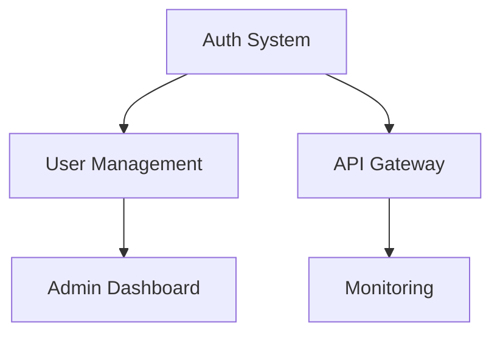

# Planned Changes Queue

**Last Updated**: {timestamp}
**Next Review**: {date}
**Planning Horizon**: 3 months

## Priority Classification

- **P1 (Critical)**: Must complete this week, blocking other work
- **P2 (High)**: Should complete this sprint, important features
- **P3 (Medium)**: Nice to have, can defer if needed
- **P4 (Low)**: Future considerations, backlog items

---

## 🔴 Priority 1 - Critical (This Week)

### Required for Current Feature
- [ ] **TASK-001**: Implement JWT refresh token rotation
  - **Context**: Security requirement for auth system
  - **Blocked By**: Nothing
  - **Effort**: 4 hours
  - **Assigned**: {developer}
  - **Due**: {date}

- [ ] **TASK-002**: Add rate limiting to authentication endpoints
  - **Context**: Prevent brute force attacks
  - **Dependencies**: Redis setup (complete)
  - **Effort**: 2 hours
  - **Assigned**: {developer}
  - **Due**: {date}

- [ ] **TASK-003**: Set up email verification flow
  - **Context**: User registration requirement
  - **Dependencies**: Email service configuration
  - **Effort**: 6 hours
  - **Assigned**: {developer}
  - **Due**: {date}

### Bug Fixes
- [ ] **BUG-001**: Fix password reset token expiration
  - **Severity**: High
  - **Reported**: {date}
  - **Effort**: 1 hour

### Technical Debt
- [ ] **DEBT-001**: Refactor user validation logic
  - **Context**: Identified during code review
  - **Impact**: Maintainability
  - **Effort**: 3 hours

---

## 🟡 Priority 2 - High (This Sprint)

### Feature Enhancements
- [ ] **FEAT-001**: Implement 2FA support
  - **User Story**: As a user, I want 2FA for extra security
  - **Dependencies**: SMS provider integration
  - **Effort**: 8 hours
  - **Value**: High

- [ ] **FEAT-002**: Add OAuth2 providers
  - **Providers**: Google, GitHub, Microsoft
  - **Dependencies**: OAuth library selection
  - **Effort**: 12 hours
  - **Value**: High

- [ ] **FEAT-003**: Audit logging for auth events
  - **Events**: Login, logout, password change, permission changes
  - **Dependencies**: Logging infrastructure
  - **Effort**: 6 hours
  - **Value**: Medium

### Infrastructure
- [ ] **INFRA-001**: Set up monitoring dashboards
  - **Metrics**: API latency, error rates, auth success
  - **Tool**: Grafana
  - **Effort**: 4 hours

- [ ] **INFRA-002**: Implement database backups
  - **Schedule**: Daily automated
  - **Retention**: 30 days
  - **Effort**: 3 hours

### Documentation
- [ ] **DOC-001**: API documentation with examples
  - **Format**: OpenAPI + Postman collection
  - **Effort**: 4 hours

---

## 🟢 Priority 3 - Medium (Next Month)

### Feature Additions
- [ ] **FEAT-004**: User profile management UI
  - **Components**: Profile edit, avatar upload, preferences
  - **Effort**: 16 hours
  - **Value**: Medium

- [ ] **FEAT-005**: Admin dashboard
  - **Features**: User management, metrics, logs
  - **Effort**: 24 hours
  - **Value**: Medium

- [ ] **FEAT-006**: Password policy configuration
  - **Options**: Complexity, expiration, history
  - **Effort**: 6 hours
  - **Value**: Low

### Performance
- [ ] **PERF-001**: Implement query caching
  - **Target**: Reduce DB load by 40%
  - **Effort**: 8 hours

- [ ] **PERF-002**: Optimize image uploads
  - **Approach**: Compression, CDN integration
  - **Effort**: 6 hours

### Testing
- [ ] **TEST-001**: Add integration test suite
  - **Coverage Target**: 80%
  - **Effort**: 12 hours

- [ ] **TEST-002**: Performance testing setup
  - **Tool**: K6 or JMeter
  - **Effort**: 8 hours

---

## 🔵 Priority 4 - Low (Backlog)

### Future Features
- [ ] Biometric authentication support
- [ ] Enterprise SSO integration (SAML)
- [ ] Advanced threat detection (ML-based)
- [ ] Multi-tenancy support
- [ ] Compliance reporting (SOC2, GDPR)
- [ ] Mobile app development
- [ ] Real-time notifications
- [ ] Data export/import tools
- [ ] API versioning strategy
- [ ] Internationalization (i18n)

### Research & Exploration
- [ ] Evaluate GraphQL migration
- [ ] Research WebAuthn implementation
- [ ] Explore serverless architecture
- [ ] Investigate blockchain for audit logs
- [ ] ML-powered anomaly detection

### Nice-to-Have
- [ ] Dark mode UI theme
- [ ] Keyboard shortcuts
- [ ] Command palette
- [ ] Activity feed
- [ ] Team collaboration features

---

## 📊 Change Metrics

### Velocity Tracking
| Week | Planned | Completed | Carry-over | Velocity |
|------|---------|-----------|------------|----------|
| W1 | 8 | 6 | 2 | 75% |
| W2 | 7 | 7 | 0 | 100% |
| W3 | 9 | 8 | 1 | 89% |
| Current | 10 | - | - | - |

### Change Categories
| Category | Count | Effort (hrs) | Priority Avg |
|----------|-------|--------------|--------------|
| Features | 15 | 120 | P2 |
| Bugs | 3 | 8 | P1 |
| Tech Debt | 5 | 20 | P2 |
| Infrastructure | 4 | 15 | P2 |
| Documentation | 3 | 10 | P3 |

---

## 🔄 Change Management

### Review Schedule
- **Daily**: P1 items in standup
- **Weekly**: P2 items in planning
- **Monthly**: P3/P4 backlog grooming
- **Quarterly**: Full backlog review

### Change Request Process
1. Submit via `/flow-change add "Description"`
2. Triage in weekly planning
3. Assign priority and effort
4. Schedule in appropriate sprint
5. Track in this document

### Escalation Path
- P1 issues → Immediate attention
- P2 issues → Sprint planning
- P3 issues → Monthly review
- P4 issues → Quarterly planning

---

## 🎯 Sprint Planning

### Current Sprint (Sprint {number})
**Dates**: {start} - {end}
**Capacity**: {hours} hours
**Committed**: {hours} hours

#### Sprint Goals
1. Complete authentication system
2. Set up monitoring
3. Document APIs

#### Sprint Backlog
| ID | Task | Priority | Effort | Status |
|----|------|----------|--------|--------|
| TASK-001 | JWT refresh | P1 | 4h | In Progress |
| TASK-002 | Rate limiting | P1 | 2h | Not Started |
| TASK-003 | Email verification | P1 | 6h | Not Started |
| FEAT-001 | 2FA support | P2 | 8h | Not Started |

### Next Sprint Planning
**Date**: {date}
**Potential Items**:
- OAuth2 integration (P2)
- Admin dashboard (P3)
- Performance optimization (P3)

---

## 📈 Forecasting

### Completion Estimates
Based on current velocity:
- **P1 Items**: Complete by {date}
- **P2 Items**: Complete by {date}
- **P3 Items**: Complete by {date}
- **Full Backlog**: ~{weeks} weeks

### Risk Assessment
| Risk | Probability | Impact | Mitigation |
|------|------------|--------|------------|
| Scope creep | High | Medium | Strict change control |
| Technical complexity | Medium | High | Spike investigations |
| Resource availability | Low | High | Cross-training |

---

## 🔗 Dependencies

### External Dependencies
- [ ] Email service provider selection
- [ ] SMS provider contract
- [ ] Security audit completion
- [ ] Legal review of terms

### Internal Dependencies


---

## 💡 Ideas Parking Lot

Items for future consideration:
- Passwordless authentication
- Social login analytics
- User behavior tracking
- A/B testing framework
- Feature flags system
- Automated security scanning
- Chaos engineering tests
- Cost optimization analysis

---

## 📝 Notes

### Recent Decisions
- Decided to prioritize security features
- Deferred UI improvements to next quarter
- Added monitoring as P2 priority

### Blockers & Issues
- Waiting on security team review
- Need clarification on compliance requirements
- Resource constraint on frontend development

### Links & References
- [Product Roadmap](./roadmap.md)
- [Technical Debt Registry](./tech-debt.md)
- [Sprint Reports](./sprints/)
- [Architecture Decisions](./DECISIONS-LOG.md)

---

## Quick Commands

```bash
# Add new change
/flow-change add "Description" --priority=P2

# Update priority
/flow-change priority TASK-001 P1

# Mark complete
/flow-change complete TASK-001

# View by priority
/flow-change list --priority=P1

# Generate sprint plan
/flow-sprint plan --capacity=60

# Review backlog
/flow-change review --older-than=30d
```