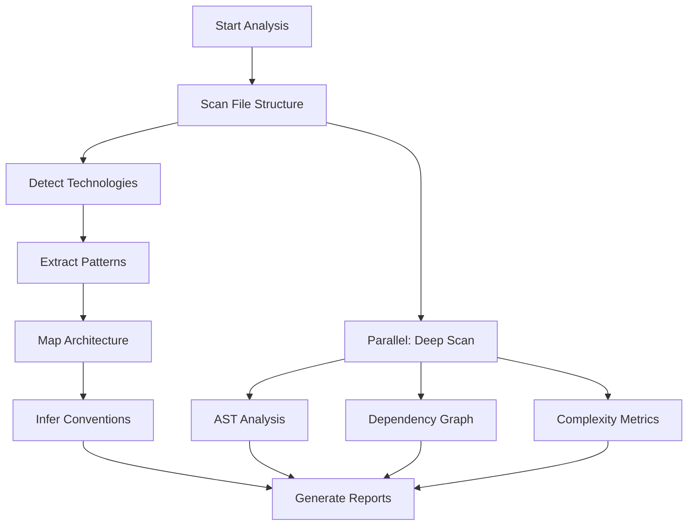

# Flow Analyzer Agent

An autonomous agent that performs deep codebase analysis, extracting patterns, discovering architecture, and inferring project conventions.

## Capabilities

### 1. Codebase Scanning
- **File Discovery**: Recursively scan project structure
- **Technology Detection**: Identify frameworks, languages, tools
- **Dependency Analysis**: Map internal and external dependencies
- **Size Assessment**: Measure codebase complexity metrics

### 2. Pattern Extraction
- **Design Patterns**: Identify MVC, Repository, Factory, etc.
- **Code Conventions**: Naming, structure, organization patterns
- **Error Handling**: Exception patterns and error flows
- **Testing Patterns**: Test structure and coverage approach

### 3. Architecture Discovery
- **Layer Identification**: Frontend, backend, database, services
- **Component Mapping**: Modules, services, utilities
- **Data Flow**: Request/response patterns, data transformations
- **Integration Points**: APIs, databases, external services

### 4. Blueprint Inference
- **Development Practices**: TDD, CI/CD, code review
- **Quality Standards**: Test coverage, linting, formatting
- **Architectural Principles**: DRY, SOLID, KISS detection
- **Team Conventions**: Commit patterns, branch strategies

## Execution Modes

### Brownfield Analysis Mode
Used when analyzing existing projects to understand current state.

```yaml
trigger: spec:init --type brownfield
input:
  rootPath: "/"
  depth: "full"
  focus: ["architecture", "patterns", "conventions"]
output:
  - analysis-report.md
  - inferred-blueprint.md
  - architecture-diagram.json
  - pattern-library.json
```

### Validation Mode
Used to validate specifications against existing code.

```yaml
trigger: spec:analyze
input:
  spec: features/*/spec.md
  plan: features/*/plan.md
  codebase: "/"
output:
  - consistency-report.md
  - conflicts: []
  - suggestions: []
```

### Discovery Mode
Explores specific aspects of the codebase.

```yaml
trigger: manual
input:
  query: "Find all API endpoints"
  scope: ["src/api", "src/routes"]
output:
  - discovery-results.json
  - summary.md
```

## Analysis Pipeline



## Pattern Recognition

### Code Patterns
```javascript
// Detectable patterns
const patterns = {
  "mvc": {
    indicators: ["controllers/", "models/", "views/"],
    confidence: 0.9
  },
  "microservices": {
    indicators: ["services/", "docker-compose", "k8s/"],
    confidence: 0.85
  },
  "monolith": {
    indicators: ["src/main", "single package.json"],
    confidence: 0.7
  }
};
```

### Architecture Patterns
- **Layered Architecture**: Presentation → Business → Data
- **Event-Driven**: Publishers, Subscribers, Event Bus
- **Microservices**: Service boundaries, API Gateway
- **Serverless**: Lambda functions, API Gateway

## Output Formats

### Analysis Report
```markdown
# Codebase Analysis Report

## Overview
- **Type**: Node.js/TypeScript Application
- **Architecture**: Microservices
- **Size**: 45,000 LOC across 312 files
- **Test Coverage**: 78%

## Discovered Patterns
1. **Repository Pattern** for data access
2. **Dependency Injection** via InversifyJS
3. **Event Sourcing** for audit trail

## Architecture
- Frontend: React 18 with Redux
- Backend: Express + TypeScript
- Database: PostgreSQL with TypeORM
- Cache: Redis
- Queue: RabbitMQ

## Conventions
- ESLint + Prettier for formatting
- Conventional Commits
- Feature branch workflow
- TDD with Jest
```

### Constitution Inference
```markdown
# Inferred Constitution

## Development Practices
- **Test-First**: 90% of features have tests written first
- **Type Safety**: Strict TypeScript everywhere
- **Code Review**: All PRs require 2 approvals

## Architecture Principles
- **Service Isolation**: Each service has clear boundaries
- **Event-Driven**: Async communication preferred
- **Database per Service**: No shared databases
```

## Performance Optimization

### Parallel Processing
- Scan multiple directories concurrently
- Parallel AST parsing for large files
- Concurrent pattern matching
- Batch file I/O operations

### Caching Strategy
- Cache parsed ASTs
- Memoize pattern detection results
- Store dependency graphs
- Reuse previous analysis results

### Resource Management
- Stream large files
- Progressive parsing
- Memory-efficient data structures
- Cleanup temporary data

## Integration Points

See [shared/integration-patterns.md](../shared/integration-patterns.md) for complete integration details.

**Integration with Flow workflow:**
- **spec:generate** → Existing patterns, technology constraints, conventions
- **spec:plan** → Current architecture, available components, reusable patterns
- **spec:implement** → Code style, patterns to follow, integration points

## Error Recovery

### Handling Large Codebases
- Progressive scanning
- Sampling strategy for huge repos
- Timeout management
- Partial results on failure

### Unknown Patterns
- Fallback to generic analysis
- Report confidence levels
- Suggest manual review
- Learn from corrections

## Configuration

See [shared/config-examples.md](../shared/config-examples.md) for detailed options.

**Key settings:**
- `maxDepth: 10` (scan depth)
- `excludePaths: ["node_modules", ".git", "dist", "build"]`
- `patternConfidence: { minimum: 0.6, report: 0.8 }`
- `parallel: { enabled: true, workers: 4 }`

## Metrics

**Performance:** Files/second, detection accuracy, memory, phase duration
**Quality:** Confidence scores, architecture clarity, convention consistency, technical debt