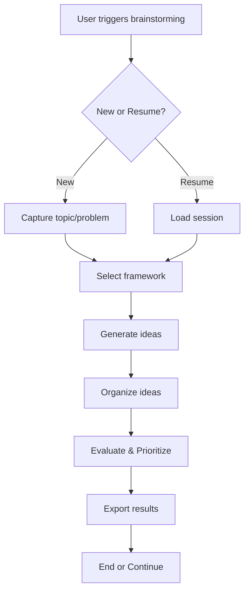

# Brainstorming Ideas Skill

A systematic ideation skill that helps users generate, organize, and prioritize ideas using proven brainstorming frameworks.

## Activation Patterns

This skill activates when users say:
- "brainstorm {topic}"
- "let's brainstorm"
- "generate ideas for {problem}"
- "help me think through {challenge}"
- "ideation session"
- "creative thinking for {subject}"
- "explore solutions for {issue}"

## What This Skill Does

1. **Initiates Brainstorming Sessions**
   - Captures topic/problem statement
   - Creates persistent session for interruption recovery
   - Tracks progress and time spent

2. **Offers Framework Selection**
   - Mind Mapping - hierarchical idea expansion
   - SCAMPER - systematic modification approach
   - Six Thinking Hats - multi-perspective analysis
   - 5 Whys - root cause analysis
   - And more frameworks for different thinking styles

3. **Captures and Organizes Ideas**
   - Rapid idea capture (single or batch)
   - Automatic categorization (Feature, Enhancement, Bug Fix, Refactor, Research)
   - Clustering similar ideas into groups
   - Visual representation with Mermaid diagrams

4. **Evaluates and Prioritizes**
   - T-shirt sizing (XS-XL) for effort and impact
   - Multi-criteria evaluation (feasibility, impact, effort, innovation)
   - Prioritization matrix generation
   - Top ideas highlighting

5. **Exports Results**
   - Markdown summaries
   - TodoWrite-compatible task lists
   - Orbit workflow specifications
   - Shareable reports with insights

## User Experience Flow



## Session Management

Sessions are automatically saved and can be resumed if interrupted:
- Session ID: `bs-YYYYMMDD-###`
- Location: `.brainstorm/sessions/{session-id}/`
- Auto-save: Every 5 ideas
- Timeout: 1 hour (configurable)

## Integration Points

- **Orbit Workflow**: Can feed directly into spec generation
- **TodoWrite**: Exports prioritized ideas as actionable tasks
- **Task Agents**: Can delegate research to spec-researcher
- **MCP Servers**: Optional AI enhancement when available

## Configuration

Users can customize behavior via `.brainstorm/config.yml`:
```yaml
brainstorming:
  default_framework: "mindmap"
  auto_save: true
  session_timeout: 3600
  max_ideas_per_session: 100
  evaluation_criteria:
    - feasibility
    - impact
    - effort
    - innovation
```

## Example Usage

```
User: "Let's brainstorm ideas for improving our authentication system"