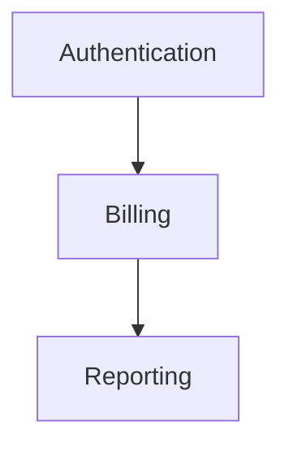

# CLI Optimization Research Report
**Date:** 2025-10-31
**Topics:** Single Entry Point, Interactive Patterns, Token Efficiency, Team Collaboration, Living Documentation
**Purpose:** Inform Spec plugin redesign for improved developer experience

---

## Executive Summary

This research examines best practices from successful CLI tools (git, docker, kubectl, terraform) and AI-specific optimization techniques to guide Spec's evolution toward a unified, token-efficient, team-friendly architecture.

**Key Findings:**
- Hub command pattern reduces cognitive load and improves discoverability
- Progressive disclosure enables learning without overwhelming users
- Token optimization requires lazy loading and strategic context management
- Team collaboration needs merge-friendly formats and conflict resolution
- Living documentation benefits from ADR-as-code and incremental updates

---

## 1. Single Entry Point Patterns

### Research Findings

#### The Hub Command Pattern

**Definition:** A single executable that routes to multiple subcommands, organizing functionality around resource-action paradigms.

**Successful Examples:**

**Git:**
```bash
git <subcommand> [options]
git commit -m "message"
git branch --list
git checkout -b feature
```

**Docker:**
```bash
docker <resource> <action>
docker container create
docker image ls
docker network inspect
```

**Kubectl:**
```bash
kubectl <action> <resource> [flags]
kubectl get pods
kubectl create deployment
kubectl delete service
```

#### Architecture Components

**1. Command Router**
- Single entry point (`spec`) dispatches to subcommands
- Parsing happens once at the top level
- Shared configuration and utilities
- Consistent error handling

**2. Subcommand Hierarchy**
```
spec
├── init       # Setup
├── spec       # Specification
│   ├── new
│   ├── edit
│   └── show
├── plan       # Technical design
├── task       # Task management
│   ├── list
│   ├── next
│   └── complete
└── status     # State inspection
```

**3. Argument Parsing Libraries**

**Rust - Clap (Recommended Pattern):**
```rust
use clap::{Parser, Subcommand};

#[derive(Parser)]
#[command(name = "spec")]
#[command(about = "AI-powered development workflow", version)]
struct Cli {
    #[command(subcommand)]
    command: Commands,

    /// Global verbose flag
    #[arg(short, long, global = true)]
    verbose: bool,
}

#[derive(Subcommand)]
enum Commands {
    /// Initialize Spec in project
    Init {
        #[arg(short, long)]
        template: Option<String>,
    },

    /// Create feature specification
    Spec {
        #[command(subcommand)]
        action: SpecAction,
    },

    /// Show current status
    Status {
        #[arg(short, long)]
        detailed: bool,
    },
}

#[derive(Subcommand)]
enum SpecAction {
    /// Create new spec
    New { description: String },
    /// Edit existing spec
    Edit { feature_id: String },
    /// Show spec details
    Show { feature_id: Option<String> },
}
```

**Python - Click:**
```python
import click

@click.group()
@click.option('--verbose', '-v', is_flag=True, help='Verbose output')
@click.pass_context
def cli(ctx, verbose):
    """Spec: AI-powered development workflow"""
    ctx.ensure_object(dict)
    ctx.obj['VERBOSE'] = verbose

@cli.command()
@click.option('--template', '-t', help='Template to use')
def init(template):
    """Initialize Spec in project"""
    click.echo(f'Initializing with template: {template}')

@cli.group()
def spec():
    """Specification management"""
    pass

@spec.command('new')
@click.argument('description')
def spec_new(description):
    """Create new specification"""
    click.echo(f'Creating spec: {description}')

if __name__ == '__main__':
    cli()
```

**Node.js - Commander:**
```javascript
const { Command } = require('commander');
const program = new Command();

program
  .name('spec')
  .description('AI-powered development workflow')
  .version('1.0.0');

program
  .command('init')
  .description('Initialize Spec in project')
  .option('-t, --template <type>', 'template to use')
  .action((options) => {
    console.log('Initializing...', options);
  });

const spec = program
  .command('spec')
  .description('Specification management');

spec
  .command('new <description>')
  .description('Create new specification')
  .action((description) => {
    console.log('Creating spec:', description);
  });

program.parse();
```

#### Benefits for Spec

**Before (Current):**
```bash
/spec-init
/spec-specify
/spec-plan
/spec-tasks
/spec-implement
/status
/help
/session save
/resume
/validate
```

**After (Proposed):**
```bash
spec init
spec spec new "feature description"
spec plan
spec task list
spec task next
spec status
spec help
spec session save
spec resume
spec validate
```

**Advantages:**
- ✅ Single command to remember
- ✅ Natural discoverability (`spec help`)
- ✅ Consistent flag handling
- ✅ Easier to document
- ✅ Better shell completion
- ✅ Reduced namespace pollution

### Recommendations for Spec

**1. Create Hub Command Structure:**
```
spec/
├── src/
│   ├── main.rs (or cli.py)
│   ├── commands/
│   │   ├── init.rs
│   │   ├── spec.rs
│   │   ├── plan.rs
│   │   ├── task.rs
│   │   └── status.rs
│   └── lib/
│       ├── state.rs
│       ├── config.rs
│       └── utils.rs
```

**2. Implement Global Options:**
- `--verbose/-v`: Detailed output
- `--quiet/-q`: Minimal output
- `--no-color`: Disable colors
- `--config <file>`: Custom config path
- `--help/-h`: Context-aware help

**3. Design Subcommand Hierarchy:**
```
spec
├── init [--template=TYPE]
├── spec
│   ├── new <description> [--priority=P1|P2|P3]
│   ├── edit <feature-id>
│   ├── show [feature-id]
│   └── list [--status=active|complete]
├── plan [feature-id]
├── task
│   ├── list [--feature=ID]
│   ├── next
│   ├── complete <task-id>
│   └── skip <task-id>
├── implement [--continue] [--task=ID]
├── update <feature-id> <changes>
├── status [--detailed]
├── session
│   ├── save [--name=NAME]
│   ├── restore <name>
│   ├── list
│   └── clear
└── validate [--fix]
```

**4. Anti-Patterns to Avoid:**
- ❌ Don't allow arbitrary abbreviations (`spe` → `spec`)
- ❌ Don't create catch-all subcommands
- ❌ Don't use positional args for unrelated data
- ❌ Don't force interactive prompts without `--no-input` option

---

## 2. Interactive CLI Patterns

### Research Findings

#### Progressive Disclosure Principles

**Source:** Command Line Interface Guidelines (clig.dev)

**Core Principle:**
"Enable Progressive Discovery — users are trying to solve a problem, but might start out knowing very little about the tool. The tool should guide them to a solution in iterative steps and provide plain-language help along the way."

#### Implementation Patterns

**1. Contextual Help System**

**Basic Level (No Args):**
```bash
$ spec
Spec: AI-powered development workflow

Usage: spec <command> [options]

Common commands:
  init       Setup Spec in your project
  spec new   Create a feature specification
  status     Check current workflow state

Run 'spec help <command>' for detailed information.
```

**Intermediate Level (Help Flag):**
```bash
$ spec spec --help
Create and manage feature specifications

Usage: spec spec <action> [options]

Actions:
  new <description>    Create new spec
  edit <feature-id>    Edit existing spec
  show [feature-id]    Display spec details
  list                 List all specs

Options:
  -p, --priority=P1|P2|P3    Set priority (default: P2)
  -t, --template=TYPE        Use template
  -f, --force                Overwrite existing

Examples:
  spec spec new "Add user authentication"
  spec spec new "Payment integration" --priority=P1
  spec spec show 001
```

**Advanced Level (Detailed Documentation):**
```bash
$ spec help spec
# Full markdown documentation
# Examples, workflows, troubleshooting
```

**2. Interactive Prompts (Inquirer.js Pattern)**

**Example: Project Initialization**
```javascript
const inquirer = require('inquirer');

async function interactiveInit() {
  const answers = await inquirer.prompt([
    {
      type: 'list',
      name: 'projectType',
      message: 'What type of project are you working on?',
      choices: ['Web App', 'API', 'CLI Tool', 'Library', 'Other']
    },
    {
      type: 'checkbox',
      name: 'features',
      message: 'Select features to enable:',
      choices: [
        { name: 'Jira Integration', value: 'jira' },
        { name: 'Confluence Sync', value: 'confluence' },
        { name: 'Auto-checkpoints', value: 'checkpoints', checked: true },
        { name: 'Git hooks', value: 'hooks' }
      ]
    },
    {
      type: 'confirm',
      name: 'createSample',
      message: 'Create sample feature for demonstration?',
      default: true
    }
  ]);

  return answers;
}
```

**Non-Interactive Equivalent:**
```bash
spec init \
  --type=web-app \
  --enable=jira,confluence,checkpoints \
  --sample
```

**3. Smart Defaults with Override**

**Pattern: Git-style Configuration Hierarchy**
```
Priority (highest to lowest):
1. Command-line flags       (--priority=P1)
2. Environment variables    (SPEC_PRIORITY=P1)
3. Project config           (.spec/config.yaml)
4. User config              (~/.spec/config.yaml)
5. System defaults          (built-in)
```

**4. Staged Information Disclosure**

**Example: Feature Creation Flow**
```bash
# Stage 1: Basic info
$ spec spec new "User authentication"
Creating specification 001-user-authentication

What priority? (P1/P2/P3) [P2]: P1
✓ Priority set to P1

# Stage 2: Details (only if needed)
Add acceptance criteria? (y/N): y
Enter criteria (blank line to finish):
1. Users can register with email
2. Password reset functionality
3.

✓ Specification created: features/001-user-authentication/spec.md

# Stage 3: Next steps
Next steps:
  spec plan            # Create technical design
  spec spec edit 001   # Refine specification
  spec status          # View current state
```

**5. Error Recovery with Suggestions**

**Pattern: Helpful Error Messages**
```bash
$ spec spec edot 001
Error: Unknown action 'edot'

Did you mean one of these?
  spec spec edit 001
  spec spec show 001

Run 'spec spec --help' for all available actions.
```

**Pattern: Validation with Suggestions**
```bash
$ spec spec new ""
Error: Description cannot be empty

Example:
  spec spec new "Add user authentication system"
  spec spec new "Implement payment processing" --priority=P1
```

#### Interactive Menu Libraries

**Node.js - Inquirer:**
```javascript
import { select, confirm, input } from '@inquirer/prompts';

// Modern async/await syntax
const command = await select({
  message: 'What would you like to do?',
  choices: [
    { name: 'Create new specification', value: 'spec_new' },
    { name: 'Continue implementation', value: 'implement' },
    { name: 'Check status', value: 'status' },
    { name: 'Exit', value: 'exit' }
  ]
});
```

**Python - Rich + Prompt Toolkit:**
```python
from rich.console import Console
from rich.prompt import Prompt, Confirm
from rich.table import Table

console = Console()

# Simple menu
choices = [
    "1. Create specification",
    "2. Continue implementation",
    "3. Check status"
]

console.print("[bold]What would you like to do?[/bold]")
for choice in choices:
    console.print(choice)

selection = Prompt.ask("Enter choice", choices=["1", "2", "3"])
```

**Rust - Dialoguer:**
```rust
use dialoguer::{Select, Confirm, Input};

let items = vec!["Create spec", "Continue work", "Check status"];
let selection = Select::new()
    .with_prompt("What would you like to do?")
    .items(&items)
    .interact()?;

let confirmed = Confirm::new()
    .with_prompt("Are you sure?")
    .interact()?;
```

### Recommendations for Spec

**1. Implement Three Interaction Modes:**

**a) Command Mode (Default - Fast for Experts):**
```bash
spec spec new "feature" --priority=P1
spec plan --template=microservice
```

**b) Interactive Mode (Guided - Good for Learning):**
```bash
spec --interactive
# Presents menu of options
# Guides through inputs
# Explains choices
```

**c) Wizard Mode (Step-by-step - Best for Setup):**
```bash
spec init --wizard
# Walks through complete setup
# Asks questions in sequence
# Provides examples and help
```

**2. Progressive Help System:**

**Level 1 - Quick Help (no args):**
- Show 5-7 most common commands
- Brief one-line descriptions
- Pointer to detailed help

**Level 2 - Command Help (--help):**
- Full usage syntax
- All options and flags
- 3-5 practical examples
- Link to documentation

**Level 3 - Extended Help (help <command>):**
- Detailed markdown guide
- Workflow explanations
- Troubleshooting section
- Related commands

**3. Context-Aware Prompts:**

```bash
# When no feature is active
$ spec plan
No active feature found.

Create a new feature first:
  spec spec new "your feature description"

Or resume an existing one:
  spec spec list
  spec resume <feature-id>

# When in middle of implementation
$ spec spec new "another feature"
Warning: Feature 001-user-auth is in progress.

Options:
  1. Save current session and start new feature
  2. Continue with current feature
  3. Cancel

Choose [1/2/3]:
```

**4. Validation with Recovery:**

```bash
$ spec task complete 999
Error: Task 999 not found in current feature

Available tasks:
  001 - Set up authentication routes [in-progress]
  002 - Create user model [pending]
  003 - Add password hashing [pending]

Did you mean:
  spec task complete 001
```

**5. Anti-Patterns to Avoid:**

- ❌ Never echo passwords (use `read -s` or equivalent)
- ❌ Don't require interaction without `--no-input` escape hatch
- ❌ Don't guess user intent for destructive operations
- ❌ Don't show verbose output by default; use `--verbose`
- ❌ Don't use log levels (ERR, WARN) in user-facing output

---

## 3. Token Efficiency Strategies

### Research Findings

#### Context Window Management

**Claude's Token Limits:**
- Sonnet 4.5: 200K tokens (~150K words)
- Opus: 200K tokens
- Sonnet 4.0: 200K tokens
- Extended context: Up to 1M tokens (enterprise)

**Cost Structure:**
- Input tokens: ~$3-15 per million
- Output tokens: ~$15-75 per million
- Context accumulates across conversation

#### Optimization Techniques

**1. Context Compression (76% Token Reduction)**

**Source:** Web-Werkstatt Case Study

**Before Compression (47 tokens):**
```
Please analyze the following customer feedback and provide insights
about what the customers are saying about our product
```

**After Compression (12 tokens):**
```
Analyze customer feedback for product insights
```

**Pattern: Abbreviate Common Terms**
```
customer → cust
product → prod
configuration → config
repository → repo
documentation → docs
specification → spec
implementation → impl
```

**Pattern: Structured Data Format**
```markdown
# Instead of natural language
"The user wants to create a new feature called user authentication
with high priority and it should include password reset functionality"

# Use structured format (YAML/JSON)
feature:
  id: 001
  name: user-authentication
  priority: P1
  requirements:
    - email_registration
    - password_reset
```

**2. Lazy Loading Pattern**

**Source:** Claude Code Best Practices

**Anti-Pattern: Load Everything**
```bash
# Loads all agent definitions, all skills, all examples
claude --load-all-context
```

**Pattern: Load on Demand**
```bash
# Load only what's needed for current operation
claude --context=minimal
# Agent loads additional context only when invoking specific skills
```

**Implementation for Spec:**
```markdown
# CLAUDE.md structure
## Core Context (Always Loaded - ~2K tokens)
- Plugin overview
- Current workflow phase
- Active feature summary

## Extended Context (Load on Demand - ~15K tokens)
### Load when running /spec-specify:
- .claude/skills/flow-specify/SKILL.md
- templates/spec-template.md

### Load when running /spec-plan:
- .claude/skills/flow-plan/SKILL.md
- .claude/agents/flow-researcher/agent.md
- templates/plan-template.md

### Load when running /spec-implement:
- .claude/skills/flow-implement/SKILL.md
- .claude/agents/flow-implementer/agent.md
- Current tasks list only
```

**3. Progressive Context Loading**

**Pattern: Start Small, Expand as Needed**

```javascript
// Phase 1: Minimal context
const minimalContext = {
  phase: 'specify',
  feature: '001-user-auth',
  status: 'planning'
};

// Phase 2: If user needs help, load more
if (userAsksQuestion) {
  loadContext('skill-reference');
}

// Phase 3: If error occurs, load debug info
if (errorOccurred) {
  loadContext('troubleshooting-guide');
}
```

**4. Template Optimization**

**Anti-Pattern: Verbose Templates**
```markdown
# Specification Template (1500 tokens)

## Feature Description
Please provide a detailed description of the feature, including:
- What the feature does
- Why it's needed
- Who will use it
- How it fits into the overall system
- What benefits it provides

## User Stories
Please write user stories in the following format:
As a [type of user]
I want to [action]
So that [benefit]

Include:
- Primary user stories (must have)
- Secondary user stories (should have)
- Optional user stories (nice to have)

[continues with extensive instructions...]
```

**Pattern: Compact Templates with Smart Defaults**
```markdown
# Specification Template (300 tokens)

## Feature: {{name}}
Priority: {{priority|default:P2}}
Status: draft

## Description
{{description}}

## User Stories
{{#each stories}}
- As {{role}}, I want {{action}} so that {{benefit}}
{{/each}}

## Acceptance Criteria
{{#each criteria}}
- {{this}}
{{/each}}

## Dependencies
{{dependencies|default:none}}

---
_Template v2.0 | See full guide: `spec help spec`_
```

**5. File Reading Strategy**

**Pattern: Selective File Access**

```markdown
# CLAUDE.md - Tell Claude what to read/ignore

## Always Read
- .spec/product-requirements.md (when planning)
- .spec-state/current-session.md (always)
- features/{{active-feature}}/*.md (context-dependent)

## Never Read
- node_modules/
- .git/
- dist/, build/, target/
- *.log
- .spec-state/checkpoints/ (unless specifically requested)

## Read on Demand
- .spec/architecture-blueprint.md (when doing architecture work)
- .spec-memory/DECISIONS-LOG.md (when making similar decisions)
```

**6. Conversation Compaction**

**Source:** Claude Code /compact Command

**Pattern: Summarize and Reset**

```bash
# When context reaches ~95% capacity
$ spec session compact

Compacting conversation history...
- Preserved: Current feature context (2K tokens)
- Summarized: Previous 47 messages (156K → 8K tokens)
- Freed: 148K tokens

New session started with summary as context.
```

**Implementation:**
```javascript
async function compactSession(session) {
  const summary = await generateSummary({
    decisions: session.decisions,
    completed_tasks: session.completed,
    active_context: session.current
  });

  // Start fresh with just the summary
  return {
    id: generateNewSessionId(),
    parent: session.id,
    context: summary,
    tokens_used: summary.length
  };
}
```

**7. MCP Server Management**

**Source:** Claude Code GitHub Issues

**Problem:** Each enabled MCP server adds tool definitions to system prompt.

**Pattern: Disable Unused Servers**
```bash
# Check active servers
spec config mcp list

# Disable temporarily unused servers
spec config mcp disable jira-integration
spec config mcp disable confluence-sync

# Re-enable when needed
spec config mcp enable jira-integration
```

**8. Chunking for Large Codebases**

**Pattern: Feature-Scoped Context**

```bash
# Instead of loading entire codebase
--include=src/**/*.{js,ts,py,rs}

# Load only relevant files for current feature
--include=features/001-user-auth/**
--include=src/auth/*.{js,ts}
--include=src/models/user.{js,ts}
```

### Recommendations for Spec

**1. Implement Lazy Loading Architecture:**

```markdown
# .claude/CORE.md (Always Loaded - Max 2K tokens)
- Plugin purpose (2 sentences)
- Current phase
- Active feature ID
- Next available command

# .claude/CONTEXT.md (Dynamic Loading)
[load_on_command:init]
- skills/flow-init/SKILL.md

[load_on_command:spec]
- skills/flow-specify/SKILL.md
- templates/spec-template.md

[load_on_command:plan]
- skills/flow-plan/SKILL.md
- agents/flow-researcher/agent.md

[load_on_error]
- docs/TROUBLESHOOTING.md (relevant section only)
```

**2. Compress Documentation:**

**Before (800 tokens):**
```markdown
# Flow Specify Skill

## Purpose and Overview
The Flow Specify skill helps users create detailed feature
specifications that capture requirements, user stories,
acceptance criteria, and technical constraints. This skill
is designed to...

[continues for many paragraphs]
```

**After (180 tokens):**
```markdown
# Specify Skill
Create feature specs with user stories, acceptance criteria, priorities.

## Usage
`spec spec new "<description>" [--priority=P1|P2|P3]`

## Triggers
- User says "create spec" / "new feature"
- After /spec-init

## Output
features/###-name/spec.md

See: `spec help spec` for examples
```

**3. Smart State Files:**

```yaml
# .spec-state/current-session.md (Minimal - Max 500 tokens)
feature: 001-user-auth
phase: implementation
task: 003
last_update: 2025-10-31T14:30:00Z
context_hash: abc123def  # Reference to full context

# Full context stored separately, loaded only when needed
# .spec-state/sessions/abc123def.json
```

**4. Template Optimization:**

```markdown
# Before: spec-template.md (1500 tokens)
[Extensive documentation and instructions]

# After: spec-template.md (300 tokens)
[Minimal template with placeholders]

# Full instructions moved to
# docs/SPEC-GUIDE.md (loaded only via `spec help spec`)
```

**5. Incremental Context Building:**

```javascript
// Phase 1: Core context (always)
const core = loadContext('CORE.md');  // 2K tokens

// Phase 2: Command-specific (on demand)
if (command === 'spec') {
  const specSkill = loadContext('skills/flow-specify/SKILL.md');  // 1K
  const template = loadContext('templates/spec-template.md');  // 0.3K
}

// Phase 3: Examples (only if user struggles)
if (userNeedsHelp) {
  const examples = loadContext('skills/flow-specify/examples.md');  // 3K
}

// Phase 4: Full reference (explicit request only)
if (userAsks('detailed guide')) {
  const reference = loadContext('skills/flow-specify/reference.md');  // 5K
}
```

**6. Token Budget Tracking:**

```javascript
class TokenBudget {
  constructor(maxTokens = 200000) {
    this.max = maxTokens;
    this.used = 0;
    this.threshold = 0.95;  // Compact at 95%
  }

  track(operation, tokens) {
    this.used += tokens;
    console.log(`[${operation}] Used: ${tokens} | Total: ${this.used}/${this.max}`);

    if (this.used / this.max > this.threshold) {
      this.warn('Approaching token limit. Consider compacting.');
    }
  }

  warn(message) {
    console.warn(`⚠️  ${message}`);
    console.log(`Run: spec session compact`);
  }
}
```

**7. Anti-Patterns to Avoid:**

- ❌ Don't load all examples, references, and guides upfront
- ❌ Don't repeat documentation across multiple files
- ❌ Don't include verbose instructions in templates
- ❌ Don't keep entire conversation history indefinitely
- ❌ Don't load agents until they're actually invoked

---

## 4. Team Collaboration in Dev Tools

### Research Findings

#### State Management Patterns

**Problem:** Multiple developers working concurrently on specifications and plans can create conflicts, corrupt state, or lose work.

**Solution Examples:**

**1. Terraform State Locking**

**Pattern: Remote Backend with Locking**

```hcl
# backend.tf
terraform {
  backend "s3" {
    bucket         = "myapp-terraform-state"
    key            = "prod/terraform.tfstate"
    region         = "us-east-1"
    dynamodb_table = "terraform-locks"
    encrypt        = true
  }
}
```

**How it works:**
- State file stored in S3 (shared, versioned)
- DynamoDB table provides distributed locking
- Only one operation can hold lock at a time
- Other operations wait or fail fast

**Locking Behavior:**
```bash
$ terraform apply
Acquiring state lock. This may take a few moments...

# If another user is running terraform:
Error: Error acquiring the state lock

Lock Info:
  ID:        abc123-def456-789
  Path:      myapp-terraform-state/prod/terraform.tfstate
  Operation: OperationTypeApply
  Who:       alice@example.com
  Version:   1.5.0
  Created:   2025-10-31 10:15:32.123456789 +0000 UTC
```

**Force Unlock (Emergency Only):**
```bash
terraform force-unlock abc123-def456-789
```

**Key Lessons:**
- ✅ Use remote backend for shared state
- ✅ Implement distributed locking mechanism
- ✅ Provide clear lock info (who, when, what)
- ✅ Allow force-unlock with warnings
- ✅ Lock at operation level, not file level

**2. Git-based Workflow (Atlantis, Terrateam)**

**Pattern: Pull Request-Level Locks**

```yaml
# atlantis.yaml
version: 3
projects:
  - name: production
    dir: terraform/prod
    workspace: default
    autoplan:
      when_modified: ["*.tf", "*.tfvars"]
    apply_requirements:
      - approved
      - mergeable
```

**Workflow:**
1. Developer creates PR with infrastructure changes
2. Atlantis automatically runs `terraform plan`
3. Plan output posted as PR comment
4. PR-level lock prevents concurrent changes
5. After approval, `atlantis apply` executes
6. Lock released on merge or PR close

**Key Lessons:**
- ✅ Integrate with existing PR workflow
- ✅ Lock at feature/change level
- ✅ Provide visibility (comments, status checks)
- ✅ Auto-release locks on completion
- ✅ Support manual unlock for abandoned work

**3. Pulumi State Management**

**Pattern: Backend with Concurrent Access Protection**

```bash
# Pulumi uses backends for state:
# - Local (file)
# - Cloud (Pulumi Service)
# - S3, Azure Blob, GCS

pulumi login s3://my-pulumi-state-bucket

# Pulumi handles locking automatically
$ pulumi up
Updating (dev):

     Type                 Name           Status
 +   pulumi:pulumi:Stack  myapp-dev      created
```

**Built-in Features:**
- Automatic locking during update operations
- State history and rollback capability
- Conflict detection on concurrent updates
- State encryption at rest

#### Merge-Friendly File Formats

**Research: Git Merge Behavior**

**Problem:** Git uses line-based text merging, which doesn't understand structural boundaries in JSON/YAML.

**Example Conflict (JSON):**
```json
{
  "features": [
    <<<<<<< HEAD
    {"id": "001", "name": "auth", "priority": "P1"},
    {"id": "002", "name": "billing", "priority": "P2"}
    =======
    {"id": "001", "name": "authentication", "priority": "P1"},
    {"id": "003", "name": "reporting", "priority": "P3"}
    >>>>>>> feature-branch
  ]
}
```

**Solutions:**

**1. Line-Based Formats (Most Merge-Friendly)**

**Markdown with Clear Sections:**
```markdown
# Feature Specifications

## Feature 001: Authentication
Priority: P1
Status: In Progress

## Feature 002: Billing
Priority: P2
Status: Planning

## Feature 003: Reporting
Priority: P3
Status: Draft
```

**Benefits:**
- Clear section boundaries
- Each feature is distinct block
- Changes typically don't overlap
- Human-readable diffs

**2. YAML (Better than JSON)**

**One Entry Per Line:**
```yaml
features:
  - id: "001"
    name: "authentication"
    priority: "P1"

  - id: "002"
    name: "billing"
    priority: "P2"

  - id: "003"
    name: "reporting"
    priority: "P3"
```

**Why Better:**
- Vertical structure reduces conflicts
- Trailing commas not needed
- Empty lines as visual separators
- Better git blame

**3. TOML (Structured but Readable)**

```toml
[feature.001]
name = "authentication"
priority = "P1"

[feature.002]
name = "billing"
priority = "P2"

[feature.003]
name = "reporting"
priority = "P3"
```

**4. Custom Merge Drivers**

**Pattern: Semantic JSON Merge**

```bash
# .gitattributes
*.json merge=json-merge

# .git/config
[merge "json-merge"]
  name = JSON-aware merge driver
  driver = git-json-merge %O %A %B %P
```

**Implementation:** Tools like `git-json-merge` understand JSON structure and merge intelligently.

**5. Append-Only Logs**

**Pattern: Event Sourcing for Decisions**

```markdown
# .spec-memory/DECISIONS-LOG.md

## 2025-10-31T10:15:00Z - Use PostgreSQL
Decision: Use PostgreSQL for primary database
Rationale: [...]
Author: alice

## 2025-10-31T14:30:00Z - Add Redis Caching
Decision: Add Redis for session caching
Rationale: [...]
Author: bob
```

**Benefits:**
- Append-only rarely conflicts
- History preserved naturally
- Clear authorship
- Easy to merge (rarely same timestamp)

#### Conflict Resolution Strategies

**1. Automatic Resolution (Safe Cases)**

```bash
# For generated files (package-lock.json, yarn.lock):
git checkout --theirs package-lock.json
npm install  # Regenerate based on package.json
```

**2. Three-Way Merge with Context**

```bash
# Show full context of conflict
git diff --merge

# Use merge tool with structural awareness
git mergetool --tool=semanticdiff
```

**3. Prefer Additive Changes**

**Anti-Pattern:**
```yaml
# User A changes:
- name: authentication

# User B changes:
- name: user-auth

# Conflict!
```

**Pattern:**
```yaml
# Original:
- name: authentication
  aliases: []

# User A adds:
- name: authentication
  aliases: ["auth"]

# User B adds:
- name: authentication
  aliases: ["user-auth"]

# Merge easily:
- name: authentication
  aliases: ["auth", "user-auth"]
```

### Recommendations for Spec

**1. Implement Collaborative State Management:**

**File Structure for Team Collaboration:**
```
.spec/
├── config.yaml                 # Project config (team-shared)
├── product-requirements.md     # High-level requirements (team-shared)
├── architecture-blueprint.md   # Architecture (team-shared)
└── features/                   # Feature isolation

.spec-state/                 # Git-ignored (local only)
├── current-session.md          # Developer's current work
└── sessions/                   # Local session history

.spec-memory/                # Team-shared memory
├── WORKFLOW-PROGRESS.md        # Overall progress (append-only)
├── DECISIONS-LOG.md            # ADRs (append-only)
├── CHANGES-PLANNED.md          # Planned work (may conflict)
└── CHANGES-COMPLETED.md        # Completed work (append-only)

features/                       # Per-feature isolation
├── 001-authentication/
│   ├── spec.md                 # One person owns
│   ├── plan.md                 # Review process
│   ├── tasks.md                # Task assignment
│   └── .lock                   # Lock file (if working)
```

**2. Feature-Level Locking:**

**Lock File Pattern:**
```yaml
# features/001-authentication/.lock
locked_by: alice@example.com
locked_at: 2025-10-31T10:15:00Z
operation: implementation
pid: 12345
machine: alice-laptop.local
expires_at: 2025-10-31T18:15:00Z  # 8 hours

# Automatically created by:
# spec spec new "authentication"
# spec implement --feature=001
```

**Locking Behavior:**
```bash
# Alice starts work
$ spec implement --feature=001
🔒 Lock acquired for feature 001

# Bob tries to work on same feature
$ spec implement --feature=001
❌ Feature 001 is locked by alice@example.com
   Locked since: 2025-10-31 10:15 (4 hours ago)
   Operation: implementation

Options:
  1. Work on different feature
  2. Wait for lock release
  3. Contact alice@example.com
  4. Force unlock (if lock is stale)

# Force unlock (with verification)
$ spec unlock 001 --force
⚠️  This will force-unlock feature 001
   Currently locked by: alice@example.com

Are you sure? Type 'UNLOCK 001' to confirm: UNLOCK 001
✓ Lock released
```

**3. Append-Only Memory Files:**

**WORKFLOW-PROGRESS.md (Conflict-Free):**
```markdown
# Workflow Progress Log

## 2025-10-31T10:00:00Z - Feature 001 Created
Author: alice@example.com
Feature: 001-authentication
Phase: specification
Status: created

## 2025-10-31T14:00:00Z - Feature 001 Planned
Author: alice@example.com
Feature: 001-authentication
Phase: planning
Status: plan_complete

## 2025-10-31T15:00:00Z - Feature 002 Created
Author: bob@example.com
Feature: 002-billing
Phase: specification
Status: created
```

**Benefits:**
- Each developer appends to end
- No conflicts (different timestamps)
- Full audit trail
- Easy to query/filter

**4. Merge-Friendly Feature Files:**

**spec.md Structure:**
```markdown
# Feature 001: Authentication

## Metadata
- ID: 001
- Priority: P1
- Status: Implementation
- Owner: alice@example.com
- Created: 2025-10-30
- Updated: 2025-10-31

## Description
[Description here]

## User Stories
### Story 1: User Registration
As a new user...

### Story 2: User Login
As a returning user...

## Acceptance Criteria
- [ ] Criterion 1
- [ ] Criterion 2

## Dependencies
- None

## Notes
### 2025-10-30 - Initial Draft
Created initial specification.

### 2025-10-31 - Added Password Reset
Added story for password reset functionality.
```

**Why This Works:**
- Clear section boundaries (merge-friendly)
- Checkboxes for independent task tracking
- Append-only notes section
- Metadata changes are isolated

**5. Team Synchronization Commands:**

```bash
# Pull latest team changes
$ spec sync
Fetching team updates...
✓ 3 new decisions in DECISIONS-LOG.md
✓ Feature 002 completed by bob@example.com
✓ Feature 003 created by charlie@example.com

# Check for conflicts before pushing
$ spec validate --team
Checking for conflicts...
✓ No conflicts detected
✓ All features have unique IDs
✓ No overlapping locks

# Resolve conflicts interactively
$ spec resolve
Conflict detected in CHANGES-PLANNED.md
  Your change: Add caching layer
  Their change: Add database indexing

These changes don't conflict. Merge both? (Y/n): Y
✓ Changes merged
```

**6. Collision Prevention:**

```bash
# Generate unique feature IDs
$ spec spec new "authentication"
Checking for ID collisions...
Next available ID: 001
✓ Created features/001-authentication/

# If ID exists (race condition)
$ spec spec new "billing"
Warning: Feature 001 exists. Using next ID: 002
✓ Created features/002-billing/
```

**7. Status Visibility:**

```bash
# See who's working on what
$ spec status --team
Team Status:

Feature 001 (authentication)
  Status: Implementation
  Owner: alice@example.com
  Locked: Yes (4 hours ago)

Feature 002 (billing)
  Status: Planning
  Owner: bob@example.com
  Locked: No

Feature 003 (reporting)
  Status: Specification
  Owner: charlie@example.com
  Locked: Yes (30 minutes ago)
```

**8. Anti-Patterns to Avoid:**

- ❌ Don't use JSON for team-shared config (merge conflicts)
- ❌ Don't allow concurrent edits to same feature
- ❌ Don't store locks in shared files (use database or service)
- ❌ Don't lock indefinitely (set expiration)
- ❌ Don't force-unlock without verification
- ❌ Don't share `.spec-state/` (local-only)

---

## 5. Master Spec Patterns

### Research Findings

#### Living Documentation Principles

**Definition:** Documentation that stays synchronized with code and evolves with the project, never becoming outdated.

**Key Characteristics:**
1. **Single Source of Truth:** One canonical location
2. **Auto-Updating:** Changes propagate automatically
3. **Version-Controlled:** History tracked in git
4. **Code-Proximate:** Lives near code, not external wiki
5. **Incremental Updates:** Small, frequent changes

#### Architecture Decision Records (ADRs)

**Pattern: ADR as Code**

**Source:** OCTO Talks, Laurent Stemmer Blog

**Structure:**
```markdown
# ADR-001: Use PostgreSQL for Primary Database

## Status
Accepted

## Context
We need a relational database for user data, transactions, and reporting.
Team has experience with both PostgreSQL and MySQL.

## Decision
Use PostgreSQL 15+ as our primary relational database.

## Consequences

### Positive
- JSONB support for flexible schema
- Advanced indexing (GiST, GIN)
- Strong consistency guarantees
- Excellent extension ecosystem
- Team expertise available

### Negative
- Slightly more complex than MySQL
- Requires careful tuning for high-write workloads
- Replication setup more involved

## Alternatives Considered

### MySQL
- Pros: Simpler, more hosting options
- Cons: Limited JSON support, weaker consistency

### MongoDB
- Pros: Flexible schema, horizontal scaling
- Cons: Eventual consistency, less mature tooling

## Implementation Notes
- Use RDS for managed hosting
- Enable point-in-time recovery
- Set up read replicas for reporting

## References
- PostgreSQL 15 Docs: https://postgresql.org/docs/15
- RDS Best Practices: https://docs.aws.amazon.com/rds/
```

**Benefits:**
- Captures decision rationale
- Documents alternatives considered
- Lives in git (versioned, searchable)
- Shows evolution over time

**Storage:**
```
docs/
└── adrs/
    ├── 001-use-postgresql.md
    ├── 002-adopt-microservices.md
    ├── 003-choose-react-frontend.md
    └── template.md
```

#### Incremental Specification Updates

**Pattern: Semantic Versioning for Specs**

**Source:** Semantic Release, Incremental (Python)

**Spec Versions:**
```markdown
# Feature 001: Authentication
Version: 2.1.0

## Changelog
### 2.1.0 (2025-10-31)
- Added: OAuth2 support requirement
- Changed: Password complexity rules

### 2.0.0 (2025-10-25)
- Changed: Moved from session-based to JWT auth (breaking)
- Removed: Remember me functionality

### 1.1.0 (2025-10-20)
- Added: Two-factor authentication support

### 1.0.0 (2025-10-15)
- Initial specification
```

**Version Numbering:**
- **Major (X.0.0):** Breaking changes to spec (architecture shift)
- **Minor (x.Y.0):** New requirements added (backward compatible)
- **Patch (x.y.Z):** Clarifications, typo fixes (no new requirements)

**Pattern: Git Tags for Versions**
```bash
# Tag spec versions
git tag -a spec-001-v2.1.0 -m "Add OAuth2 support"

# View spec history
git log features/001-authentication/spec.md

# Compare versions
git diff spec-001-v1.0.0 spec-001-v2.0.0 -- features/001-authentication/spec.md
```

#### Auto-Sync Strategies

**1. Bi-Directional Sync (Jira/Confluence)**

**Pattern: Sync Engine**
```javascript
class SpecSyncEngine {
  async syncToJira(featureSpec) {
    const issue = await jira.createOrUpdateIssue({
      project: 'PROJ',
      summary: featureSpec.title,
      description: featureSpec.description,
      customFields: {
        acceptanceCriteria: featureSpec.criteria,
        priority: featureSpec.priority
      }
    });

    // Store mapping
    await this.saveMapping(featureSpec.id, issue.key);
  }

  async syncFromJira(issueKey) {
    const issue = await jira.getIssue(issueKey);
    const featureId = await this.getFeatureId(issueKey);

    // Update local spec
    await this.updateSpec(featureId, {
      status: issue.fields.status,
      assignee: issue.fields.assignee,
      updated: issue.fields.updated
    });
  }

  async bidirectionalSync() {
    // Pull changes from Jira
    const updatedIssues = await jira.getUpdatedSince(lastSync);
    for (const issue of updatedIssues) {
      await this.syncFromJira(issue.key);
    }

    // Push local changes to Jira
    const updatedSpecs = await this.getLocalChangesSince(lastSync);
    for (const spec of updatedSpecs) {
      await this.syncToJira(spec);
    }
  }
}
```

**2. Event-Based Updates**

**Pattern: File Watcher + Webhook**
```javascript
const chokidar = require('chokidar');

// Watch spec files
const watcher = chokidar.watch('features/**/spec.md', {
  persistent: true
});

watcher.on('change', async (path) => {
  console.log(`Spec changed: ${path}`);

  // Parse spec
  const spec = await parseSpec(path);

  // Trigger updates
  await Promise.all([
    updateJira(spec),
    updateConfluence(spec),
    notifyTeam(spec)
  ]);
});
```

**3. Git Hook Automation**

**Pattern: Pre-Commit Validation + Post-Commit Sync**

```bash
# .git/hooks/pre-commit
#!/bin/bash
# Validate specs before commit

CHANGED_SPECS=$(git diff --cached --name-only | grep 'features/.*/spec.md')

if [ -n "$CHANGED_SPECS" ]; then
  echo "Validating specifications..."

  for spec in $CHANGED_SPECS; do
    spec validate "$spec" || exit 1
  done

  echo "✓ All specs valid"
fi
```

```bash
# .git/hooks/post-commit
#!/bin/bash
# Sync to external systems after commit

CHANGED_SPECS=$(git diff-tree --no-commit-id --name-only -r HEAD | grep 'features/.*/spec.md')

if [ -n "$CHANGED_SPECS" ]; then
  echo "Syncing specifications..."

  for spec in $CHANGED_SPECS; do
    spec sync "$spec" --to=jira,confluence
  done
fi
```

**4. Continuous Sync Service**

**Pattern: Background Daemon**
```javascript
class SpecSyncDaemon {
  constructor(interval = 60000) { // 1 minute
    this.interval = interval;
    this.running = false;
  }

  async start() {
    this.running = true;
    console.log('Spec sync daemon started');

    while (this.running) {
      await this.syncCycle();
      await this.sleep(this.interval);
    }
  }

  async syncCycle() {
    try {
      // Check for changes
      const changes = await this.detectChanges();

      if (changes.length > 0) {
        console.log(`Found ${changes.length} changes`);

        for (const change of changes) {
          await this.processChange(change);
        }
      }
    } catch (error) {
      console.error('Sync error:', error);
    }
  }

  async detectChanges() {
    // Check local changes
    const localChanges = await this.getLocalChanges();

    // Check remote changes (Jira/Confluence)
    const remoteChanges = await this.getRemoteChanges();

    return [...localChanges, ...remoteChanges];
  }

  async processChange(change) {
    if (change.source === 'local') {
      await this.syncToRemote(change);
    } else {
      await this.syncFromRemote(change);
    }
  }
}

// Start daemon
const daemon = new SpecSyncDaemon();
daemon.start();
```

#### Master Specification Structure

**Pattern: Single Source of Truth with Derived Views**

```
.spec/
├── master-spec.md              # Master specification
├── views/                      # Generated views
│   ├── roadmap.md              # Derived roadmap
│   ├── api-contracts.yaml      # Extracted API specs
│   └── test-matrix.csv         # Test coverage matrix
└── sync/                       # Sync metadata
    ├── mappings.json           # Jira/Confluence IDs
    ├── last-sync.json          # Sync timestamps
    └── conflicts.json          # Pending conflicts
```

**master-spec.md:**
```markdown
# Project Master Specification
Version: 3.2.0
Last Updated: 2025-10-31T15:00:00Z

## Overview
[High-level project description]

## Features

### Feature 001: Authentication (v2.1.0)
Status: In Progress
Priority: P1
Owner: alice@example.com
Jira: PROJ-123

#### Description
[Feature description]

#### User Stories
- US-001: User registration
- US-002: User login
- US-003: Password reset

#### Acceptance Criteria
- [x] AC-001: Email validation
- [ ] AC-002: Password complexity
- [ ] AC-003: Session management

### Feature 002: Billing (v1.0.0)
Status: Planning
Priority: P2
Owner: bob@example.com
Jira: PROJ-456

[...]

## Cross-Cutting Concerns

### Security Requirements
- All endpoints require authentication
- Rate limiting: 100 req/min per user
- [...]

### Performance Requirements
- API response time: < 200ms (p95)
- [...]

## Architecture Decisions
- [ADR-001: Use PostgreSQL](adrs/001-use-postgresql.md)
- [ADR-002: Adopt Microservices](adrs/002-adopt-microservices.md)

## Dependencies


## Timeline
- 2025-11: Features 001, 002
- 2025-12: Features 003, 004
- 2026-Q1: Features 005, 006
```

**Benefits:**
- Single document for project overview
- Links to detailed feature specs
- Includes all features (done, in-progress, planned)
- Shows relationships and dependencies
- Easy to search and navigate

#### Conflict Resolution for Specs

**Pattern: Three-Way Merge for Specifications**

**Scenario:** Two developers update same spec simultaneously.

**Resolution Strategy:**
```bash
# Detect conflict
$ git pull
Auto-merging features/001-authentication/spec.md
CONFLICT (content): Merge conflict in features/001-authentication/spec.md

# Use semantic merge tool
$ spec resolve features/001-authentication/spec.md

Conflict in Feature 001 Specification:

Section: User Stories
<<<<<<< HEAD (your changes)
- US-004: OAuth2 login
  As a user, I want to log in with Google/GitHub
=======
- US-004: Two-factor authentication
  As a user, I want to enable 2FA for security
>>>>>>> origin/main (their changes)

Resolution options:
  1. Keep your changes (OAuth2)
  2. Keep their changes (2FA)
  3. Keep both (merge as separate stories)
  4. Edit manually

Choose [1/2/3/4]: 3

✓ Resolved: Both stories added as US-004 and US-005
```

**Automatic Merge Rules:**
```javascript
const mergeRules = {
  // Additive changes auto-merge
  addUserStory: 'auto-merge',
  addAcceptanceCriteria: 'auto-merge',

  // Modifications require manual review
  editUserStory: 'manual-review',
  deleteUserStory: 'manual-review',

  // Status updates: last-write-wins
  updateStatus: 'last-write-wins',
  updateAssignee: 'last-write-wins',

  // Version bumps: semantic resolution
  updateVersion: 'semantic-resolve'
};
```

### Recommendations for Spec

**1. Implement Master Specification:**

```markdown
# .spec/master-spec.md (Auto-generated from features/)

# Project: MyApp
Generated: 2025-10-31T15:00:00Z

## Active Features (3)
- [001: Authentication](../features/001-authentication/spec.md) - P1, Implementation
- [002: Billing](../features/002-billing/spec.md) - P2, Planning
- [003: Reporting](../features/003-reporting/spec.md) - P3, Specification

## Completed Features (0)
[None]

## Roadmap
[ASCII timeline or Mermaid gantt chart]

## Architecture Decisions
- [ADR-001: Use PostgreSQL](.spec-memory/adrs/001-postgresql.md)
- [ADR-002: JWT Authentication](.spec-memory/adrs/002-jwt-auth.md)

## Team Assignments
- alice@example.com: Feature 001, 002
- bob@example.com: Feature 003

---
_This file is auto-generated by `spec sync`. Do not edit manually._
```

**2. Incremental Spec Versioning:**

```bash
# Automatic version bumping
$ spec spec update 001 --add-story "OAuth2 login"
Updated Feature 001
Version: 2.1.0 → 2.2.0 (minor: added story)

$ spec spec update 001 --change-architecture "JWT → OAuth2"
Updated Feature 001
Version: 2.2.0 → 3.0.0 (major: breaking change)

$ spec spec update 001 --fix-typo
Updated Feature 001
Version: 3.0.0 → 3.0.1 (patch: non-functional change)
```

**3. ADR Integration:**

```bash
# Create ADR
$ spec decide "Use PostgreSQL for primary database"
Creating ADR-003...

Why this decision?
> Need relational DB for transactions and reporting

What are the alternatives? (comma-separated)
> MySQL, MongoDB

✓ Created: .spec-memory/adrs/003-use-postgresql.md

# Link ADR to feature
$ spec spec link 001 --adr=003
✓ Feature 001 now references ADR-003

# View decisions for feature
$ spec spec show 001 --include-adrs
Feature 001: Authentication

Related Architecture Decisions:
- ADR-002: JWT Authentication (Accepted)
- ADR-003: Use PostgreSQL (Accepted)
```

**4. Sync Commands:**

```bash
# Generate master spec
$ spec sync master-spec
Generating master specification...
✓ .spec/master-spec.md updated

# Sync to Jira
$ spec sync --to=jira
Syncing to Jira...
- Feature 001 → PROJ-123 (updated)
- Feature 002 → PROJ-456 (created)
- Feature 003 → PROJ-789 (updated)
✓ 3 features synced

# Sync from Jira
$ spec sync --from=jira
Pulling from Jira...
- PROJ-123 → Feature 001 (status changed)
- PROJ-456 → Feature 002 (assignee changed)
⚠  Conflict in Feature 001: local changes pending
✓ 2 features synced, 1 conflict

# Resolve conflicts
$ spec sync resolve
Conflict in Feature 001:
  Local: Added OAuth2 story
  Jira: Status changed to "In Review"

Action:
  1. Keep both changes (merge)
  2. Prefer local changes
  3. Prefer Jira changes

Choose [1/2/3]: 1
✓ Conflict resolved

# Start sync daemon
$ spec sync daemon start
Sync daemon started (PID: 12345)
Interval: 5 minutes
Targets: Jira, Confluence

# Stop sync daemon
$ spec sync daemon stop
Sync daemon stopped
```

**5. Change Tracking:**

```markdown
# .spec/master-spec.md includes change log

## Recent Changes

### 2025-10-31T15:30:00Z
Author: alice@example.com
Feature: 001-authentication
Change: Added OAuth2 support story
Version: 2.1.0 → 2.2.0

### 2025-10-31T14:00:00Z
Author: bob@example.com
Feature: 002-billing
Change: Created billing spec
Version: 1.0.0
```

**6. Validation and Consistency:**

```bash
# Validate master spec against features
$ spec validate --master
Checking consistency...
✓ All features referenced exist
✓ No orphaned features
✓ All ADRs exist
✓ Version numbers are valid
✗ Feature 002 missing acceptance criteria

Fix issues? (y/N): y
✓ Added template acceptance criteria to Feature 002

# Check for drift
$ spec validate --drift
Checking for drift between master and features...
⚠  Master spec last generated: 2 hours ago
⚠  Feature 001 updated 30 minutes ago (not in master)

Regenerate master spec? (Y/n): Y
✓ Master spec regenerated
```

**7. Anti-Patterns to Avoid:**

- ❌ Don't manually edit generated master spec
- ❌ Don't create conflicting versions in different places
- ❌ Don't sync without conflict detection
- ❌ Don't overwrite without backup
- ❌ Don't lose ADR history when updating specs
- ❌ Don't sync sensitive data to external systems

---

## Summary & Implementation Roadmap

### Priority 1: Single Entry Point (Weeks 1-2)

**Immediate Benefits:**
- Improved discoverability
- Consistent UX
- Reduced cognitive load

**Implementation:**
1. Create hub command structure
2. Migrate slash commands to subcommands
3. Implement global options
4. Add shell completion
5. Update documentation

**Example:**
```bash
spec init
spec spec new "feature"
spec plan
spec task list
spec implement
```

### Priority 2: Token Optimization (Weeks 2-3)

**Immediate Benefits:**
- Faster responses
- Lower API costs
- Better scalability

**Implementation:**
1. Create lazy-loading architecture
2. Compress documentation (75% target)
3. Implement progressive context loading
4. Add token budget tracking
5. Create compact templates

**Example:**
```markdown
# CORE.md (2K tokens max)
# Loaded: Always
# Contains: Current state only

# SKILL.md (1K tokens each)
# Loaded: On command
# Contains: Command-specific logic
```

### Priority 3: Interactive Patterns (Weeks 3-4)

**Immediate Benefits:**
- Better for beginners
- Reduced errors
- Clearer guidance

**Implementation:**
1. Add three interaction modes
2. Implement progressive help
3. Create context-aware prompts
4. Add validation with suggestions
5. Build error recovery

**Example:**
```bash
spec --interactive  # Menu-driven
spec init --wizard  # Step-by-step
spec spec new "..."  # Direct command
```

### Priority 4: Team Collaboration (Weeks 4-5)

**Immediate Benefits:**
- Safe concurrent work
- Reduced conflicts
- Better visibility

**Implementation:**
1. Add feature-level locking
2. Use merge-friendly formats
3. Implement append-only logs
4. Create sync commands
5. Add status visibility

**Example:**
```bash
spec status --team  # See who's working on what
spec sync           # Pull team updates
spec unlock 001     # Release stale lock
```

### Priority 5: Living Documentation (Weeks 5-6)

**Immediate Benefits:**
- Single source of truth
- Always up-to-date
- Better decision tracking

**Implementation:**
1. Generate master spec
2. Add ADR support
3. Implement versioning
4. Create sync engine
5. Add validation

**Example:**
```bash
spec sync master-spec    # Generate overview
spec decide "Use Redis"  # Create ADR
spec validate --drift    # Check consistency
```

---

## Specific Recommendations for Spec

### Command Consolidation

**Replace 9 commands with 1 hub:**

```
Before:                      After:
/spec-init           →    spec init
/spec-specify        →    spec spec new
/spec-plan           →    spec plan
/spec-tasks          →    spec task list
/spec-implement      →    spec implement
/status                 →    spec status
/help                   →    spec help
/session save           →    spec session save
/validate               →    spec validate
```

### Token Budget

**Target: 80% reduction in context size**

```
Current:                     Target:
SKILL.md: 800 tokens    →    180 tokens (compact)
examples.md: 3000       →    500 (separate doc)
reference.md: 5000      →    800 (separate doc)
Templates: 1500         →    300 (minimal)
Total per skill: 10300  →    1780 (83% reduction)
```

### File Structure

**Reorganize for team collaboration:**

```
Before (conflicts common):
.spec/state.md (shared, conflicts)

After (conflict-free):
.spec-state/ (local, git-ignored)
.spec-memory/ (append-only, shared)
features/###/ (locked per-feature)
```

### Interactive Flows

**Add progressive disclosure:**

```
Level 1: spec
  → Show 5 common commands

Level 2: spec help
  → Show all commands with brief descriptions

Level 3: spec help <command>
  → Full documentation, examples, troubleshooting

Level 4: spec --interactive
  → Menu-driven mode for exploration
```

### Sync Integration

**Bidirectional sync with Jira/Confluence:**

```bash
# Initial setup
spec config sync --provider=jira
spec config sync --project=PROJ

# Automatic sync
spec sync daemon start

# Manual sync
spec sync --push  # Local → Jira
spec sync --pull  # Jira → Local
spec sync --both  # Bidirectional
```

---

## Anti-Patterns to Avoid

### Command Design
- ❌ Arbitrary abbreviations
- ❌ Too many positional args
- ❌ Inconsistent flag names
- ❌ Required interactive prompts

### Token Management
- ❌ Loading all docs upfront
- ❌ Repeating content across files
- ❌ Verbose templates
- ❌ Infinite history retention

### Team Collaboration
- ❌ JSON for shared config
- ❌ Concurrent editing same feature
- ❌ Locks without expiration
- ❌ No conflict detection

### Documentation
- ❌ External wiki (gets stale)
- ❌ Manual sync (forgotten)
- ❌ No version history
- ❌ Separate decision docs

---

## References & Further Reading

### CLI Design
- [Command Line Interface Guidelines](https://clig.dev/) - Comprehensive CLI UX guide
- [The Art of Command Line](https://github.com/jlevy/the-art-of-command-line)
- [12 Factor CLI Apps](https://medium.com/@jdxcode/12-factor-cli-apps-dd3c227a0e46)

### Argument Parsing
- [Clap (Rust)](https://docs.rs/clap/) - Derive-based CLI parser
- [Click (Python)](https://click.palletsprojects.com/) - Composable CLI framework
- [Commander (Node.js)](https://github.com/tj/commander.js) - Complete CLI solution

### Interactive CLIs
- [Inquirer.js](https://github.com/SBoudrias/Inquirer.js) - Interactive prompts
- [Rich (Python)](https://github.com/Textualize/rich) - Terminal formatting
- [Dialoguer (Rust)](https://github.com/console-rs/dialoguer) - CLI dialogs

### Token Optimization
- [Claude Token Optimization Guide](https://claudelog.com/faqs/how-to-optimize-claude-code-token-usage/)
- [Context Engineering for Claude](https://liquidmetal.ai/casesAndBlogs/context-engineering-claude-code/)
- [76% Token Reduction Case Study](https://web-werkstatt.at/aktuell/breaking-the-claude-context-limit/)

### State Management
- [Terraform State Locking](https://developer.hashicorp.com/terraform/language/state/locking)
- [Atlantis Docs](https://www.runatlantis.io/docs/) - Git-based workflow
- [Pulumi State Management](https://www.pulumi.com/docs/concepts/state/)

### Living Documentation
- [ADR Tools](https://github.com/npryce/adr-tools) - Architecture decisions
- [Semantic Release](https://github.com/semantic-release/semantic-release) - Auto versioning
- [Incremental (Python)](https://github.com/twisted/incremental) - Version management

### Merge Strategies
- [Git Merge Drivers](https://git-scm.com/docs/gitattributes#_defining_a_custom_merge_driver)
- [Semantic Merge](https://www.semanticmerge.com/) - Structural merge tool
- [git-json-merge](https://github.com/jonatanpedersen/git-json-merge) - JSON-aware merge

---

**Document Version:** 1.0
**Next Review:** After implementation of Priority 1 & 2
**Maintainer:** Spec Plugin Development Team
