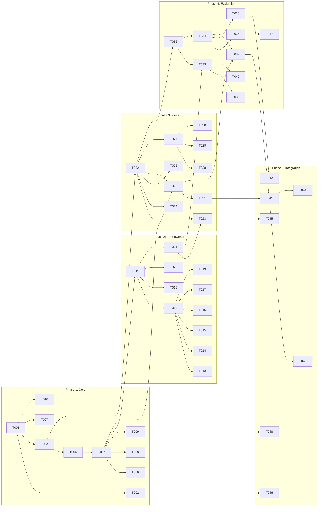

# Brainstorming Ideas Skill - Task Breakdown

**Feature ID**: 001-brainstorming-skill
**Priority**: P2 (Should Have)
**Total Effort**: 44-54 hours (~7-9 days with parallelization)
**Critical Path**: T001 → T005 → T011 → T021 → T031 → T041

## Task Overview

| Phase | Tasks | Effort | Can Parallelize |
|-------|-------|--------|-----------------|
| Core Infrastructure | 10 | 8-10h | No (foundational) |
| Framework Engine | 11 | 10-12h | Partially (after T011) |
| Idea Management | 10 | 12-14h | Yes (with Phase 2) |
| Evaluation System | 9 | 8-10h | After Phase 3 |
| Integration & Polish | 10 | 6-8h | After Phase 4 |

## Detailed Tasks

### Phase 1: Core Infrastructure (Sequential)

| ID | Task | Description | Effort | Priority | Dependencies | Status |
|----|------|-------------|--------|----------|--------------|--------|
| T001 | Create skill directory | Set up `.claude/skills/brainstorming/` structure | 0.5h | P1 | None | ⬜ Pending |
| T002 | Write SKILL.md | Define activation patterns and skill metadata | 1h | P1 | T001 | ⬜ Pending |
| T003 | Session data model | Define Session interface and JSON schema | 1h | P1 | T001 | ⬜ Pending |
| T004 | Storage layer setup | Create `.brainstorm/` directory handler | 1h | P1 | T003 | ⬜ Pending |
| T005 | Session manager core | Implement create/load/save session functions | 2h | P1 | T004 | ⬜ Pending |
| T006 | Session lifecycle | Add timeout and cleanup logic | 1h | P2 | T005 | ⬜ Pending |
| T007 | Configuration loader | Parse and validate config.yml | 1h | P1 | T001 | ⬜ Pending |
| T008 | State persistence | Atomic write operations for data safety | 1h | P1 | T005 | ⬜ Pending |
| T009 | Error handling base | Global error handler and recovery | 0.5h | P2 | T005 | ⬜ Pending |
| T010 | Logging system | Debug and audit trail setup | 1h | P3 | T001 | ⬜ Pending |

### Phase 2: Framework Engine (Parallel after T011)

| ID | Task | Description | Effort | Priority | Dependencies | Status |
|----|------|-------------|--------|----------|--------------|--------|
| T011 | Framework interface | Define Framework type and execution flow | 1h | P1 | T005 | ⬜ Pending |
| T012 | Template loader | Load and parse framework templates | 1h | P1 | T011 | ⬜ Pending |
| T013 | Mind Mapping framework | Implement hierarchical idea expansion | 1.5h | P1 | T012 | ⬜ Pending |
| T014 | SCAMPER framework | Implement systematic modification approach | 1.5h | P1 | T012 | ⬜ Pending |
| T015 | Six Hats framework | Implement perspective-based analysis | 1.5h | P1 | T012 | ⬜ Pending |
| T016 | Five Whys framework | Implement root cause analysis | 1h | P1 | T012 | ⬜ Pending |
| T017 | Framework selector | Auto-suggest framework based on problem | 1h | P2 | T012 | ⬜ Pending |
| T018 | Framework templates | Create markdown templates for each | 1.5h | P1 | T011 | ⬜ Pending |
| T019 | Progressive disclosure | Show framework steps progressively | 1h | P2 | T012 | ⬜ Pending |
| T020 | Framework state | Track progress through framework steps | 1h | P2 | T011 | ⬜ Pending |
| T021 | AskUserQuestion integration | Interactive framework selection | 0.5h | P1 | T011 | ⬜ Pending |

### Phase 3: Idea Management (Parallel with Phase 2)

| ID | Task | Description | Effort | Priority | Dependencies | Status |
|----|------|-------------|--------|----------|--------------|--------|
| T022 | Idea data model | Define Idea interface and structure | 1h | P1 | T003 | ⬜ Pending |
| T023 | Idea capture UI | Single and batch idea input interface | 2h | P1 | T022, T021 | ⬜ Pending |
| T024 | Auto-categorization | Type-based classification logic | 1.5h | P1 | T022 | ⬜ Pending |
| T025 | Duplicate detection | Find and merge similar ideas | 1h | P2 | T022 | ⬜ Pending |
| T026 | Idea storage | Save ideas to session storage | 1h | P1 | T022, T005 | ⬜ Pending |
| T027 | Group data model | Define Group interface and hierarchy | 1h | P1 | T022 | ⬜ Pending |
| T028 | Clustering algorithm | Automatic similarity grouping | 2h | P2 | T027 | ⬜ Pending |
| T029 | Manual grouping | User-driven organization interface | 1.5h | P1 | T027 | ⬜ Pending |
| T030 | Mermaid generator | Create visual diagrams from groups | 2h | P1 | T027 | ⬜ Pending |
| T031 | Auto-save logic | Save every 5 ideas automatically | 1h | P1 | T026 | ⬜ Pending |

### Phase 4: Evaluation System

| ID | Task | Description | Effort | Priority | Dependencies | Status |
|----|------|-------------|--------|----------|--------------|--------|
| T032 | Evaluation criteria | Define scoring dimensions | 0.5h | P1 | T022 | ⬜ Pending |
| T033 | T-shirt sizing UI | Interactive scoring interface | 1.5h | P1 | T032, T021 | ⬜ Pending |
| T034 | Scoring logic | Calculate composite scores | 1h | P1 | T032 | ⬜ Pending |
| T035 | Priority matrix | Generate effort/impact matrix | 1.5h | P1 | T034 | ⬜ Pending |
| T036 | Top ideas selection | Identify and highlight best ideas | 1h | P1 | T034 | ⬜ Pending |
| T037 | Evaluation report | Generate evaluation summary | 1h | P2 | T035 | ⬜ Pending |
| T038 | Bulk evaluation | Score multiple ideas efficiently | 1h | P2 | T033 | ⬜ Pending |
| T039 | Score persistence | Save evaluations to storage | 0.5h | P1 | T034, T026 | ⬜ Pending |
| T040 | Re-evaluation flow | Allow score updates | 1h | P3 | T033 | ⬜ Pending |

### Phase 5: Integration & Polish

| ID | Task | Description | Effort | Priority | Dependencies | Status |
|----|------|-------------|--------|----------|--------------|--------|
| T041 | Markdown exporter | Export session to markdown | 1h | P1 | T031, T039 | ⬜ Pending |
| T042 | TodoWrite integration | Generate task lists from ideas | 1h | P1 | T036 | ⬜ Pending |
| T043 | Orbit spec export | Format for Orbit workflow | 1h | P1 | T041 | ⬜ Pending |
| T044 | Export templates | Create output format templates | 1h | P1 | T041 | ⬜ Pending |
| T045 | MCP hooks | Optional AI enhancement points | 0.5h | P3 | T023 | ⬜ Pending |
| T046 | Help documentation | User guide and examples | 1h | P2 | T002 | ⬜ Pending |
| T047 | Reference.md | Technical documentation | 1h | P2 | All | ⬜ Pending |
| T048 | Error recovery | Graceful failure handling | 0.5h | P2 | T009 | ⬜ Pending |
| T049 | Performance optimization | Optimize for 100+ ideas | 1h | P3 | All | ⬜ Pending |
| T050 | Integration tests | End-to-end testing | 1h | P2 | All | ⬜ Pending |

## Dependency Graph

## Parallelization Strategy

### Parallel Track 1 (Frameworks)
After T011 is complete, developers can work on:
- T013-T016: Individual frameworks (4 developers parallel)
- T018: Framework templates
- T017, T019-T020: Framework features

### Parallel Track 2 (Ideas)
After T022 is complete, developers can work on:
- T024-T025: Categorization and deduplication
- T027-T030: Grouping and visualization
- Can run in parallel with Framework track

### Parallel Track 3 (Polish)
While main development proceeds:
- T010: Logging
- T046-T047: Documentation
- T044: Export templates

## Resource Allocation

### Recommended Team Structure
- **Developer 1**: Core infrastructure (T001-T010) then Evaluation (T032-T040)
- **Developer 2**: Framework engine (T011-T021)
- **Developer 3**: Idea management (T022-T031)
- **Developer 4**: Integration and documentation (T041-T050)

### Solo Developer Approach
1. Complete Phase 1 (Core) - Days 1-2
2. Implement basic frameworks (T011-T013, T021) - Day 3
3. Build idea management (T022-T023, T026, T031) - Days 4-5
4. Add evaluation (T032-T036) - Day 6
5. Integration and testing - Day 7
6. Enhancement and polish - Days 8-9

## Risk Mitigation Tasks

| Risk | Mitigation Task | When |
|------|-----------------|------|
| Data loss | T008 (Atomic writes) | Phase 1 |
| Performance | T049 (Optimization) | Phase 5 |
| User confusion | T046 (Help docs) | Phase 5 |
| Integration issues | T050 (E2E tests) | Phase 5 |
| Framework complexity | T019 (Progressive disclosure) | Phase 2 |

## Definition of Done

### Task Completion Criteria
- [ ] Code implemented and tested
- [ ] Error handling in place
- [ ] Documentation updated
- [ ] Integration points verified
- [ ] Performance acceptable (<2s operations)

### Phase Completion Gates
- **Phase 1**: Sessions can be created, saved, loaded
- **Phase 2**: At least 2 frameworks functional
- **Phase 3**: Ideas can be captured, grouped, visualized
- **Phase 4**: Ideas can be scored and prioritized
- **Phase 5**: All export formats working, documentation complete

## Implementation Notes

### Priority Guidance
- **P1**: Must have for MVP - implement first
- **P2**: Should have for good UX - implement after P1
- **P3**: Nice to have - implement if time permits

### Quick Wins (Can be done early)
- T001-T002: Set up structure
- T007: Configuration
- T010: Logging
- T046: Documentation

### Complex Tasks (Need careful planning)
- T028: Clustering algorithm
- T030: Mermaid generation
- T035: Priority matrix

## Next Actions

1. Review and approve task breakdown
2. Assign developers to tracks
3. Set up development environment
4. Begin T001 (Create skill directory)
5. Daily standups to track progress

---
*Last Updated: 2025-11-20*
*Total Tasks: 50*
*Estimated Completion: 7-9 days with 2-3 developers*
*Critical Path Length: ~20 hours*