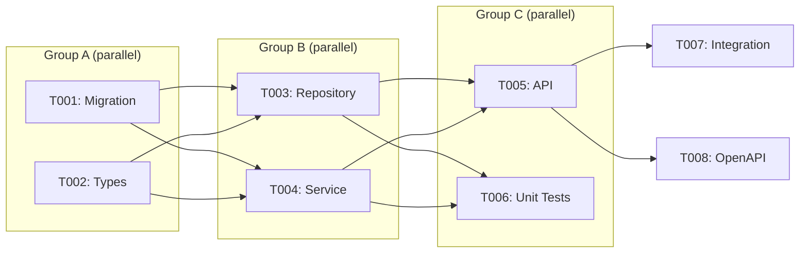
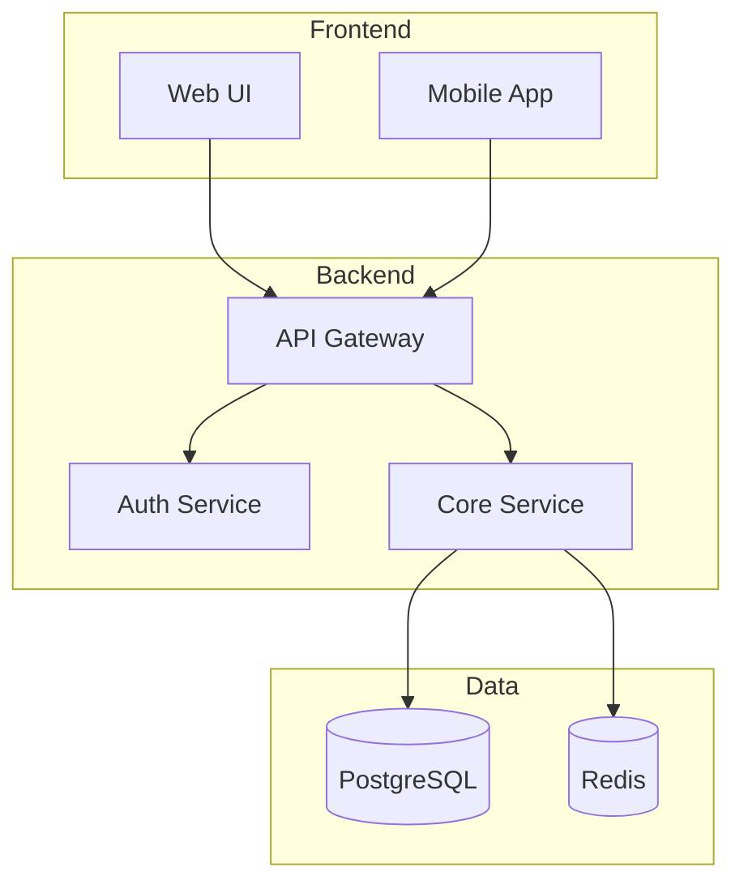

# Orbit Plugin Uplift Plan

**Version**: 3.0.0

## Executive Summary

This plan addresses six key improvements to the Orbit plugin:
1. **Context Loading Efficiency** - Reduce tool/model calls via batch loading
2. **User Experience** - Strategic AskUserQuestion usage for guidance
3. **Parallel Execution** - Task planning that maximizes concurrency
4. **Extensibility** - Support for user's MCP servers, skills, and existing features
5. **Brownfield Support** - Maintain living documentation (PRD, TDD, OpenAPI)
6. **Critical Change Alerts** - Highlight contract/model changes before execution

---

## 1. Context Loading Efficiency

### Problem
Current workflow makes many sequential tool calls to gather context:
- Read session.json
- Glob features/
- Read spec.md
- Read plan.md
- Read tasks.md
- Read metrics.md

This wastes tokens and increases latency. Also no quick way to see all in-progress features.

### Solution: Frontmatter-Based State + Archive

#### Frontmatter State in spec.md

Store feature state in YAML frontmatter for instant access:

```markdown
---
id: 001-user-auth
title: User Authentication
status: implementation    # initialize|specification|clarification|planning|implementation|complete
priority: P1
created: 2025-11-26
updated: 2025-11-27
progress:
  tasks_total: 10
  tasks_done: 3
owner: dev-team
---

# Feature: User Authentication
...
```

**Status Transitions:**
```
initialize → specification → clarification → planning → implementation → complete
                    ↑              ↓
                    └──────────────┘  (can loop back)
```

#### Feature Archive

Completed features move to `.spec/archive/` to keep active list clean:

```
.spec/
├── features/           # Active features only
│   ├── 002-payments/
│   └── 003-notifications/
├── archive/            # Completed features
│   └── 001-user-auth/
└── state/
    └── session.json
```

Archive benefits:
- Faster context loading (fewer features to scan)
- Clear visibility into active work
- Historical reference preserved
- Can search archive when needed

### Solution: Context Loader Script

Create `lib/context-loader.sh` that reads frontmatter for quick state detection:

```bash
#!/usr/bin/env bash
# .claude/hooks/lib/context-loader.sh
# Single script that gathers all context, output as JSON

set -euo pipefail

PROJECT_DIR="${CLAUDE_PROJECT_DIR:-$(pwd)}"
SPEC_DIR="${PROJECT_DIR}/.spec"

output_json() {
  python3 << 'PYTHON'
import json
import os
import re
import yaml

spec_dir = os.environ.get('SPEC_DIR', '.spec')
project_dir = os.environ.get('PROJECT_DIR', '.')

def read_file(path):
    try:
        with open(path, 'r') as f:
            return f.read()
    except:
        return None

def parse_frontmatter(content):
    """Extract YAML frontmatter from markdown."""
    if not content or not content.startswith('---'):
        return {}
    try:
        end = content.find('---', 3)
        if end == -1:
            return {}
        yaml_str = content[3:end].strip()
        return yaml.safe_load(yaml_str) or {}
    except:
        return {}

def get_feature_state(feature_dir):
    """Get feature state from spec.md frontmatter."""
    spec_path = f"{feature_dir}/spec.md"
    content = read_file(spec_path)
    if not content:
        return {"status": "initialize", "progress": {"tasks_total": 0, "tasks_done": 0}}

    fm = parse_frontmatter(content)
    return {
        "id": fm.get("id", os.path.basename(feature_dir)),
        "title": fm.get("title", "Untitled"),
        "status": fm.get("status", "specification"),
        "priority": fm.get("priority", "P2"),
        "created": fm.get("created", ""),
        "updated": fm.get("updated", ""),
        "progress": fm.get("progress", {"tasks_total": 0, "tasks_done": 0}),
        "owner": fm.get("owner", "")
    }

def scan_features(features_dir):
    """Scan all features and return their states."""
    features = []
    if not os.path.isdir(features_dir):
        return features

    for name in sorted(os.listdir(features_dir)):
        feature_dir = f"{features_dir}/{name}"
        if os.path.isdir(feature_dir):
            state = get_feature_state(feature_dir)
            state["path"] = feature_dir
            features.append(state)

    return features

def get_in_progress_features(features):
    """Filter to features that need attention."""
    active_statuses = ["initialize", "specification", "clarification", "planning", "implementation"]
    return [f for f in features if f["status"] in active_statuses]

def suggest_next_action(features, current_feature):
    """Suggest what user should do next based on feature states."""
    in_progress = get_in_progress_features(features)

    if not in_progress:
        return {"action": "new_feature", "reason": "No features in progress"}

    # Priority order: implementation > planning > clarification > specification
    priority_order = ["implementation", "planning", "clarification", "specification", "initialize"]

    for status in priority_order:
        for f in in_progress:
            if f["status"] == status:
                if f["id"] == current_feature:
                    return {
                        "action": f"continue_{status}",
                        "feature": f["id"],
                        "reason": f"Continue {f['title']} ({status})"
                    }
                else:
                    return {
                        "action": f"switch_to_{status}",
                        "feature": f["id"],
                        "reason": f"Switch to {f['title']} ({status})"
                    }

    return {"action": "new_feature", "reason": "All features complete"}

# Load session
session_file = f"{spec_dir}/state/session.json"
session = {}
if os.path.exists(session_file):
    try:
        session = json.load(open(session_file))
    except:
        pass

current_feature = session.get("feature")

# Scan active features (frontmatter only - fast!)
features = scan_features(f"{spec_dir}/features")
in_progress = get_in_progress_features(features)

# Get suggestion
suggestion = suggest_next_action(features, current_feature)

# Get current feature details (only load artifacts for active feature)
current_feature_state = None
current_artifacts = None
feature_dir = None

if current_feature:
    feature_dir = f"{spec_dir}/features/{current_feature}"
    if os.path.isdir(feature_dir):
        current_feature_state = get_feature_state(feature_dir)
        # Only load full artifacts for current feature (lazy loading)
        current_artifacts = {
            "spec": read_file(f"{feature_dir}/spec.md"),
            "plan": read_file(f"{feature_dir}/plan.md"),
            "tasks": read_file(f"{feature_dir}/tasks.md"),
            "metrics": read_file(f"{feature_dir}/metrics.md")
        }

# Scan archive for reference
archived = []
archive_dir = f"{spec_dir}/archive"
if os.path.isdir(archive_dir):
    for name in sorted(os.listdir(archive_dir)):
        arch_feature_dir = f"{archive_dir}/{name}"
        if os.path.isdir(arch_feature_dir):
            state = get_feature_state(arch_feature_dir)
            state["archived"] = True
            archived.append(state)

# Load architecture docs (just filenames, not content - load on demand)
architecture_files = []
arch_dir = f"{spec_dir}/architecture"
if os.path.isdir(arch_dir):
    architecture_files = [f for f in os.listdir(arch_dir) if f.endswith('.md')]

# Detect MCP servers
mcp_servers = []
mcp_file = f"{project_dir}/.mcp.json"
if os.path.exists(mcp_file):
    try:
        mcp_config = json.load(open(mcp_file))
        mcp_servers = list(mcp_config.get("mcpServers", {}).keys())
    except:
        pass

# Detect user skills
user_skills = []
skills_dir = f"{project_dir}/.claude/skills"
if os.path.isdir(skills_dir):
    user_skills = [d for d in os.listdir(skills_dir)
                   if os.path.isdir(f"{skills_dir}/{d}")]

# Detect user agents
user_agents = []
agents_dir = f"{project_dir}/.claude/agents"
if os.path.isdir(agents_dir):
    user_agents = [f.replace('.md', '') for f in os.listdir(agents_dir)
                   if f.endswith('.md')]

# Build context output
context = {
    "suggestion": suggestion,  # What user should do next
    "current": {
        "feature": current_feature,
        "state": current_feature_state,
        "artifacts": current_artifacts  # Full content for active feature
    },
    "features": {
        "active": features,           # All active features with frontmatter state
        "in_progress": in_progress,   # Filtered to non-complete
        "archived_count": len(archived)
    },
    "architecture_files": architecture_files,
    "extensions": {
        "mcp_servers": mcp_servers,
        "user_skills": user_skills,
        "user_agents": user_agents
    },
    "project": {
        "has_openapi": os.path.exists(f"{project_dir}/openapi.yml") or
                       os.path.exists(f"{project_dir}/openapi.yaml"),
        "has_prisma": os.path.exists(f"{project_dir}/prisma/schema.prisma")
    }
}

print(json.dumps(context, indent=2))
PYTHON
}

output_json
```

### Example Context Output

```json
{
  "suggestion": {
    "action": "continue_implementation",
    "feature": "002-payments",
    "reason": "Continue Payments Integration (implementation)"
  },
  "current": {
    "feature": "002-payments",
    "state": {
      "id": "002-payments",
      "title": "Payments Integration",
      "status": "implementation",
      "priority": "P1",
      "progress": {"tasks_total": 8, "tasks_done": 3}
    },
    "artifacts": { "spec": "...", "plan": "...", "tasks": "...", "metrics": "..." }
  },
  "features": {
    "active": [
      {"id": "002-payments", "title": "Payments", "status": "implementation", "progress": {...}},
      {"id": "003-notifications", "title": "Notifications", "status": "planning", "progress": {...}}
    ],
    "in_progress": [...],
    "archived_count": 5
  },
  "extensions": {
    "mcp_servers": ["postgres", "github"],
    "user_skills": ["brainstorming"],
    "user_agents": ["security-scanner"]
  }
}
```

### Skill Integration

The skill loads context once at start:

```markdown
## Initialization

<context-loading>
Before any workflow action, load full context with a single Bash call:

```bash
bash .claude/hooks/lib/context-loader.sh
```

This returns:
- Current feature and phase
- All artifact contents
- Architecture documents
- Available extensions (MCP, skills, agents)
- Project file detection (OpenAPI, Prisma, GraphQL)

Use this context for all subsequent decisions without additional reads.
</context-loading>
```

### Efficiency Gains

| Before | After |
|--------|-------|
| 6-8 Read calls | 1 Bash call |
| ~2000 tokens overhead | ~500 tokens |
| Sequential loading | Parallel in Python |
| No extension detection | Auto-discovers MCP/skills |
| No feature state summary | Instant in-progress list |

### Feature Archive Workflow

When a feature reaches `complete` status, archive it:

```bash
# Archive helper in lib.sh
archive_feature() {
  local feature="$1"
  local src="${SPEC_DIR}/features/${feature}"
  local dst="${SPEC_DIR}/archive/${feature}"

  if [[ -d "${src}" ]]; then
    # Update frontmatter to archived
    update_frontmatter "${src}/spec.md" "archived" "true"
    update_frontmatter "${src}/spec.md" "archived_date" "$(date -u +%Y-%m-%d)"

    # Move to archive
    mkdir -p "${SPEC_DIR}/archive"
    mv "${src}" "${dst}"

    # Clear session if this was current feature
    if [[ "$(get_feature)" == "${feature}" ]]; then
      echo '{"feature": null}' > "${SESSION_FILE}"
    fi

    echo "Archived: ${feature}"
  fi
}
```

#### Archive Triggers

1. **Automatic**: When all tasks marked `[x]` AND validation passes
2. **Manual**: User selects "Archive Feature" from /orbit menu
3. **Bulk**: `/orbit archive-completed` archives all complete features

#### Frontmatter on Archive

```yaml
---
id: 001-user-auth
title: User Authentication
status: complete
priority: P1
created: 2025-11-20
updated: 2025-11-27
archived: true
archived_date: 2025-11-27
progress:
  tasks_total: 12
  tasks_done: 12
completion_summary: "Implemented JWT auth with refresh tokens"
---
```

#### Searching Archive

When creating new features, search archive for related work:

```python
def find_related_archived(query, archived_features):
    """Find archived features related to a query."""
    matches = []
    query_lower = query.lower()
    for f in archived_features:
        if query_lower in f["title"].lower():
            matches.append(f)
        # Could add keyword matching from spec content
    return matches
```

Use case: "I want to add social auth" → Finds archived "001-user-auth" as reference.

---

## 2. Strategic AskUserQuestion Usage

### UX Principles

1. **Ask early, ask once** - Gather requirements before starting work
2. **Batch questions** - Max 4 questions per AskUserQuestion call
3. **Provide defaults** - Always suggest the most likely choice
4. **Context in options** - Include brief descriptions

### Question Points by Phase

#### Phase: Initialize (New Project)
```yaml
trigger: No .spec/ directory
questions:
  - header: "Project Type"
    question: "What type of project is this?"
    options:
      - label: "Greenfield"
        description: "Starting from scratch"
      - label: "Brownfield"
        description: "Existing codebase - will analyze first"
      - label: "API-First"
        description: "Designing API contracts first"
```

#### Phase: Feature Selection
```yaml
trigger: Multiple features exist OR resuming session
questions:
  - header: "Feature"
    question: "Which feature would you like to work on?"
    options:
      - label: "{feature-1}"
        description: "Phase: {phase}, Progress: {x/y}"
      - label: "{feature-2}"
        description: "Phase: {phase}"
      - label: "New Feature"
        description: "Start a new feature"
```

#### Phase: Specification
```yaml
trigger: Creating new spec
questions:
  - header: "Scope"
    question: "What's the scope of this feature?"
    options:
      - label: "Small"
        description: "1-3 user stories, single component"
      - label: "Medium"
        description: "4-8 user stories, multiple components"
      - label: "Large"
        description: "9+ user stories, cross-cutting concerns"
  - header: "Priority"
    question: "What priority level?"
    options:
      - label: "P1 - Must Have"
        description: "Core functionality, blocks release"
      - label: "P2 - Should Have"
        description: "Important but can defer"
      - label: "P3 - Nice to Have"
        description: "Enhancement, low priority"
```

#### Phase: Planning (Critical Change Detection)
```yaml
trigger: Plan involves contracts/models
questions:
  - header: "⚠️ Critical Changes"
    question: "This plan modifies critical components. Proceed?"
    options:
      - label: "Review Changes"
        description: "Show detailed impact analysis"
      - label: "Proceed with Caution"
        description: "Continue but flag for extra review"
      - label: "Revise Approach"
        description: "Go back to planning"
```

#### Phase: Implementation
```yaml
trigger: Starting implementation
questions:
  - header: "Execution Mode"
    question: "How should tasks be executed?"
    options:
      - label: "Guided"
        description: "Confirm each task before executing"
      - label: "Autonomous"
        description: "Execute all, report at end"
      - label: "Parallel Groups"
        description: "Execute independent groups in parallel"
```

### Question Flow Diagram

```
┌─────────────────────────────────────────────────────────────┐
│                         /orbit                               │
└─────────────────────────────────────────────────────────────┘
                              │
                              ▼
                    ┌─────────────────┐
                    │  Load Context   │
                    │  (1 Bash call)  │
                    └─────────────────┘
                              │
              ┌───────────────┼───────────────┐
              ▼               ▼               ▼
        No Features     Has Feature     Multiple Features
              │               │               │
              ▼               ▼               ▼
        Ask: New or      Continue?      Ask: Which
        Analyze?              │          feature?
              │               │               │
              └───────────────┴───────────────┘
                              │
                              ▼
                    Phase-specific workflow
                              │
              ┌───────────────┼───────────────┐
              ▼               ▼               ▼
        Spec Phase      Plan Phase      Impl Phase
              │               │               │
        Ask: Scope      Ask: Critical   Ask: Execution
        Priority        Changes?        Mode
              │               │               │
              └───────────────┴───────────────┘
                              │
                              ▼
                        Execute Work
```

---

## 3. Parallel Task Planning

### Task Dependency Model

Extend tasks.md format to explicitly mark parallelization:

```markdown
# Tasks: Feature Name

## Parallel Group A (can run simultaneously)
- [ ] T001: Create database migration [P1] [critical:schema]
- [ ] T002: Create TypeScript types [P1] [critical:types]

## Parallel Group B (depends on Group A)
- [ ] T003: Implement repository layer [P1] [depends:T001,T002]
- [ ] T004: Implement service layer [P1] [depends:T001,T002]

## Parallel Group C (depends on Group B)
- [ ] T005: Create API endpoints [P1] [depends:T003,T004] [critical:api]
- [ ] T006: Write unit tests [P2] [depends:T003,T004]
- [ ] T007: Write integration tests [P2] [depends:T005]

## Sequential (must be last)
- [ ] T008: Update OpenAPI spec [P1] [depends:T005] [critical:api]
- [ ] T009: Update documentation [P3] [depends:T005,T006,T007]
```

### Task Metadata Tags

| Tag | Purpose | Example |
|-----|---------|---------|
| `[P1/P2/P3]` | Priority | `[P1]` |
| `[depends:X,Y]` | Dependencies | `[depends:T001,T002]` |
| `[critical:type]` | Critical change | `[critical:schema]`, `[critical:api]` |
| `[parallel:group]` | Explicit grouping | `[parallel:A]` |
| `[estimate:size]` | T-shirt size | `[estimate:M]` |

### Parallel Execution Strategy

```python
# Pseudocode for implementing-tasks agent

def execute_tasks(tasks):
    # Build dependency graph
    graph = build_dependency_graph(tasks)

    # Find independent groups
    groups = topological_sort_into_groups(graph)

    for group in groups:
        # Execute group tasks in parallel using Task tool
        if len(group) > 1:
            # Spawn parallel subagents
            parallel_execute([
                Task(prompt=f"Execute task {t.id}: {t.description}")
                for t in group
            ])
        else:
            # Single task - execute directly
            execute_task(group[0])

        # Wait for group completion before next group
        await_group_completion(group)
```

### Visualization in metrics.md

```markdown
## Task Execution Plan


```

---

## 4. Extensibility Framework

### Extension Discovery

The context-loader automatically detects:

```json
{
  "extensions": {
    "mcp_servers": ["github", "postgres", "memory"],
    "user_skills": ["brainstorming", "code-review"],
    "user_agents": ["custom-deployer", "security-scanner"]
  }
}
```

### Using Discovered Extensions

#### MCP Server Integration

```markdown
## MCP Integration

<mcp-usage>
When MCP servers are available, prefer them for specialized operations:

| Server | Use For |
|--------|---------|
| `github` | PR creation, issue management |
| `postgres` | Schema introspection, migrations |
| `memory` | Storing context across sessions |
| `filesystem` | Large file operations |

Example: If `postgres` MCP is available and task involves DB:
1. Use `mcp__postgres__query` to introspect current schema
2. Generate migration based on actual state
3. Validate migration before applying
</mcp-usage>
```

#### Existing Feature Discovery

```markdown
## Feature Discovery

<feature-reuse>
Before creating a new feature, check for existing related features:

1. Search `.spec/features/` for similar names
2. Check `architecture/` for reusable patterns
3. Look for completed features that could be extended

If related feature exists:
- Ask user: "Found similar feature '{name}'. Resume or create new?"
- If resume: Load feature context and continue from detected phase
- If new: Reference existing feature in spec for consistency
</feature-reuse>
```

#### User Agent Delegation

```markdown
## Agent Delegation

<agent-discovery>
Check for user-defined agents that might handle specialized tasks:

Available agents from context:
- Built-in: implementing-tasks, validating-artifacts, analyzing-codebase
- User: {user_agents from context}

When a task matches a user agent's domain:
1. Read agent definition to understand capabilities
2. Delegate if appropriate
3. Aggregate results back to main workflow
</agent-discovery>
```

### Extension Configuration

Allow users to configure extension preferences in `.spec/.spec-config.yml`:

```yaml
version: 1.0.0
paths:
  spec_root: ".spec"
  features: "features"

extensions:
  # Prefer these MCP servers when available
  preferred_mcp:
    database: "postgres"
    git: "github"
    memory: "memory"

  # Always invoke these agents for certain tasks
  agent_hooks:
    pre_implementation: ["security-scanner"]
    post_implementation: ["code-review"]

  # Skills to offer as options
  auxiliary_skills:
    - "brainstorming"
    - "documentation"

workflow:
  protect:
    - ".env"
    - "package-lock.json"
    - ".git/"

  # Critical patterns to flag
  critical_patterns:
    - "openapi.y*ml"
    - "schema.prisma"
    - "migrations/"
    - "types.ts"
```

---

## 5. Brownfield Documentation

### Living Documentation Structure

```
.spec/
├── architecture/
│   ├── product-requirements.md    # PRD - evolving requirements
│   ├── technical-design.md        # TDD - system architecture
│   ├── api-contracts.md           # API documentation index
│   └── decisions/                 # ADRs (Architecture Decision Records)
│       ├── 001-auth-strategy.md
│       └── 002-database-choice.md
├── features/
│   └── {feature}/
└── contracts/                     # Generated/maintained contracts
    ├── openapi.yml
    ├── graphql.schema
    └── protobuf/
```

### Product Requirements Document (PRD)

Template at `.spec/architecture/product-requirements.md`:

```markdown
# Product Requirements Document

**Product**: {name}
**Version**: {version}
**Last Updated**: {date}
**Owner**: {team/person}

## Vision
{1-2 sentence product vision}

## Goals
1. {goal with measurable outcome}
2. {goal}

## User Personas

### {Persona Name}
- **Role**: {job title/function}
- **Goals**: {what they want to achieve}
- **Pain Points**: {current frustrations}

## Feature Summary

| ID | Feature | Status | Priority | Release |
|----|---------|--------|----------|---------|
| F001 | {name} | ✓ Done | P1 | v1.0 |
| F002 | {name} | In Progress | P1 | v1.1 |
| F003 | {name} | Planned | P2 | v1.2 |

## Non-Functional Requirements

### Performance
- {requirement with metric}

### Security
- {requirement}

### Scalability
- {requirement}

---

## Changelog

| Date | Change | Author |
|------|--------|--------|
| {date} | {what changed} | {who} |
```

### Technical Design Document (TDD)

Template at `.spec/architecture/technical-design.md`:

```markdown
# Technical Design Document

**System**: {name}
**Version**: {version}
**Last Updated**: {date}

## System Overview



## Technology Stack

| Layer | Technology | Version | Purpose |
|-------|------------|---------|---------|
| Frontend | React | 18.x | UI framework |
| Backend | Node.js | 20.x | Runtime |
| Database | PostgreSQL | 15.x | Primary data store |
| Cache | Redis | 7.x | Session/cache |

## Component Details

### {Component Name}
- **Purpose**: {what it does}
- **Location**: `src/{path}`
- **Dependencies**: {internal/external}
- **API**: {endpoints it exposes}

## Data Models

### {Model Name}
```typescript
interface User {
  id: string;
  email: string;
  createdAt: Date;
  // ...
}
```

## API Contracts

See: `contracts/openapi.yml`

| Endpoint | Method | Purpose |
|----------|--------|---------|
| /api/users | GET | List users |
| /api/users/:id | GET | Get user |

## Integration Points

| System | Type | Protocol | Purpose |
|--------|------|----------|---------|
| Stripe | External | REST | Payments |
| SendGrid | External | REST | Email |

---

## Changelog

| Date | Change | Author |
|------|--------|--------|
```

### API Contract Management

#### OpenAPI Integration

When `analyzing-codebase` detects an API-based project:

```markdown
## API Contract Workflow

<api-contracts>
1. **Detection**: Check for existing openapi.yml, swagger.yml, or similar
2. **Baseline**: If exists, use as source of truth for endpoint planning
3. **Updates**: When tasks modify API:
   - Flag as `[critical:api]`
   - After implementation, regenerate/update contract
   - Validate contract matches implementation

### Contract Update Process
1. Read current contract
2. Parse implementation changes
3. Generate contract diff
4. Present diff to user for approval
5. Update contract file
6. Update technical-design.md API section
</api-contracts>
```

#### Agent: Contract Synchronization

Add responsibility to `implementing-tasks`:

```markdown
<post-task contract="true">
After completing a task marked [critical:api]:
1. Read openapi.yml (if exists)
2. Compare implemented endpoints to spec
3. Generate patch if diverged
4. Append to task output:

   ## Contract Update Required
   ```diff
   + /api/users/{id}/preferences:
   +   get:
   +     summary: Get user preferences
   +     responses:
   +       200:
   +         description: User preferences object
   ```
</post-task>
```

---

## 6. Critical Change Detection & Alerting

### Critical Change Categories

| Category | Patterns | Risk Level | Action |
|----------|----------|------------|--------|
| **API Contract** | `openapi.yml`, `swagger.*`, `*.proto` | HIGH | Require explicit approval |
| **Database Schema** | `schema.prisma`, `migrations/*`, `*.sql` | HIGH | Show migration preview |
| **Type Definitions** | `types.ts`, `interfaces.ts`, `models/*` | MEDIUM | Highlight breaking changes |
| **Authentication** | `auth/*`, `jwt.*`, `session.*` | HIGH | Security review prompt |
| **Configuration** | `.env*`, `config/*` | MEDIUM | Verify no secrets exposed |

### Detection in Plan Phase

When creating plan.md, scan for critical patterns:

```markdown
## Critical Change Analysis

<critical-scan>
Scan plan for changes to critical paths:

1. Parse plan.md for file references
2. Match against critical_patterns from config
3. Categorize by risk level
4. Generate warning section

Output format in plan.md:
```
## ⚠️ Critical Changes

This plan modifies critical components:

| File/Pattern | Category | Risk | Requires |
|--------------|----------|------|----------|
| `schema.prisma` | Database | HIGH | Migration review |
| `openapi.yml` | API | HIGH | Contract approval |
| `src/auth/jwt.ts` | Security | HIGH | Security review |

**Recommendation**: Review each critical change before proceeding to tasks.
```
</critical-scan>
```

### Alerting in Implementation Phase

Before executing critical tasks:

```markdown
## Pre-Task Critical Check

<critical-alert>
Before executing a task with [critical:*] tag:

1. Display prominent warning:
   ```
   ⚠️  CRITICAL CHANGE: {category}

   This task modifies: {file/pattern}
   Impact: {description of what changes}

   Downstream effects:
   - {effect 1}
   - {effect 2}
   ```

2. Use AskUserQuestion:
   - header: "⚠️ Critical Change"
   - question: "This modifies {category}. How to proceed?"
   - options:
     - "Show full impact analysis"
     - "Proceed with change"
     - "Skip this task"
     - "Abort implementation"
</critical-alert>
```

### Breaking Change Detection

For type/interface changes:

```typescript
// Example: Detecting breaking changes in types

interface BreakingChangeAnalysis {
  file: string;
  changes: {
    removed: string[];      // Removed fields/methods
    typeChanged: string[];  // Changed types
    required: string[];     // New required fields
  };
  impactedFiles: string[];  // Files importing this
  riskLevel: 'HIGH' | 'MEDIUM' | 'LOW';
}
```

Skill logic:
```markdown
<breaking-change-detection>
When task involves type modifications:

1. Read current type definition
2. Parse proposed changes
3. Identify:
   - Removed properties (BREAKING)
   - Changed types (BREAKING if narrowing)
   - New required fields (BREAKING)
   - New optional fields (SAFE)
4. Find all importers via Grep
5. Assess impact scope

Alert format:
```
⚠️ BREAKING CHANGE DETECTED

File: src/types/user.ts
Change: Removed field `legacyId`

Impacted files (7):
- src/services/user.service.ts
- src/api/users.controller.ts
- src/repositories/user.repo.ts
...

Risk: HIGH - Requires updates to 7 files
```
</breaking-change-detection>
```

---

## 7. Implementation Plan

### Phase 1: Frontmatter & State (Tasks 1-4)

| Task | Description | Parallel Group |
|------|-------------|----------------|
| T001 | Update spec.md template with frontmatter schema | A |
| T002 | Create `lib/context-loader.sh` with frontmatter parsing | A |
| T003 | Add `update_frontmatter()` helper to lib.sh | A |
| T004 | Update skill to maintain frontmatter on phase transitions | A |

### Phase 2: Archive System (Tasks 5-7)

| Task | Description | Parallel Group |
|------|-------------|----------------|
| T005 | Create `archive_feature()` helper in lib.sh | B |
| T006 | Add archive option to /orbit complete phase | B |
| T007 | Add archive search for related features | B |

### Phase 3: Context Efficiency (Tasks 8-10)

| Task | Description | Parallel Group |
|------|-------------|----------------|
| T008 | Update skill to use context loader (single call) | C |
| T009 | Add suggestion engine to context loader | C |
| T010 | Remove redundant Read calls from agents | C |

### Phase 4: UX Improvements (Tasks 11-14)

| Task | Description | Parallel Group |
|------|-------------|----------------|
| T011 | Define AskUserQuestion templates per phase | D |
| T012 | Update orbit.md with question flow + feature list | D |
| T013 | Add question batching to skill | D |
| T014 | Add "suggested next action" to /orbit banner | D |

### Phase 5: Parallel Execution (Tasks 15-17)

| Task | Description | Parallel Group |
|------|-------------|----------------|
| T015 | Extend tasks.md format with dependency tags | E |
| T016 | Update implementing-tasks for parallel groups | E |
| T017 | Add execution plan visualization (mermaid) | E |

### Phase 6: Extensibility (Tasks 18-21)

| Task | Description | Parallel Group |
|------|-------------|----------------|
| T018 | Add MCP detection to context loader | F |
| T019 | Add user skill/agent discovery | F |
| T020 | Create extension configuration schema | F |
| T021 | Add feature discovery and resume logic | F |

### Phase 7: Brownfield Support (Tasks 22-25)

| Task | Description | Parallel Group |
|------|-------------|----------------|
| T022 | Create PRD template and generator | G |
| T023 | Create TDD template and generator | G |
| T024 | Add OpenAPI sync to analyzing-codebase | G |
| T025 | Add contract update to implementing-tasks | G |

### Phase 8: Critical Alerts (Tasks 26-28)

| Task | Description | Parallel Group |
|------|-------------|----------------|
| T026 | Add critical pattern detection to planner | H |
| T027 | Add pre-task alerts to implementing-tasks | H |
| T028 | Add breaking change detection for types | H |

### Phase 9: Integration & Testing (Tasks 29-31)

| Task | Description | Parallel Group |
|------|-------------|----------------|
| T029 | Integration test: full greenfield workflow | I |
| T030 | Integration test: brownfield with archive | I |
| T031 | Update all documentation | I |

---

## 8. File Changes Summary

### New Files
```
.claude/hooks/lib/context-loader.sh         # Context gathering script
.spec/architecture/product-requirements.md  # PRD template
.spec/architecture/technical-design.md      # TDD template
.spec/architecture/decisions/               # ADR directory
.spec/archive/                              # Completed features archive
```

### Modified Files
```
.claude/skills/orbit-workflow/SKILL.md   # Frontmatter handling, context loading, questions
.claude/agents/implementing-tasks.md     # Parallel execution, critical alerts
.claude/agents/analyzing-codebase.md     # PRD/TDD generation, OpenAPI sync
.claude/agents/validating-artifacts.md   # Contract validation
.claude/commands/orbit.md                # Question flow, feature list, archive option
.claude/hooks/lib.sh                     # update_frontmatter(), archive_feature()
.spec/.spec-config.yml                   # Extension configuration
```

### Template Updates
```
spec.md template                         # Add frontmatter schema
plan.md template                         # Add dependency notation docs
tasks.md template                        # Add parallel group + critical tags
```

### Removed Files
None - additive changes only

---

## 9. Success Metrics

| Metric | Current | Target |
|--------|---------|--------|
| Tool calls per /orbit | 6-8 | 1-2 |
| Time to context load | 3-5s | <0.5s |
| Feature state visibility | None | All features with status |
| User guidance prompts | 1 | 3-4 per session |
| Parallel task utilization | 0% | 60%+ |
| Critical change detection | None | 100% |
| Extension auto-discovery | None | 100% |
| Archive utilization | N/A | Auto-archive on complete |

---

## 10. Risks & Mitigations

| Risk | Impact | Mitigation |
|------|--------|------------|
| Context loader too slow | HIGH | Frontmatter-only scan, lazy artifact load |
| Too many questions annoy users | MEDIUM | Add "don't ask again" option |
| Parallel execution race conditions | HIGH | Validate dependencies before parallel |
| False positive critical alerts | MEDIUM | Tune patterns, allow dismiss |
| Frontmatter out of sync | MEDIUM | Update on every phase transition |
| Archive search too slow | LOW | Index titles/keywords on archive |
| Extension conflicts | LOW | Namespace user extensions |

---

## Next Steps

1. Review and approve this plan
2. Create feature directory: `.spec/features/002-orbit-uplift/`
3. Copy this to `spec.md` and generate `plan.md`
4. Generate `tasks.md` from Phase 1-7
5. Begin implementation with parallel groups

---

*Generated: 2025-11-26*
*Plan Version: 1.0.0*
