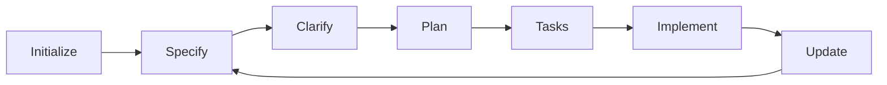
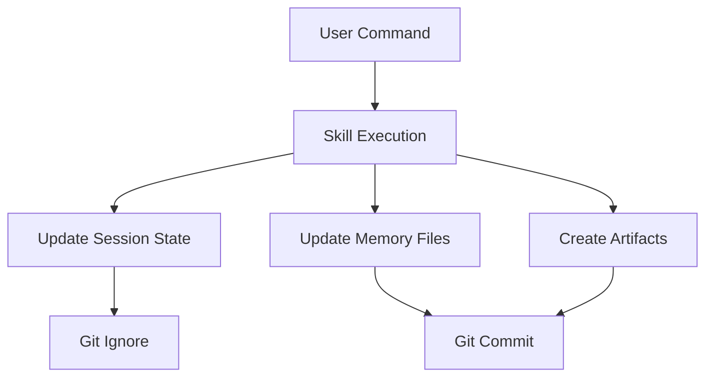

# Spec Plugin Architecture Blueprint

## System Architecture

### Overview

Spec follows a layered architecture with clear separation of concerns:

```
┌─────────────────────────────────────────────────┐
│                 User Interface                   │
│          (Slash Commands & Skills)               │
├─────────────────────────────────────────────────┤
│              Workflow Orchestration              │
│         (Skills, Agents, State Manager)          │
├─────────────────────────────────────────────────┤
│                State Persistence                 │
│        (Session State, Memory Files)             │
├─────────────────────────────────────────────────┤
│              Integration Layer                   │
│         (Git, MCP, Claude Code API)              │
└─────────────────────────────────────────────────┘
```

## Component Architecture

### 1. Command Layer (`.claude/commands/`)

**Purpose**: User-facing interface for workflow operations

**Components**:
- `👻 init.md` - Initialize Spec workflow
- `👻 specify.md` - Create specifications
- `👻 implement.md` - Execute implementation
- `👻 status.md` - Check workflow state
- `👻 help.md` - Context-aware assistance
- `👻 session.md` - Session management
- `👻 resume.md` - Continue interrupted work
- `👻 validate.md` - Consistency checking

**Design Principles**:
- Emoji prefix (👻) for visual identification
- Minimal argument parsing
- Delegate to skills for complex logic
- Provide clear user feedback

### 2. Skill Layer (`.claude/skills/`)

**Purpose**: Complex multi-step workflow operations

**Core Skills** (14 total):
```
Initialization & Setup:
├── spec-init         # Workflow initialization
├── spec-discover     # Codebase analysis
└── spec-update       # Configuration updates

Specification Phase:
├── spec-specify      # Create specifications
├── spec-clarify      # Resolve ambiguities
└── spec-checklist    # Quality validation

Planning Phase:
├── spec-plan         # Technical design
├── spec-blueprint    # Architecture definition
└── spec-analyze      # Consistency analysis

Implementation Phase:
├── spec-tasks        # Task breakdown
├── spec-implement    # Code execution
└── spec-orchestrate  # End-to-end workflow

Support:
├── spec-metrics      # Progress tracking
└── skill-builder        # Skill creation
```

**Skill Structure**:
```
skill-name/
├── SKILL.md            # Main skill definition
├── examples.md         # Usage examples
├── reference.md        # Technical reference
└── scripts/
    └── validate.sh     # Validation script
```

### 3. Agent Layer (`.claude/agents/`)

**Purpose**: Autonomous task execution

**Agents**:
- `spec-researcher` - Technical research and ADR documentation
- `spec-analyzer` - Deep codebase analysis
- `spec-implementer` - Autonomous implementation

**Agent Capabilities**:
- File operations (Read, Write, Edit)
- Search operations (Glob, Grep)
- Web operations (WebSearch, WebFetch)
- Shell operations (Bash)
- Parallel task execution

### 4. State Management

**Session State** (`.spec-state/`):
```
current-session.md       # Active session tracking
├── feature_name        # Current feature
├── phase              # Current phase
├── tasks              # Task progress
└── checkpoints/       # Session snapshots
```

**Persistent Memory** (`.spec-memory/`):
```
WORKFLOW-PROGRESS.md     # Feature completion tracking
DECISIONS-LOG.md        # Architecture decisions (ADRs)
CHANGES-PLANNED.md      # Upcoming changes
CHANGES-COMPLETED.md    # Completed changes
```

**Feature Artifacts** (`features/`):
```
###-feature-name/
├── spec.md            # Requirements & stories
├── plan.md            # Technical design
└── tasks.md           # Implementation tasks
```

### 5. Template System (`templates/`)

**Purpose**: Standardized document generation

**Templates** (v2.0 - Optimized):
- `spec-template.md` - Feature specifications
- `plan-template.md` - Technical plans
- `tasks-template.md` - Task lists
- `product-requirements-template.md` - Product docs
- `architecture-blueprint-template.md` - Architecture docs

**Shared Standards** (`_shared/`):
- Priority definitions (P1/P2/P3)
- Task ID format (T###)
- User story format
- ADR template

## Data Flow

### Workflow Progression



### State Updates



## Integration Points

### Claude Code Integration

**Commands**: Slash command markdown files
**Skills**: Skill markdown with progressive disclosure
**Agents**: Agent markdown with tool access
**Hooks**: Event-based automation

### Git Integration

**Tracked Files**:
- `.spec-memory/` - Project history
- `features/` - Feature artifacts
- `.spec/config/` - Configuration

**Ignored Files**:
- `.spec-state/` - Session-specific
- `.spec-state/checkpoints/` - Temporary

### MCP Integration

**Current**: Placeholder `.mcp.json`
**Future**: Tool definitions for external services

## Performance Optimization

### Token Usage

**Optimizations Applied**:
- 66% template size reduction (v1.0 → v2.0)
- 43% agent documentation reduction
- Progressive disclosure in skills
- Lazy loading of examples

**Metrics**:
- Average command: < 500 tokens
- Average skill: < 2000 tokens
- Average agent task: < 5000 tokens

### Response Time

**Targets**:
- Command response: < 2s
- Skill execution: < 10s
- Agent task: < 60s
- File operations: < 500ms

## Security & Reliability

### Error Handling

```bash
# Standard error handling pattern
if ! command; then
    echo "Error: Operation failed"
    echo "Debug: Check /path/to/log"
    exit 1
fi
```

### Validation

- Input validation at command layer
- State consistency checking
- Artifact format validation
- Pre-commit validation hooks

### Recovery

- Session checkpoints for recovery
- State file backups
- Graceful degradation
- Clear error messages

## Extension Points

### Custom Skills

Location: `.claude/skills/custom-skill/`
Template: Use `skill-builder` skill
Validation: `scripts/validate.sh`

### Custom Templates

Location: `templates/custom/`
Format: Markdown with placeholders
Usage: Reference in skills

### Workflow Hooks

Location: `.claude/hooks/`
Format: JSON configuration
Events: Pre/post command execution

## Deployment

### Package Structure

```
spec/
├── .claude/           # Core integration
├── .spec/          # Configuration
├── templates/         # User templates
├── README.md          # User documentation
├── CLAUDE.md          # Claude instructions
└── .mcp.json         # MCP config
```

### Installation

Via marketplace:
```bash
/plugin install spec@spec-marketplace
```

Local development:
```bash
/plugin install ./plugins/spec
```

### Version Management

- Follow semver (MAJOR.MINOR.PATCH)
- Update `marketplace.json`
- Tag releases in git
- Maintain CHANGELOG.md

## Future Enhancements

### Planned Features

1. **Visual Workflow Editor**: Web-based UI
2. **AI Suggestions**: Proactive recommendations
3. **Team Sync**: Real-time collaboration
4. **Advanced Analytics**: Detailed metrics
5. **Enterprise Features**: SSO, audit logs

### Architecture Evolution

- Microservices for heavy operations
- WebSocket for real-time features
- GraphQL API for complex queries
- Plugin marketplace integration

---

*Last Updated: 2024*
*Version: 2.1.0*
*Status: Production Architecture*