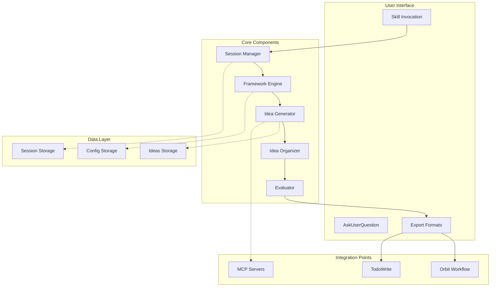

# Brainstorming Ideas Skill - Technical Plan

**Feature ID**: 001-brainstorming-skill
**Priority**: P2 (Should Have)
**Status**: In Planning
**Created**: 2025-11-20
**Architect**: Development Team

## 1. System Architecture

### Overview
The Brainstorming Skill is implemented as a self-contained Claude Code skill module that leverages the existing tool ecosystem (Read, Write, AskUserQuestion, TodoWrite) while maintaining session state for complex ideation workflows.

### Architecture Pattern


### Key Design Decisions
1. **Stateful Sessions**: Sessions persist between invocations to support long brainstorming processes
2. **Framework Modularity**: Each framework is a standalone template for easy addition/modification
3. **Progressive Disclosure**: Complex features revealed only when needed
4. **Local-First Storage**: All data stored locally with optional MCP enhancement

## 2. Component Design

### 2.1 Session Manager
**Purpose**: Manages brainstorming session lifecycle

**Responsibilities**:
- Create/restore sessions with unique IDs
- Track session state and progress
- Handle timeouts and cleanup
- Maintain session metadata

**Interface**:
```typescript
interface SessionManager {
  createSession(topic: string): Session
  loadSession(sessionId: string): Session
  saveSession(session: Session): void
  listActiveSessions(): Session[]
  cleanupExpired(): void
}
```

### 2.2 Framework Engine
**Purpose**: Executes brainstorming frameworks

**Responsibilities**:
- Load framework templates
- Guide users through framework steps
- Adapt prompts based on context
- Suggest appropriate framework based on problem type

**Supported Frameworks**:
1. **Mind Mapping**: Hierarchical idea expansion
2. **SCAMPER**: Systematic modification approach
3. **Six Thinking Hats**: Multi-perspective analysis
4. **5 Whys**: Root cause analysis
5. **Affinity Mapping**: Grouping related concepts
6. **Brainwriting**: Silent generation technique
7. **SWOT Analysis**: Strengths/Weaknesses/Opportunities/Threats

### 2.3 Idea Generator
**Purpose**: Captures and processes ideas

**Responsibilities**:
- Rapid idea capture (single or batch)
- Auto-categorization using type-based tags
- Duplicate detection
- Idea enhancement via MCP (optional)

**Data Structure**:
```json
{
  "id": "uuid",
  "content": "string",
  "category": "Feature|Enhancement|BugFix|Refactor|Research",
  "tags": ["array"],
  "created_at": "timestamp",
  "parent_id": "uuid|null",
  "metadata": {
    "source": "user|ai|framework",
    "confidence": 0.0-1.0
  }
}
```

### 2.4 Idea Organizer
**Purpose**: Groups and relates ideas

**Responsibilities**:
- Automatic clustering by similarity
- Manual grouping interface
- Hierarchy management
- Mermaid diagram generation

**Clustering Algorithm**:
1. Extract keywords from each idea
2. Calculate similarity scores
3. Apply threshold-based grouping
4. Generate group names from common themes

### 2.5 Evaluator
**Purpose**: Scores and prioritizes ideas

**Evaluation Criteria**:
- **Feasibility**: Technical possibility (XS-XL)
- **Impact**: Business/user value (XS-XL)
- **Effort**: Implementation complexity (XS-XL)
- **Innovation**: Novelty factor (XS-XL)

**Prioritization Matrix**:
```
         Impact →
    ┌────┬────┬────┬────┬────┐
 E  │ XL │ P3 │ P2 │ P1 │ P1 │
 f  ├────┼────┼────┼────┼────┤
 f  │ L  │ P3 │ P2 │ P1 │ P1 │
 o  ├────┼────┼────┼────┼────┤
 r  │ M  │ P3 │ P2 │ P2 │ P1 │
 t  ├────┼────┼────┼────┼────┤
 ↓  │ S  │ P2 │ P2 │ P2 │ P1 │
    ├────┼────┼────┼────┼────┤
    │ XS │ P1 │ P1 │ P1 │ P1 │
    └────┴────┴────┴────┴────┘
      XS   S    M    L   XL
```

## 3. Data Models

### 3.1 Session Model
```yaml
session:
  id: "bs-20251120-001"
  topic: "Authentication system improvements"
  framework: "mindmap"
  state: "active|paused|completed"
  created_at: "2025-11-20T12:00:00Z"
  updated_at: "2025-11-20T13:00:00Z"
  expires_at: "2025-11-20T14:00:00Z"
  stats:
    ideas_generated: 45
    groups_created: 5
    time_spent: 3600
```

### 3.2 Ideas Collection
```json
{
  "ideas": [
    {
      "id": "idea-001",
      "content": "Implement OAuth2 with multiple providers",
      "category": "Feature",
      "tags": ["auth", "oauth", "security"],
      "group_id": "group-001",
      "scores": {
        "feasibility": "M",
        "impact": "L",
        "effort": "M",
        "innovation": "S"
      },
      "priority": "P1"
    }
  ],
  "groups": [
    {
      "id": "group-001",
      "name": "Authentication Methods",
      "description": "Various auth approaches",
      "idea_ids": ["idea-001", "idea-002"],
      "parent_group_id": null
    }
  ]
}
```

### 3.3 Configuration Model
```yaml
brainstorming:
  default_framework: "mindmap"
  auto_save: true
  save_interval: 5  # ideas
  session_timeout: 3600  # seconds
  max_ideas_per_session: 100
  evaluation_criteria:
    - feasibility
    - impact
    - effort
    - innovation
  scoring_scale: "tshirt"  # tshirt|numeric|custom
  output_formats:
    - markdown
    - tasks
    - spec
    - mermaid
  clustering:
    enabled: true
    threshold: 0.7
    max_groups: 10
```

## 4. API Contracts

### 4.1 Skill Invocation
```typescript
// Trigger patterns
"brainstorm <topic>"
"let's brainstorm"
"generate ideas for <topic>"
"help me think through <problem>"

// Skill activation
interface BrainstormingSkill {
  activate(context: SkillContext): void
  resume(sessionId: string): void
  export(sessionId: string, format: ExportFormat): string
}
```

### 4.2 Internal APIs
```typescript
// Framework API
interface Framework {
  name: string
  description: string
  steps: FrameworkStep[]
  execute(session: Session): void
}

// Export API
interface Exporter {
  toMarkdown(session: Session): string
  toTasks(ideas: Idea[]): Task[]
  toSpec(session: Session): string
  toMermaid(groups: Group[]): string
}

// MCP Integration (optional)
interface MCPEnhancer {
  expandIdea(idea: Idea): Idea[]
  suggestRelated(idea: Idea): Idea[]
  validateFeasibility(idea: Idea): FeasibilityScore
}
```

## 5. Implementation Phases

### Phase 1: Core Infrastructure (8-10h)
1. Set up skill directory structure
2. Create SKILL.md with activation patterns
3. Implement session management
4. Build basic storage layer
5. Create configuration system

### Phase 2: Framework Engine (10-12h)
1. Develop framework template system
2. Implement Mind Mapping framework
3. Implement SCAMPER framework
4. Implement Six Thinking Hats
5. Add framework selection logic

### Phase 3: Idea Management (12-14h)
1. Build idea capture system
2. Implement auto-categorization
3. Create grouping/clustering logic
4. Develop Mermaid visualization
5. Add manual organization features

### Phase 4: Evaluation System (8-10h)
1. Create scoring interfaces
2. Implement T-shirt sizing
3. Build prioritization matrix
4. Generate evaluation reports
5. Add export capabilities

### Phase 5: Integration & Polish (6-8h)
1. Integrate with TodoWrite
2. Connect to Orbit workflow
3. Add MCP enhancement hooks
4. Create user documentation
5. Implement error handling

**Total Estimated Effort**: 44-54 hours

## 6. Technical Decisions

### 6.1 Storage Strategy
**Decision**: Use JSON files in `.brainstorm/sessions/` directory
**Rationale**:
- Simple to implement and debug
- No external dependencies
- Easy backup/restore
- Human-readable format

### 6.2 Framework Architecture
**Decision**: Template-based with progressive disclosure
**Rationale**:
- Easy to add new frameworks
- Consistent user experience
- Reduces cognitive load
- Allows customization

### 6.3 Visualization Approach
**Decision**: Mermaid diagrams for relationships
**Rationale**:
- Native markdown support
- Rich visualization options
- Version control friendly
- Wide tool support

### 6.4 Evaluation Method
**Decision**: T-shirt sizes over numeric scores
**Rationale**:
- Reduces analysis paralysis
- More intuitive for users
- Aligns with agile practices
- Easier consensus building

## 7. Risks and Mitigations

| Risk | Probability | Impact | Mitigation |
|------|-------------|--------|------------|
| Session data loss | Medium | High | Auto-save every 5 ideas, atomic writes |
| Performance with 100+ ideas | Low | Medium | Pagination, lazy loading, indexing |
| Framework complexity | Medium | Medium | Progressive disclosure, help text |
| MCP integration issues | Low | Low | Graceful degradation, optional feature |
| User abandonment | Medium | Medium | Quick wins, progress indicators |
| Export format incompatibility | Low | Medium | Validation, format versioning |

## 8. Architecture Decision Records (ADRs)

### ADR-001: Local-First Storage
**Status**: Accepted
**Context**: Need reliable persistence without external dependencies
**Decision**: Store all data locally in JSON files
**Consequences**:
- (+) No network requirements
- (+) Full data control
- (-) No built-in sync
- (-) Manual backup needed

### ADR-002: Framework Modularity
**Status**: Accepted
**Context**: Need to support multiple brainstorming methodologies
**Decision**: Each framework as independent template
**Consequences**:
- (+) Easy to add frameworks
- (+) Framework-specific customization
- (-) Some code duplication
- (-) Need consistent interfaces

### ADR-003: Mermaid for Visualization
**Status**: Accepted
**Context**: Need visual representation of idea relationships
**Decision**: Use Mermaid diagram syntax
**Consequences**:
- (+) Markdown compatible
- (+) Rich diagram types
- (-) Requires renderer support
- (-) Learning curve for syntax

### ADR-004: T-Shirt Sizing
**Status**: Accepted
**Context**: Need simple, intuitive scoring mechanism
**Decision**: Use XS-XL sizing for evaluation
**Consequences**:
- (+) Familiar to developers
- (+) Quick decisions
- (-) Less granular
- (-) Subjective interpretation

## 9. Success Criteria

### Technical Success
- [ ] All 6 user stories implemented
- [ ] 4+ frameworks functional
- [ ] <2s response time for operations
- [ ] 0 data loss incidents
- [ ] 95% export success rate

### User Success
- [ ] 20+ ideas per session average
- [ ] 80% sessions completed (not abandoned)
- [ ] All frameworks utilized
- [ ] Positive user feedback
- [ ] Integration with Orbit workflow proven

## 10. Next Steps

1. Review and approve technical plan
2. Break down into detailed tasks
3. Set up development environment
4. Begin Phase 1 implementation
5. Schedule checkpoint reviews

---
*Last Updated: 2025-11-20*
*Status: Ready for task breakdown*
*Reviewed by: Pending*