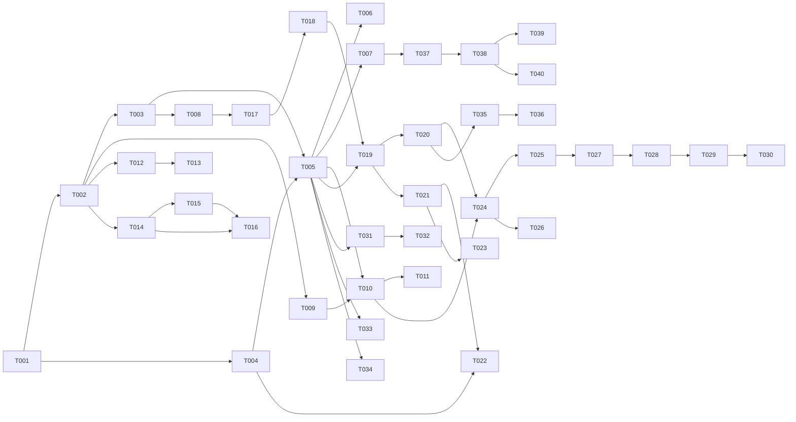

# Task Breakdown: Workflow Subagents

**Feature ID**: 001-workflow-subagents
**Total Estimated Effort**: 220 hours
**Parallelization Potential**: ~110 hours with 3 developers
**Critical Path**: T001 → T004 → T008 → T020 → T028

## Task List

| ID | Task | Priority | Est (hrs) | Dependencies | Status | Assignee |
|----|------|----------|-----------|--------------|--------|----------|
| **Phase 1: Foundation** |||||||
| T001 | Create .claude/agents/ directory structure | P1 | 1 | - | pending | - |
| T002 | Define subagent template format | P1 | 2 | T001 | pending | - |
| T003 | Implement message passing protocol | P1 | 8 | T002 | pending | - |
| T004 | Create state persistence layer | P1 | 6 | T001 | pending | - |
| T005 | Build agent lifecycle manager | P1 | 8 | T003, T004 | pending | - |
| T006 | Add permission scoping system | P1 | 4 | T005 | pending | - |
| T007 | Create agent test harness | P1 | 6 | T005 | pending | - |
| T008 | Implement result aggregation | P1 | 5 | T003 | pending | - |
| **Phase 2: Core Agents** |||||| |
| T009 | Create spec-implementer agent definition | P1 | 3 | T002 | pending | - |
| T010 | Implement spec-implementer workflow | P1 | 12 | T009, T005 | pending | - |
| T011 | Add TDD cycle to spec-implementer | P1 | 8 | T010 | pending | - |
| T012 | Create consistency-analyzer agent | P1 | 8 | T002, T005 | pending | - |
| T013 | Implement cross-artifact validation | P1 | 10 | T012 | pending | - |
| T014 | Create specification-analyzer agent | P1 | 6 | T002, T005 | pending | - |
| T015 | Build quality checklist generator | P2 | 6 | T014 | pending | - |
| T016 | Add validation reporting | P2 | 4 | T014, T015 | pending | - |
| **Phase 3: Orchestration** |||||| |
| T017 | Build task dependency resolver | P1 | 8 | T008 | pending | - |
| T018 | Implement topological sort algorithm | P1 | 4 | T017 | pending | - |
| T019 | Create parallel execution scheduler | P1 | 10 | T018, T005 | pending | - |
| T020 | Add resource lock management | P1 | 6 | T019 | pending | - |
| T021 | Build progress tracking system | P2 | 6 | T019 | pending | - |
| T022 | Implement checkpoint management | P1 | 8 | T004, T021 | pending | - |
| T023 | Create orchestrator UI components | P2 | 6 | T021 | pending | - |
| **Phase 4: Integration** |||||| |
| T024 | Update orbit-orchestrator for subagents | P1 | 8 | T020, T010 | pending | - |
| T025 | Modify orbit-lifecycle hooks | P1 | 4 | T024 | pending | - |
| T026 | Update orbit-planning integration | P1 | 4 | T024 | pending | - |
| T027 | Add SubagentStop hook support | P1 | 4 | T025 | pending | - |
| T028 | Create metrics collection system | P2 | 8 | T027 | pending | - |
| T029 | Build monitoring dashboard | P2 | 8 | T028 | pending | - |
| T030 | Update documentation | P2 | 4 | T029 | pending | - |
| **Phase 5: Advanced Features** |||||| |
| T031 | Implement spec-researcher agent | P2 | 10 | T005 | pending | - |
| T032 | Add WebSearch/WebFetch integration | P2 | 4 | T031 | pending | - |
| T033 | Create codebase-analyzer agent | P2 | 8 | T005 | pending | - |
| T034 | Add MCP protocol support | P3 | 8 | T005 | pending | - |
| T035 | Implement retry mechanisms | P1 | 6 | T020 | pending | - |
| T036 | Add circuit breaker pattern | P2 | 4 | T035 | pending | - |
| **Testing & Validation** |||||| |
| T037 | Write unit tests for framework | P1 | 8 | T007 | pending | - |
| T038 | Create integration test suite | P1 | 10 | T037, T024 | pending | - |
| T039 | Performance benchmarking | P2 | 6 | T038 | pending | - |
| T040 | User acceptance testing | P1 | 8 | T038 | pending | - |

## Dependency Visualization

## Parallel Execution Groups

### Group 1 (Start Immediately)
- T001: Create directory structure

### Group 2 (After T001)
- T002: Define subagent template
- T004: Create state persistence

### Group 3 (After T002)
- T003: Message passing protocol
- T009: spec-implementer definition
- T012: consistency-analyzer agent
- T014: specification-analyzer agent

### Group 4 (Mixed Dependencies)
- T005: Lifecycle manager (after T003, T004)
- T008: Result aggregation (after T003)
- T031: spec-researcher (after T005)
- T033: codebase-analyzer (after T005)

### Group 5 (Integration Phase)
- T024-T030: Sequential integration tasks

## Critical Path Analysis

**Primary Critical Path**:
T001 → T002 → T003 → T005 → T010 → T024 → T025 → T027 → T028
**Duration**: ~65 hours

**Secondary Critical Path**:
T001 → T004 → T005 → T019 → T020 → T024
**Duration**: ~48 hours

**Optimization Opportunities**:
1. Parallelize agent development (T009-T016) with framework completion
2. Start documentation (T030) early and update incrementally
3. Begin test writing (T037) alongside development

## Resource Allocation

### Developer 1 (Framework Specialist)
- Focus: T001-T008, T017-T023
- Estimated: 70 hours

### Developer 2 (Agent Developer)
- Focus: T009-T016, T031-T034
- Estimated: 75 hours

### Developer 3 (Integration Engineer)
- Focus: T024-T030, T035-T040
- Estimated: 75 hours

## Milestones

1. **M1: Framework Complete** (Week 1)
   - Tasks: T001-T008
   - Deliverable: Working subagent framework

2. **M2: Core Agents Operational** (Week 2)
   - Tasks: T009-T016
   - Deliverable: Three core agents functional

3. **M3: Orchestration Ready** (Week 3)
   - Tasks: T017-T023
   - Deliverable: Parallel execution working

4. **M4: Integration Complete** (Week 4)
   - Tasks: T024-T030
   - Deliverable: Full Orbit integration

5. **M5: Production Ready** (Week 5)
   - Tasks: T031-T040
   - Deliverable: Tested, documented, deployed

## Risk Mitigation Tasks

### High Priority Mitigations
- T006: Permission scoping (Security)
- T022: Checkpoint management (Recovery)
- T035: Retry mechanisms (Reliability)

### Medium Priority Mitigations
- T016: Validation reporting (Quality)
- T028: Metrics collection (Observability)
- T036: Circuit breaker (Stability)

## Notes

1. **Parallel Execution**: With 3 developers, estimated completion in ~3 weeks
2. **Sequential Execution**: Single developer would need ~6 weeks
3. **Testing**: Allocate 20% of development time to testing
4. **Documentation**: Update incrementally, don't leave until end
5. **Early Validation**: Get user feedback after M2 milestone

---
*Task breakdown complete. Ready for implementation phase.*