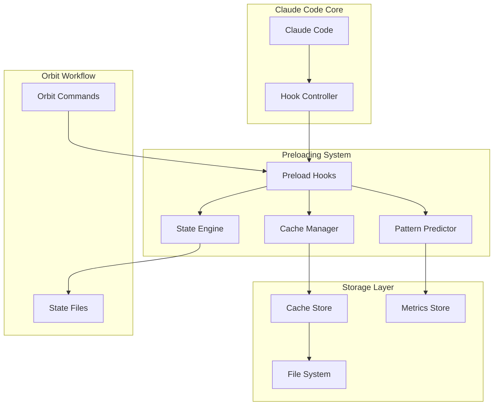

# Technical Plan: Context Preloading Hook System

**Feature ID**: 002-context-preloading-hooks
**Created**: 2025-11-19
**Version**: 1.0.0
**Status**: In Planning

## 1. System Architecture

### Overview
The Context Preloading Hook System is a performance optimization layer that sits between Claude Code's hook infrastructure and the Orbit workflow. It intercepts standard hook events, preloads relevant context, and caches frequently accessed data to minimize I/O operations.

### Architecture Diagram


### Key Components

1. **Preload Hooks** - Event interceptors that trigger on SessionStart, UserPromptSubmit, PostToolUse
2. **Cache Manager** - LRU cache with event-based invalidation
3. **Pattern Predictor** - ML-lite pattern recognition for usage prediction
4. **State Engine** - Automatic state synchronization with smart batching
5. **Metrics Store** - Performance tracking and analysis

## 2. Component Design

### 2.1 Preload Hooks

**Location**: `.claude/hooks/orbit-preload-*.sh`

**Components:**
- `orbit-preload-session.sh` - SessionStart handler
- `orbit-preload-prompt.sh` - UserPromptSubmit handler
- `orbit-preload-predict.sh` - PostToolUse handler

**Key Functions:**
```bash
# Core preloading function
preload_context() {
    local phase=$1
    local feature=$2

    # Build context array based on phase
    case "$phase" in
        specification)
            context_files=("spec.md" "current-session.md")
            ;;
        planning)
            context_files=("spec.md" "plan.md" "architecture.md")
            ;;
        implementation)
            context_files=("tasks.md" "changes-planned.md")
            ;;
    esac

    # Preload and cache
    for file in "${context_files[@]}"; do
        cache_file "$file"
    done
}
```

### 2.2 Cache Manager

**Location**: `.claude/hooks/lib/cache-manager.sh`

**Features:**
- In-memory caching using Bash associative arrays
- File-based persistent cache in `.spec/state/cache/`
- Event-based invalidation
- LRU eviction policy

**Data Structure:**
```bash
# Cache entry format
declare -A cache_data=(
    ["file_path"]="content"
    ["file_path.meta"]="timestamp|size|checksum"
)

# Access pattern tracking
declare -A access_patterns=(
    ["file_path"]="count|last_access|phase"
)
```

### 2.3 Pattern Predictor

**Location**: `.claude/hooks/lib/pattern-predictor.sh`

**Algorithm:**
1. Track file access sequences per phase
2. Build transition probability matrix
3. Prefetch top 3 most likely next files
4. Update patterns on each access

**Pattern Storage:**
```json
{
  "patterns": {
    "specification->planning": ["spec.md", "architecture.md", "plan.md"],
    "planning->tasks": ["plan.md", "tasks.md", "changes-planned.md"],
    "tasks->implementation": ["tasks.md", "current-session.md", "workflow-progress.md"]
  },
  "transitions": {
    "specification": { "planning": 0.8, "clarification": 0.2 },
    "planning": { "tasks": 0.9, "specification": 0.1 }
  }
}
```

### 2.4 State Engine

**Location**: `.claude/hooks/lib/state-engine.sh`

**Responsibilities:**
- Monitor file changes using checksums
- Apply smart batching logic
- Ensure atomic writes
- Trigger cache invalidation

**Batching Logic:**
```bash
# Critical updates (immediate)
CRITICAL_EVENTS="phase_change task_complete error"

# Non-critical updates (batched)
BATCH_EVENTS="metric_update progress_log"

# Batch interval
BATCH_INTERVAL=30  # seconds
```

## 3. Data Models

### 3.1 Cache Entry
```json
{
  "key": "file_path",
  "content": "file_content",
  "metadata": {
    "timestamp": "2025-11-19T22:50:00Z",
    "size": 2048,
    "checksum": "sha256:abc123...",
    "access_count": 5,
    "last_access": "2025-11-19T22:55:00Z"
  }
}
```

### 3.2 Performance Metrics
```json
{
  "session_id": "session-123",
  "timestamp": "2025-11-19T22:50:00Z",
  "metrics": {
    "cache_hits": 45,
    "cache_misses": 5,
    "hit_rate": 0.9,
    "avg_hook_time_ms": 75,
    "preload_time_ms": 50,
    "files_cached": 12,
    "cache_size_bytes": 524288
  }
}
```

### 3.3 Access Pattern
```json
{
  "file": "spec.md",
  "access_sequence": ["current-session.md", "spec.md", "plan.md"],
  "phase": "planning",
  "frequency": 15,
  "predictions": {
    "next_files": ["tasks.md", "architecture.md", "changes-planned.md"],
    "confidence": [0.8, 0.6, 0.4]
  }
}
```

## 4. Hook Interfaces

### 4.1 SessionStart Hook
```bash
#!/usr/bin/env bash
# orbit-preload-session.sh

source .claude/hooks/lib/cache-manager.sh
source .claude/hooks/lib/pattern-predictor.sh

# Hook entry point
on_session_start() {
    local session_id=$1

    # Initialize cache
    init_cache "$session_id"

    # Load current state
    preload_state_files

    # Predict and prefetch
    prefetch_likely_files

    # Start background sync
    start_state_sync &
}
```

### 4.2 UserPromptSubmit Hook
```bash
#!/usr/bin/env bash
# orbit-preload-prompt.sh

# Hook entry point
on_prompt_submit() {
    local prompt=$1

    # Get cached context
    context=$(get_cached_context)

    # Append to prompt
    echo "[Preloaded Context]"
    echo "$context"
    echo "[End Context]"
    echo "$prompt"
}
```

### 4.3 PostToolUse Hook
```bash
#!/usr/bin/env bash
# orbit-preload-predict.sh

# Hook entry point
on_tool_use() {
    local tool=$1
    local result=$2

    # Update access patterns
    update_patterns "$tool"

    # Invalidate affected cache
    invalidate_cache "$tool"

    # Prefetch predicted next
    prefetch_next_files

    # Trigger state update if needed
    maybe_update_state "$tool" "$result"
}
```

## 5. Implementation Phases

### Phase 1: Core Infrastructure (Week 1)
1. Set up hook file structure
2. Implement basic cache manager
3. Create state engine with atomic writes
4. Add basic preload functionality
5. Unit tests for core components

### Phase 2: Smart Features (Week 2)
1. Implement pattern predictor
2. Add event-based invalidation
3. Create smart batching logic
4. Implement LRU eviction
5. Integration tests

### Phase 3: Optimization & Metrics (Week 3)
1. Add performance monitoring
2. Implement metrics dashboard
3. Optimize cache operations
4. Add configuration options
5. Performance benchmarking

### Phase 4: Polish & Documentation (Week 4)
1. Error handling and fallbacks
2. User documentation
3. Configuration templates
4. Migration guide
5. Final testing and release

## 6. Technical Decisions

### 6.1 Storage Format
**Decision**: Use JSON for structured data, plain text for content cache
**Rationale**: JSON provides structure for metadata while plain text minimizes parsing overhead
**Trade-offs**: Slightly larger storage vs better compatibility

### 6.2 Cache Location
**Decision**: Store cache in `.spec/state/cache/` (git-ignored)
**Rationale**: Keeps cache close to state files, automatically excluded from version control
**Trade-offs**: Per-project cache vs global cache

### 6.3 Pattern Learning
**Decision**: Simple frequency-based prediction, not ML
**Rationale**: Minimal dependencies, fast execution, good enough accuracy
**Trade-offs**: Less sophisticated prediction vs simplicity

### 6.4 Batching Strategy
**Decision**: Dual-mode (immediate + batched)
**Rationale**: Balances responsiveness with efficiency
**Trade-offs**: More complex logic vs optimal performance

## 7. Risk Analysis

| Risk | Impact | Mitigation |
|------|--------|------------|
| Cache corruption | High | Checksums, automatic rebuild |
| Memory overflow | Medium | LRU eviction, size limits |
| Hook failures | Medium | Fallback to direct reads |
| Performance regression | Low | Metrics monitoring, feature flags |
| Platform incompatibility | Low | POSIX compliance, compatibility tests |

## 8. Architecture Decision Records

### ADR-001: Event-Based Cache Invalidation
**Date**: 2025-11-19
**Status**: Accepted
**Context**: Need to ensure cache consistency
**Decision**: Use file watchers and hook events for invalidation
**Consequences**: More complex but ensures data freshness

### ADR-002: Bash-Native Implementation
**Date**: 2025-11-19
**Status**: Accepted
**Context**: Hook system requires shell scripts
**Decision**: Pure Bash with optional jq for JSON
**Consequences**: Limited by Bash capabilities but no dependencies

### ADR-003: Smart Auto-Detection
**Date**: 2025-11-19
**Status**: Accepted
**Context**: Users want automatic optimization
**Decision**: Learn patterns from usage, no manual config required
**Consequences**: Better UX but requires pattern tracking

### ADR-004: Local-Only Metrics
**Date**: 2025-11-19
**Status**: Accepted
**Context**: Privacy concerns about telemetry
**Decision**: All metrics stay local, no external transmission
**Consequences**: No centralized insights but maintains privacy

## 9. Success Criteria

- ✅ Hook execution time <100ms
- ✅ Cache hit rate >70%
- ✅ 50% reduction in redundant file reads
- ✅ Zero manual configuration required
- ✅ Graceful degradation on failures
- ✅ Works on Linux, macOS, Windows (Git Bash/WSL)

## 10. Dependencies

### Required
- Bash 4.0+ (associative arrays)
- Standard Unix utilities (cat, grep, sed, awk)
- `.spec/` directory structure

### Optional
- `jq` for JSON processing (fallback to sed/awk)
- `inotifywait` for file watching (fallback to polling)
- `md5sum` or `sha256sum` for checksums

## Next Steps

1. Review and approve technical plan
2. Create detailed task breakdown
3. Set up development environment
4. Begin Phase 1 implementation
5. Weekly progress reviews